# Data Model: AI Training Marketplace

> **Template Status**: Live | **Version**: 0.11.2 | **Command**: `/arckit.data-model`

## Document Control

| Field | Value |
|-------|-------|
| **Document ID** | ARC-001-DATA-v1.3 |
| **Document Type** | Data Model and Database Design Specification |
| **Project** | AI Training Marketplace (Project 001) |
| **Classification** | OFFICIAL |
| **Status** | DRAFT |
| **Version** | 1.3 |
| **Created Date** | 2025-11-09 |
| **Last Modified** | 2026-01-26 |
| **Review Cycle** | Monthly |
| **Next Review Date** | 2026-02-26 |
| **Owner** | Chief Technology Officer, AI Training Marketplace |
| **Reviewed By** | [PENDING] |
| **Approved By** | [PENDING] |
| **Distribution** | Project Team, Data Governance Committee, Architecture Review Board |

## Revision History

| Version | Date | Author | Changes | Approved By | Approval Date |
|---------|------|--------|---------|-------------|---------------|
| 1.0 | 2025-11-09 | ArcKit AI | Initial creation from `/arckit.data-model` command | [PENDING] | [PENDING] |
| 1.1 | 2026-01-26 | ArcKit AI | Updated to match latest template structure (Document Control fields) | [PENDING] | [PENDING] |
| 1.2 | 2026-01-26 | ArcKit AI | Added Template Status metadata line per latest template | [PENDING] | [PENDING] |
| 1.3 | 2026-01-26 | ArcKit AI | Updated to template version 0.11.2 | [PENDING] | [PENDING] |

---

## Executive Summary

### Overview

This data model defines the complete data architecture for the AI Training Marketplace, a multi-sided platform connecting training providers with enterprises and individual learners seeking AI/ML training. The model covers all entities required to support course catalog management, user management, enrollment tracking, payment processing, enterprise subscriptions, quality assurance, and compliance with UK GDPR and Data Protection Act 2018.

The data model is derived from 7 data requirements (DR-001 through DR-007) documented in the requirements specification, ensuring complete traceability from business needs to database schema.

### Model Statistics

- **Total Entities**: 15 entities defined (E-001 through E-015)
- **Total Attributes**: 187 attributes across all entities
- **Total Relationships**: 24 relationships mapped (19 one-to-many, 3 many-to-many, 2 one-to-one)
- **Data Classification**:
  - 🟢 Public: 2 entities (courses, categories)
  - 🟡 Internal: 3 entities (course reviews, recommendations, quality scores)
  - 🟠 Confidential: 9 entities (users, enrollments, payments, providers, enterprises - contain PII)
  - 🔴 Restricted: 1 entity (audit logs - security-sensitive)

### Compliance Summary

- **GDPR/DPA 2018 Status**: COMPLIANT (with DPIA required)
- **PII Entities**: 6 entities contain personally identifiable information (E-001 Users, E-002 User Profiles, E-006 Providers, E-009 Enterprises, E-010 Enterprise Employees, E-014 Payment Methods)
- **Data Protection Impact Assessment (DPIA)**: REQUIRED (large-scale PII processing, profiling for recommendations, enterprise employee data)
- **Data Retention**: 7 years maximum (driven by UK financial regulations and tax law)
- **Cross-Border Transfers**: NO (UK data residency - AWS eu-west-2 London region)

### Key Data Governance Stakeholders

- **Data Owner (Business)**: Chief Product Officer - Accountable for data quality and usage
- **Data Steward**: Head of Compliance - Responsible for data governance policies
- **Data Custodian (Technical)**: Platform Engineering Team - Manages data storage and security
- **Data Protection Officer**: Head of Compliance - Ensures privacy compliance

---

## Visual Entity-Relationship Diagram (ERD)

```mermaid
erDiagram
    %% Core User Entities
    USER ||--o| USER_PROFILE : has
    USER ||--o{ ENROLLMENT : places
    USER ||--o{ PAYMENT_TRANSACTION : makes
    USER ||--o{ COURSE_REVIEW : writes
    USER ||--o{ CERTIFICATE : earns

    %% Provider Entities
    PROVIDER ||--o{ COURSE : publishes
    PROVIDER ||--o{ PAYMENT_TRANSACTION : receives

    %% Course Entities
    COURSE ||--o{ ENROLLMENT : has
    COURSE ||--o{ COURSE_REVIEW : receives
    COURSE }o--|| CATEGORY : belongs_to
    COURSE ||--o| QUALITY_SCORE : has

    %% Enrollment and Progress
    ENROLLMENT ||--o| CERTIFICATE : generates
    ENROLLMENT ||--o{ LEARNING_PROGRESS : tracks

    %% Enterprise Entities
    ENTERPRISE ||--o{ ENTERPRISE_EMPLOYEE : manages
    ENTERPRISE ||--o| ENTERPRISE_SUBSCRIPTION : has
    ENTERPRISE_EMPLOYEE }o--|| USER : maps_to
    ENTERPRISE_SUBSCRIPTION ||--o{ PAYMENT_TRANSACTION : generates

    %% Payment Entities
    USER ||--o{ PAYMENT_METHOD : stores
    PAYMENT_METHOD ||--o{ PAYMENT_TRANSACTION : uses

    %% Audit
    AUDIT_LOG }o--o{ USER : references
    AUDIT_LOG }o--o{ PROVIDER : references

    USER {
        uuid user_id PK "Unique identifier"
        string email UK "Email address (PII)"
        string password_hash "Bcrypt hashed password"
        string role "LEARNER|PROVIDER|ENTERPRISE_ADMIN|PLATFORM_ADMIN"
        string auth_provider "LOCAL|SAML|OAUTH|GOVUK_ONE_LOGIN"
        boolean mfa_enabled "Multi-factor authentication flag"
        timestamp created_at "Account creation date"
        timestamp last_login "Last login timestamp"
        boolean is_active "Account active status"
    }

    USER_PROFILE {
        uuid profile_id PK "Unique identifier"
        uuid user_id FK "User reference"
        string first_name "First name (PII)"
        string last_name "Last name (PII)"
        string job_role "Job title (optional)"
        string department "Department (optional)"
        string employer "Employer name (optional)"
        text bio "User biography (optional)"
        string avatar_url "Profile picture URL"
        jsonb preferences "User preferences (notifications, privacy)"
        timestamp updated_at "Last profile update"
    }

    PROVIDER {
        uuid provider_id PK "Unique identifier"
        uuid user_id FK "User account reference"
        string legal_entity_name "Legal business name (PII)"
        string business_type "LIMITED_COMPANY|SOLE_TRADER|CHARITY"
        string tax_id "UK VAT number or company registration (encrypted)"
        string contact_name "Contact person name (PII)"
        string contact_email "Contact email (PII)"
        string contact_phone "Contact phone (PII)"
        text address "Full address (PII)"
        string bank_account_number "Encrypted bank account"
        string bank_sort_code "Encrypted sort code"
        string kyc_status "PENDING|APPROVED|REJECTED"
        string provider_status "ACTIVE|SUSPENDED|TERMINATED"
        decimal commission_tier "0.20|0.25|0.30"
        decimal total_gmv "Gross merchandise value (lifetime)"
        timestamp created_at "Provider registration date"
        timestamp verified_at "KYC verification date"
    }

    COURSE {
        uuid course_id PK "Unique identifier"
        uuid provider_id FK "Provider reference"
        uuid category_id FK "Category reference"
        string title "Course title (max 200 chars)"
        text description "Course description (rich text)"
        jsonb learning_objectives "Array of learning objectives"
        string level "BEGINNER|INTERMEDIATE|ADVANCED"
        integer duration_hours "Estimated course duration"
        string language "ISO 639-1 language code"
        decimal price_gbp "Course price in GBP (nullable for free)"
        jsonb content_urls "Video, document, assessment URLs"
        string publication_status "DRAFT|UNDER_REVIEW|PUBLISHED|UNPUBLISHED"
        decimal average_rating "Denormalized average (0.0-5.0)"
        integer total_enrollments "Denormalized enrollment count"
        integer total_completions "Denormalized completion count"
        timestamp created_at "Course creation date"
        timestamp updated_at "Last update date"
        timestamp published_at "Publication date"
    }

    CATEGORY {
        uuid category_id PK "Unique identifier"
        string name "Category name"
        string slug "URL-friendly slug"
        text description "Category description"
        uuid parent_category_id FK "Parent category (nullable for top-level)"
        integer display_order "Sort order"
    }

    ENROLLMENT {
        uuid enrollment_id PK "Unique identifier"
        uuid user_id FK "Learner reference"
        uuid course_id FK "Course reference"
        uuid enterprise_id FK "Enterprise sponsor (nullable)"
        string enrollment_source "INDIVIDUAL|ENTERPRISE|BULK_IMPORT"
        decimal amount_paid "Amount paid by learner (0 if enterprise)"
        string enrollment_status "ACTIVE|COMPLETED|REFUNDED|EXPIRED"
        integer progress_percent "Course progress (0-100)"
        timestamp enrolled_at "Enrollment date"
        timestamp completed_at "Completion date (nullable)"
        timestamp expires_at "Access expiry date (nullable)"
    }

    LEARNING_PROGRESS {
        uuid progress_id PK "Unique identifier"
        uuid enrollment_id FK "Enrollment reference"
        string content_item_id "Video/lesson/quiz identifier"
        string content_type "VIDEO|DOCUMENT|QUIZ|ASSIGNMENT"
        integer progress_percent "Item completion (0-100)"
        integer time_spent_minutes "Time spent on item"
        jsonb quiz_scores "Quiz attempts and scores"
        timestamp last_accessed "Last access timestamp"
        timestamp completed_at "Item completion date (nullable)"
    }

    CERTIFICATE {
        uuid certificate_id PK "Unique identifier"
        uuid enrollment_id FK "Enrollment reference"
        uuid user_id FK "Learner reference"
        uuid course_id FK "Course reference"
        string certificate_number "Unique certificate number (CERT-YYYYMM-XXXXXX)"
        timestamp issued_at "Certificate issue date"
        string verification_hash "SHA-256 hash for verification"
        string pdf_url "Certificate PDF URL (S3)"
    }

    COURSE_REVIEW {
        uuid review_id PK "Unique identifier"
        uuid user_id FK "Reviewer reference"
        uuid course_id FK "Course reference"
        integer rating "Star rating (1-5)"
        text review_text "Review content (max 2000 chars)"
        jsonb helpful_votes "User IDs who voted helpful"
        boolean is_verified_purchase "Enrollment verified flag"
        string moderation_status "PENDING|APPROVED|REJECTED|FLAGGED"
        timestamp created_at "Review submission date"
        timestamp updated_at "Last edit date"
    }

    QUALITY_SCORE {
        uuid score_id PK "Unique identifier"
        uuid course_id FK "Course reference"
        decimal completion_score "Completion rate (0-100)"
        decimal rating_score "Average rating (0-5)"
        decimal outcome_score "Skills application score (0-100)"
        decimal composite_score "Weighted composite (0-100)"
        jsonb score_breakdown "Detailed scoring components"
        timestamp calculated_at "Score calculation timestamp"
    }

    PAYMENT_TRANSACTION {
        uuid transaction_id PK "Unique identifier"
        uuid user_id FK "Payer reference (learner or enterprise)"
        uuid enrollment_id FK "Enrollment reference (nullable for subscriptions)"
        uuid provider_id FK "Provider reference (payee)"
        uuid enterprise_id FK "Enterprise reference (nullable)"
        decimal amount "Transaction amount (GBP)"
        string currency "ISO 4217 currency code"
        string payment_gateway "STRIPE|GOVUK_PAY"
        string gateway_transaction_id "External transaction ID"
        string payment_method_type "CARD|BANK_TRANSFER|INVOICE"
        string transaction_status "PENDING|SUCCEEDED|FAILED|REFUNDED"
        decimal platform_commission "Platform commission amount"
        decimal provider_payout "Provider payout amount"
        text failure_reason "Failure details (nullable)"
        timestamp transaction_date "Transaction timestamp"
        timestamp refunded_at "Refund timestamp (nullable)"
    }

    PAYMENT_METHOD {
        uuid payment_method_id PK "Unique identifier"
        uuid user_id FK "User reference"
        string method_type "CARD|BANK_ACCOUNT"
        string payment_gateway "STRIPE|GOVUK_PAY"
        string gateway_token "Tokenized payment method (encrypted)"
        string last_four "Last 4 digits (display only)"
        string card_brand "VISA|MASTERCARD|AMEX (if card)"
        date expiry_date "Card expiry (if card)"
        boolean is_default "Default payment method flag"
        timestamp created_at "Payment method added date"
    }

    ENTERPRISE {
        uuid enterprise_id PK "Unique identifier"
        string organization_name "Legal organization name"
        string industry "Industry sector"
        integer employee_count "Organization size"
        string primary_contact_name "Primary contact (PII)"
        string primary_contact_email "Primary email (PII)"
        string primary_contact_phone "Primary phone (PII)"
        text billing_address "Billing address (PII)"
        string payment_terms "NET_30|NET_60|CREDIT_CARD"
        timestamp created_at "Enterprise registration date"
    }

    ENTERPRISE_SUBSCRIPTION {
        uuid subscription_id PK "Unique identifier"
        uuid enterprise_id FK "Enterprise reference"
        string subscription_tier "BASIC|PROFESSIONAL|ENTERPRISE"
        integer license_count "Total licenses purchased"
        integer licenses_used "Licenses currently used"
        decimal monthly_price "Monthly subscription price"
        string billing_frequency "MONTHLY|ANNUAL"
        timestamp subscription_start "Subscription start date"
        timestamp subscription_end "Subscription end date"
        string subscription_status "ACTIVE|CANCELED|EXPIRED"
        boolean auto_renew "Auto-renewal flag"
    }

    ENTERPRISE_EMPLOYEE {
        uuid employee_id PK "Unique identifier"
        uuid enterprise_id FK "Enterprise reference"
        uuid user_id FK "User account reference (nullable until activated)"
        string employee_email "Employee work email (PII)"
        string employee_name "Employee name (PII)"
        string job_role "Job title"
        string department "Department"
        string manager_email "Manager email (for reporting)"
        string activation_status "PENDING|ACTIVATED|DEACTIVATED"
        timestamp invited_at "Invitation sent date"
        timestamp activated_at "Account activation date"
    }

    AUDIT_LOG {
        uuid log_id PK "Unique identifier"
        timestamp event_timestamp "Event timestamp (UTC)"
        string event_type "AUTHENTICATION|AUTHORIZATION|DATA_ACCESS|CONFIG_CHANGE|DATA_SUBJECT_REQUEST"
        string actor_type "USER|ADMIN|SYSTEM"
        uuid actor_id "User/admin ID (nullable for system)"
        string action "LOGIN|READ|UPDATE|DELETE|PERMISSION_CHANGE"
        string resource_type "USER|COURSE|PROVIDER|PAYMENT|ENROLLMENT"
        uuid resource_id "Affected entity ID"
        string ip_address "Source IP address"
        string user_agent "Browser user agent"
        string result "SUCCESS|FAILURE|ERROR"
        jsonb additional_context "Request params, before/after values"
        string error_code "Error code (if failure)"
    }
```



---

## Entity Catalog

### Entity E-001: User

**Description**: Core user account entity representing learners, providers, enterprise admins, and platform admins. Handles authentication, authorization, and account lifecycle.

**Source Requirements**:
- DR-001: Learner Personal Data
- NFR-SEC-001: Authentication and authorization
- INT-004: Identity federation (SAML, OAuth, OIDC)

**Business Context**: Users are the primary actors in the platform. A single user account can have multiple roles (e.g., learner and provider). Authentication supports local credentials, SAML SSO, OAuth 2.0, and GOV.UK One Login.

**Data Ownership**:
- **Business Owner**: Chief Product Officer
- **Technical Owner**: Platform Engineering Team
- **Data Steward**: Head of Compliance

**Data Classification**: CONFIDENTIAL

**Volume Estimates**:
- **Initial Volume**: 500 users at Month 3 (pilot launch)
- **Growth Rate**: +2,000 users per month
- **Peak Volume**: 50,000 users at Month 24
- **Average Record Size**: 0.5 KB

**Data Retention**:
- **Active Period**: Lifetime of active account
- **Archive Period**: 2 years after account deactivation
- **Total Retention**: 7 years (GDPR + financial audit trail)
- **Deletion Policy**: Hard delete after 7 years OR immediate anonymization upon data subject request (right to erasure)

#### Attributes

| Attribute | Type | Required | PII | Description | Validation Rules | Default | Source Req |
|-----------|------|----------|-----|-------------|------------------|---------|------------|
| user_id | UUID | Yes | No | Unique identifier | UUID v4 format | Auto-generated | DR-001 |
| email | VARCHAR(255) | Yes | Yes | Email address | RFC 5322 format, unique, case-insensitive | None | DR-001 |
| password_hash | VARCHAR(255) | No | No | Bcrypt hashed password | Bcrypt with cost 12 (nullable if SSO-only) | NULL | NFR-SEC-001 |
| role | ENUM | Yes | No | User role | LEARNER, PROVIDER, ENTERPRISE_ADMIN, PLATFORM_ADMIN | LEARNER | NFR-SEC-001 |
| auth_provider | ENUM | Yes | No | Authentication method | LOCAL, SAML, OAUTH, GOVUK_ONE_LOGIN | LOCAL | INT-004 |
| external_auth_id | VARCHAR(255) | No | No | External IDP identifier | Unique per auth_provider | NULL | INT-004 |
| mfa_enabled | BOOLEAN | Yes | No | MFA enabled flag | true/false | false | NFR-SEC-001 |
| mfa_secret | VARCHAR(255) | No | No | TOTP secret (encrypted) | Base32, encrypted | NULL | NFR-SEC-001 |
| created_at | TIMESTAMP | Yes | No | Account creation date | ISO 8601 UTC | NOW() | DR-001 |
| last_login | TIMESTAMP | No | No | Last login timestamp | ISO 8601 UTC | NULL | DR-001 |
| is_active | BOOLEAN | Yes | No | Account active status | true/false | true | DR-001 |
| email_verified | BOOLEAN | Yes | No | Email verification status | true/false | false | NFR-SEC-001 |
| email_verification_token | VARCHAR(64) | No | No | Email verification token | SHA-256 hash, expires 24h | NULL | NFR-SEC-001 |
| password_reset_token | VARCHAR(64) | No | No | Password reset token | SHA-256 hash, expires 1h | NULL | NFR-SEC-001 |
| password_reset_expires | TIMESTAMP | No | No | Reset token expiry | ISO 8601 UTC | NULL | NFR-SEC-001 |

#### Relationships

**Outgoing Relationships**:
- user_profile: E-001 → E-002 (one-to-one) - Each user has one profile
- enrollments: E-001 → E-005 (one-to-many) - User can enroll in multiple courses
- payment_transactions: E-001 → E-011 (one-to-many) - User can make multiple payments
- course_reviews: E-001 → E-008 (one-to-many) - User can write multiple reviews
- certificates: E-001 → E-007 (one-to-many) - User can earn multiple certificates
- payment_methods: E-001 → E-012 (one-to-many) - User can store multiple payment methods

**Incoming Relationships**:
- provider: E-003 → E-001 (many-to-one) - Provider account links to user
- enterprise_employee: E-010 → E-001 (many-to-one) - Employee activates user account

#### Indexes

**Primary Key**:
- `pk_user` on `user_id` (clustered index, UUID)

**Unique Constraints**:
- `uk_user_email` on `LOWER(email)` (case-insensitive unique)
- `uk_user_external_auth` on `(auth_provider, external_auth_id)` (unique per IDP)

**Performance Indexes**:
- `idx_user_email` on `email` (login queries)
- `idx_user_role` on `role` (role-based queries)
- `idx_user_created_at` on `created_at` (cohort analysis)
- `idx_user_last_login` on `last_login` (activity tracking)

#### Privacy & Compliance

**GDPR/DPA 2018 Considerations**:
- **Contains PII**: YES
- **PII Attributes**: email, mfa_secret (indirect identifier)
- **Legal Basis for Processing**: Contract (GDPR Art 6(1)(b)) - user account necessary to perform service
- **Data Subject Rights**:
  - **Right to Access**: Provide user record via API endpoint `/api/v1/subject-access-request`
  - **Right to Rectification**: Allow email updates via `/api/v1/user/profile` (requires email verification)
  - **Right to Erasure**: Anonymize user record (set email to `deleted-{uuid}@example.com`, clear PII fields, mark is_active=false)
  - **Right to Portability**: Export in JSON format with enrollments, certificates, reviews
  - **Right to Object**: Support marketing opt-out via preferences
  - **Right to Restrict Processing**: Support account freeze (is_active=false, retain data)
- **Data Breach Impact**: HIGH - Email exposure enables phishing; password hash exposure requires forced reset
- **Cross-Border Transfers**: None (UK data residency - AWS eu-west-2)
- **Data Protection Impact Assessment (DPIA)**: REQUIRED (part of platform DPIA)

**Sector-Specific Compliance**:
- **PCI-DSS**: Not applicable (no payment card data stored)
- **Government Security Classification**: OFFICIAL (public sector users may have OFFICIAL-SENSITIVE data in profiles)

**Audit Logging**:
- **Access Logging**: Required - Log all authentication attempts (success/failure)
- **Change Logging**: Required - Log email changes, password changes, role changes (before/after values)
- **Retention of Logs**: 7 years (security incident investigation)

---

### Entity E-002: User Profile

**Description**: Extended user profile information including name, job role, employer, biography, and preferences. Separated from core user entity for performance (profiles loaded on-demand).

**Source Requirements**:
- DR-001: Learner Personal Data (name, job role, department, employer)

**Business Context**: User profiles enable personalization (recommendations based on job role), enterprise reporting (employee analytics), and social features (public profiles). Profile visibility controlled by privacy preferences.

**Data Ownership**:
- **Business Owner**: Chief Product Officer
- **Technical Owner**: Platform Engineering Team
- **Data Steward**: Head of Compliance

**Data Classification**: CONFIDENTIAL

**Volume Estimates**:
- **Initial Volume**: 500 profiles at Month 3
- **Growth Rate**: +2,000 profiles per month (matches user growth)
- **Peak Volume**: 50,000 profiles at Month 24
- **Average Record Size**: 2 KB (including JSON preferences)

**Data Retention**:
- **Active Period**: Lifetime of user account
- **Archive Period**: 2 years after account deactivation
- **Total Retention**: 7 years
- **Deletion Policy**: Hard delete with parent user OR anonymize upon data subject request

#### Attributes

| Attribute | Type | Required | PII | Description | Validation Rules | Default | Source Req |
|-----------|------|----------|-----|-------------|------------------|---------|------------|
| profile_id | UUID | Yes | No | Unique identifier | UUID v4 | Auto-generated | DR-001 |
| user_id | UUID | Yes | No | User account reference | FK to E-001.user_id | None | DR-001 |
| first_name | VARCHAR(50) | Yes | Yes | First name | 1-50 chars, non-empty | None | DR-001 |
| last_name | VARCHAR(50) | Yes | Yes | Last name | 1-50 chars, non-empty | None | DR-001 |
| job_role | VARCHAR(100) | No | Yes | Job title | Max 100 chars | NULL | DR-001 |
| department | VARCHAR(100) | No | Yes | Department | Max 100 chars | NULL | DR-001 |
| employer | VARCHAR(200) | No | Yes | Employer name | Max 200 chars | NULL | DR-001 |
| bio | TEXT | No | No | User biography | Max 2000 chars | NULL | FR-001 |
| avatar_url | VARCHAR(500) | No | No | Profile picture URL | Valid HTTPS URL (S3) | NULL | FR-001 |
| preferences | JSONB | Yes | No | User preferences | Valid JSON object | {} | DR-001 |
| created_at | TIMESTAMP | Yes | No | Profile creation date | ISO 8601 UTC | NOW() | DR-001 |
| updated_at | TIMESTAMP | Yes | No | Last profile update | ISO 8601 UTC | NOW() | DR-001 |

**Preferences JSON Schema**:
```json
{
  "notifications": {
    "email_enrollment": true,
    "email_completion": true,
    "email_marketing": false
  },
  "privacy": {
    "profile_visibility": "PUBLIC|PRIVATE",
    "show_job_role": true,
    "show_employer": false
  },
  "language": "en-GB",
  "timezone": "Europe/London"
}
```

#### Relationships

**Outgoing Relationships**:
- user: E-002 → E-001 (many-to-one) - Profile belongs to user

**Incoming Relationships**: None

#### Indexes

**Primary Key**:
- `pk_user_profile` on `profile_id` (clustered)

**Foreign Keys**:
- `fk_profile_user` on `user_id` references E-001.user_id
  - On Delete: CASCADE (delete profile when user deleted)
  - On Update: CASCADE

**Unique Constraints**:
- `uk_profile_user_id` on `user_id` (one profile per user)

**Performance Indexes**:
- `idx_profile_job_role` on `job_role` (recommendation algorithm)
- `idx_profile_employer` on `employer` (enterprise analytics)
- `idx_profile_updated_at` on `updated_at` (activity tracking)

#### Privacy & Compliance

**GDPR/DPA 2018 Considerations**:
- **Contains PII**: YES
- **PII Attributes**: first_name, last_name, job_role, department, employer
- **Legal Basis**: Contract (user profile necessary for service)
- **Data Subject Rights**: Same as E-001 (exported together, deleted together)
- **Data Breach Impact**: MEDIUM - Name exposure low risk, employer + job role enables targeted attacks
- **DPIA**: Required (part of platform DPIA)

---

### Entity E-003: Provider

**Description**: Training provider business entity storing legal, financial, and KYC/AML information for revenue payouts and compliance.

**Source Requirements**:
- DR-005: Provider Business Data
- FR-001: Provider registration and verification
- SD-2: Provider revenue and reach

**Business Context**: Providers are training institutions (universities, private companies, independent trainers) who publish courses and receive revenue payouts (70-80% of course fees after platform commission). KYC/AML verification required before first payout.

**Data Ownership**:
- **Business Owner**: Chief Commercial Officer
- **Technical Owner**: Finance Team
- **Data Steward**: Head of Compliance

**Data Classification**: CONFIDENTIAL

**Volume Estimates**:
- **Initial Volume**: 50 providers at Month 6 (curated onboarding)
- **Growth Rate**: +20 providers per month
- **Peak Volume**: 250 providers at Month 24
- **Average Record Size**: 3 KB (including encrypted bank details)

**Data Retention**:
- **Active Period**: Lifetime of provider account
- **Archive Period**: 7 years after account termination (financial regulations)
- **Total Retention**: 7 years post-termination
- **Deletion Policy**: Cannot delete (financial audit trail required); anonymize PII fields after retention period

#### Attributes

| Attribute | Type | Required | PII | Description | Validation Rules | Default | Source Req |
|-----------|------|----------|-----|-------------|------------------|---------|------------|
| provider_id | UUID | Yes | No | Unique identifier | UUID v4 | Auto-generated | DR-005 |
| user_id | UUID | Yes | No | User account reference | FK to E-001.user_id | None | DR-005 |
| legal_entity_name | VARCHAR(255) | Yes | Yes | Legal business name | 1-255 chars | None | DR-005 |
| business_type | ENUM | Yes | No | Business entity type | LIMITED_COMPANY, SOLE_TRADER, CHARITY, PARTNERSHIP | None | DR-005 |
| tax_id | VARCHAR(50) | Yes | Yes | UK VAT or company reg | Encrypted, valid format | None | DR-005 |
| contact_name | VARCHAR(100) | Yes | Yes | Contact person name | 1-100 chars | None | DR-005 |
| contact_email | VARCHAR(255) | Yes | Yes | Contact email | RFC 5322 format | None | DR-005 |
| contact_phone | VARCHAR(20) | Yes | Yes | Contact phone | E.164 format | None | DR-005 |
| address | TEXT | Yes | Yes | Full address | Min 10 chars | None | DR-005 |
| bank_account_number | VARCHAR(255) | Yes | Yes | Bank account (encrypted) | Encrypted, 8 digits | None | DR-005 |
| bank_sort_code | VARCHAR(255) | Yes | Yes | Sort code (encrypted) | Encrypted, 6 digits | None | DR-005 |
| kyc_status | ENUM | Yes | No | KYC verification status | PENDING, APPROVED, REJECTED | PENDING | DR-005 |
| provider_status | ENUM | Yes | No | Provider account status | ACTIVE, SUSPENDED, TERMINATED | ACTIVE | DR-005 |
| commission_tier | DECIMAL(3,2) | Yes | No | Commission rate | 0.20, 0.25, 0.30 | 0.30 | BR-006 |
| total_gmv | DECIMAL(12,2) | Yes | No | Lifetime GMV (GBP) | Non-negative | 0.00 | SD-2 |
| created_at | TIMESTAMP | Yes | No | Registration date | ISO 8601 UTC | NOW() | DR-005 |
| verified_at | TIMESTAMP | No | No | KYC verification date | ISO 8601 UTC | NULL | DR-005 |

#### Relationships

**Outgoing Relationships**:
- user: E-003 → E-001 (many-to-one) - Provider account links to user
- courses: E-003 → E-004 (one-to-many) - Provider publishes multiple courses
- payment_transactions: E-003 → E-011 (one-to-many) - Provider receives payments

**Incoming Relationships**: None

#### Indexes

**Primary Key**:
- `pk_provider` on `provider_id` (clustered)

**Foreign Keys**:
- `fk_provider_user` on `user_id` references E-001.user_id
  - On Delete: RESTRICT (cannot delete user if provider exists)
  - On Update: CASCADE

**Unique Constraints**:
- `uk_provider_user_id` on `user_id` (one provider per user)
- `uk_provider_tax_id` on `tax_id` (encrypted, but must be unique)

**Performance Indexes**:
- `idx_provider_kyc_status` on `kyc_status` (admin KYC queue)
- `idx_provider_status` on `provider_status` (active provider list)
- `idx_provider_total_gmv` on `total_gmv` (commission tier calculation)
- `idx_provider_created_at` on `created_at` (cohort analysis)

#### Privacy & Compliance

**GDPR/DPA 2018 Considerations**:
- **Contains PII**: YES
- **PII Attributes**: legal_entity_name, tax_id, contact_name, contact_email, contact_phone, address, bank_account_number, bank_sort_code
- **Legal Basis**: Contract (provider account necessary for payout processing) + Legitimate Interest (KYC/AML compliance)
- **Data Subject Rights**:
  - **Right to Access**: Provide provider record via API
  - **Right to Rectification**: Allow contact info updates via provider portal
  - **Right to Erasure**: Cannot fully delete (financial audit trail required 7 years); anonymize PII after retention period
  - **Right to Portability**: Export in JSON format
- **Data Breach Impact**: HIGH - Bank account exposure enables fraud; tax ID exposure enables identity theft
- **DPIA**: Required (financial data processing, automated KYC)

**Sector-Specific Compliance**:
- **Money Laundering Regulations 2017**: KYC/AML verification required before first payout (verify legal entity, beneficial owners, source of funds)
- **HMRC Tax Compliance**: Tax ID stored for 1099/tax reporting (providers are independent contractors)

**Audit Logging**:
- **Access Logging**: Required - Log all access to bank_account_number, bank_sort_code (decrypt operations)
- **Change Logging**: Required - Log all changes to financial fields, KYC status changes (before/after values)
- **Retention**: 7 years

---

### Entity E-004: Course

**Description**: Course catalog entity storing course metadata, content references, pricing, and denormalized quality metrics for search and discovery.

**Source Requirements**:
- DR-004: Course Catalog and Content Metadata
- FR-002: Course creation and publishing
- FR-040: Course search and discovery
- BR-001: Course catalog growth (400+ courses)

**Business Context**: Courses are the core supply-side entity. Providers publish courses which learners discover and enroll in. Content is hosted externally (video platforms, provider LMS) with URLs stored in content_urls JSON. Quality metrics (average_rating, completion rate) denormalized for search performance.

**Data Ownership**:
- **Business Owner**: Chief Product Officer
- **Technical Owner**: Platform Engineering Team
- **Data Steward**: Head of Content Quality

**Data Classification**: PUBLIC (published courses), INTERNAL (draft courses)

**Volume Estimates**:
- **Initial Volume**: 100 courses at Month 6
- **Growth Rate**: +40 courses per month
- **Peak Volume**: 500 courses at Month 24
- **Average Record Size**: 10 KB (including JSON content_urls and learning_objectives)

**Data Retention**:
- **Active Period**: Indefinite (published courses)
- **Archive Period**: 2 years after unpublish (for analytics)
- **Total Retention**: Indefinite for published, 2 years post-unpublish
- **Deletion Policy**: Soft delete (set publication_status=UNPUBLISHED, retain data for analytics)

#### Attributes

| Attribute | Type | Required | PII | Description | Validation Rules | Default | Source Req |
|-----------|------|----------|-----|-------------|------------------|---------|------------|
| course_id | UUID | Yes | No | Unique identifier | UUID v4 | Auto-generated | DR-004 |
| provider_id | UUID | Yes | No | Provider reference | FK to E-003.provider_id | None | DR-004 |
| category_id | UUID | Yes | No | Category reference | FK to E-015.category_id | None | DR-004 |
| title | VARCHAR(200) | Yes | No | Course title | 10-200 chars | None | DR-004 |
| description | TEXT | Yes | No | Course description | Min 100 chars, rich text (HTML) | None | DR-004 |
| learning_objectives | JSONB | Yes | No | Learning objectives | JSON array, min 3 items | [] | DR-004 |
| level | ENUM | Yes | No | Difficulty level | BEGINNER, INTERMEDIATE, ADVANCED | BEGINNER | DR-004 |
| duration_hours | INTEGER | Yes | No | Estimated duration | 1-1000 hours | None | DR-004 |
| language | VARCHAR(5) | Yes | No | Language code | ISO 639-1 (e.g., en, fr) | en | DR-004 |
| price_gbp | DECIMAL(8,2) | No | No | Course price (GBP) | 0-99999.99, nullable for free | NULL | DR-004 |
| content_urls | JSONB | Yes | No | Content references | JSON object with video/doc/quiz URLs | {} | DR-004 |
| thumbnail_url | VARCHAR(500) | No | No | Course thumbnail | Valid HTTPS URL (S3) | NULL | FR-002 |
| publication_status | ENUM | Yes | No | Publication status | DRAFT, UNDER_REVIEW, PUBLISHED, UNPUBLISHED | DRAFT | DR-004 |
| average_rating | DECIMAL(3,2) | Yes | No | Average rating (denorm) | 0.00-5.00 | 0.00 | BR-003 |
| total_enrollments | INTEGER | Yes | No | Enrollment count (denorm) | Non-negative | 0 | BR-001 |
| total_completions | INTEGER | Yes | No | Completion count (denorm) | Non-negative | 0 | BR-003 |
| completion_rate | DECIMAL(5,2) | Yes | No | Completion % (denorm) | 0.00-100.00, calculated | 0.00 | BR-003 |
| created_at | TIMESTAMP | Yes | No | Course creation date | ISO 8601 UTC | NOW() | DR-004 |
| updated_at | TIMESTAMP | Yes | No | Last update date | ISO 8601 UTC | NOW() | DR-004 |
| published_at | TIMESTAMP | No | No | Publication date | ISO 8601 UTC | NULL | DR-004 |

**Content URLs JSON Schema**:
```json
{
  "videos": [
    {"id": "lesson-1", "title": "Introduction", "url": "https://...", "duration_minutes": 15},
    {"id": "lesson-2", "title": "Getting Started", "url": "https://...", "duration_minutes": 30}
  ],
  "documents": [
    {"id": "doc-1", "title": "Course Handbook", "url": "https://...", "type": "PDF"}
  ],
  "quizzes": [
    {"id": "quiz-1", "title": "Module 1 Quiz", "url": "https://...", "questions": 10}
  ]
}
```

#### Relationships

**Outgoing Relationships**:
- provider: E-004 → E-003 (many-to-one) - Course published by provider
- category: E-004 → E-015 (many-to-one) - Course belongs to category
- enrollments: E-004 → E-005 (one-to-many) - Course has enrollments
- reviews: E-004 → E-008 (one-to-many) - Course receives reviews
- quality_score: E-004 → E-009 (one-to-one) - Course has quality score

**Incoming Relationships**: None

#### Indexes

**Primary Key**:
- `pk_course` on `course_id` (clustered)

**Foreign Keys**:
- `fk_course_provider` on `provider_id` references E-003.provider_id
  - On Delete: RESTRICT (cannot delete provider with courses)
  - On Update: CASCADE
- `fk_course_category` on `category_id` references E-015.category_id
  - On Delete: RESTRICT (cannot delete category with courses)
  - On Update: CASCADE

**Performance Indexes**:
- `idx_course_publication_status` on `publication_status` (filter published courses)
- `idx_course_provider_id` on `provider_id` (provider dashboard)
- `idx_course_category_id` on `category_id` (category browsing)
- `idx_course_level` on `level` (filter by difficulty)
- `idx_course_price` on `price_gbp` (filter by price range)
- `idx_course_average_rating` on `average_rating` (sort by rating)
- `idx_course_total_enrollments` on `total_enrollments` (sort by popularity)
- `idx_course_published_at` on `published_at` (new courses)

**Full-Text Search**:
- `ftx_course_search` on `(title, description)` using PostgreSQL full-text search (tsvector)

#### Privacy & Compliance

**GDPR/DPA 2018 Considerations**:
- **Contains PII**: NO (course metadata is non-personal)
- **Data Classification**: PUBLIC (published courses visible to all)
- **Legal Basis**: Not applicable (no personal data)
- **Data Breach Impact**: LOW (public data, no PII)

---

### Entity E-005: Enrollment

**Description**: Enrollment entity tracking learner course enrollments, payment, progress, completion status, and enterprise sponsorship.

**Source Requirements**:
- DR-002: Enrollment and Progress Data
- FR-041: Course enrollment
- FR-043: Progress tracking
- BR-003: Completion rate (75%+)

**Business Context**: Enrollments are the core transaction entity linking learners to courses. Tracks enrollment source (individual purchase vs enterprise bulk license), payment amount (0 if enterprise-sponsored), progress percentage, and completion status. Enterprise enrollments count against enterprise license allocation.

**Data Ownership**:
- **Business Owner**: Chief Product Officer
- **Technical Owner**: Platform Engineering Team
- **Data Steward**: Head of Content Quality (completion rate monitoring)

**Data Classification**: CONFIDENTIAL

**Volume Estimates**:
- **Initial Volume**: 1,000 enrollments at Month 6
- **Growth Rate**: +10,000 enrollments per month (target O-1: 10K monthly by Month 18)
- **Peak Volume**: 150,000 enrollments at Month 24
- **Average Record Size**: 1 KB

**Data Retention**:
- **Active Period**: 7 years (credential verification, audit trail)
- **Archive Period**: None (keep in hot storage for 7 years)
- **Total Retention**: 7 years
- **Deletion Policy**: Cannot delete (financial/credential audit trail required 7 years); anonymize learner linkage after retention period

#### Attributes

| Attribute | Type | Required | PII | Description | Validation Rules | Default | Source Req |
|-----------|------|----------|-----|-------------|------------------|---------|------------|
| enrollment_id | UUID | Yes | No | Unique identifier | UUID v4 | Auto-generated | DR-002 |
| user_id | UUID | Yes | No | Learner reference | FK to E-001.user_id | None | DR-002 |
| course_id | UUID | Yes | No | Course reference | FK to E-004.course_id | None | DR-002 |
| enterprise_id | UUID | No | No | Enterprise sponsor | FK to E-013.enterprise_id, nullable | NULL | DR-006 |
| enrollment_source | ENUM | Yes | No | Enrollment origin | INDIVIDUAL, ENTERPRISE, BULK_IMPORT | INDIVIDUAL | DR-002 |
| amount_paid | DECIMAL(8,2) | Yes | No | Amount paid by learner | 0-99999.99, 0 if enterprise | 0.00 | DR-003 |
| enrollment_status | ENUM | Yes | No | Enrollment status | ACTIVE, COMPLETED, REFUNDED, EXPIRED | ACTIVE | DR-002 |
| progress_percent | INTEGER | Yes | No | Course progress | 0-100 | 0 | DR-002 |
| enrolled_at | TIMESTAMP | Yes | No | Enrollment date | ISO 8601 UTC | NOW() | DR-002 |
| completed_at | TIMESTAMP | No | No | Completion date | ISO 8601 UTC | NULL | DR-002 |
| last_accessed | TIMESTAMP | No | No | Last access date | ISO 8601 UTC | NOW() | DR-002 |
| expires_at | TIMESTAMP | No | No | Access expiry | ISO 8601 UTC, nullable for lifetime | NULL | FR-041 |

#### Relationships

**Outgoing Relationships**:
- user: E-005 → E-001 (many-to-one) - Enrollment belongs to user
- course: E-005 → E-004 (many-to-one) - Enrollment for course
- enterprise: E-005 → E-013 (many-to-one, nullable) - Enrollment sponsored by enterprise
- certificate: E-005 → E-007 (one-to-one) - Enrollment generates certificate
- learning_progress: E-005 → E-006 (one-to-many) - Enrollment tracks progress items
- payment_transaction: E-005 → E-011 (one-to-one) - Enrollment linked to payment

**Incoming Relationships**: None

#### Indexes

**Primary Key**:
- `pk_enrollment` on `enrollment_id` (clustered)

**Foreign Keys**:
- `fk_enrollment_user` on `user_id` references E-001.user_id (ON DELETE CASCADE)
- `fk_enrollment_course` on `course_id` references E-004.course_id (ON DELETE RESTRICT)
- `fk_enrollment_enterprise` on `enterprise_id` references E-013.enterprise_id (ON DELETE SET NULL)

**Unique Constraints**:
- `uk_enrollment_user_course` on `(user_id, course_id)` (prevent duplicate enrollments)

**Performance Indexes**:
- `idx_enrollment_user_id` on `user_id` (user's enrollments)
- `idx_enrollment_course_id` on `course_id` (course enrollment list)
- `idx_enrollment_enterprise_id` on `enterprise_id` (enterprise reporting)
- `idx_enrollment_status` on `enrollment_status` (filter by status)
- `idx_enrollment_enrolled_at` on `enrolled_at` (enrollment timeline)
- `idx_enrollment_completed_at` on `completed_at` (completion timeline)

#### Privacy & Compliance

**GDPR/DPA 2018 Considerations**:
- **Contains PII**: YES (indirectly via user_id FK)
- **Legal Basis**: Contract (enrollment data necessary to provide service)
- **Data Subject Rights**: Export with user data (subject access request), anonymize user_id upon erasure request
- **Data Breach Impact**: MEDIUM - Enrollment data reveals learning interests (could be sensitive for job seekers, career changers)
- **DPIA**: Required (part of platform DPIA, profiling for recommendations)

---

### Entity E-006: Learning Progress

**Description**: Detailed learning progress tracking for individual content items (videos, quizzes, assignments) within an enrollment.

**Source Requirements**:
- DR-002: Enrollment and Progress Data (time spent, assessment scores)
- FR-043: Progress tracking
- FR-044: Certificate generation (requires completion verification)

**Business Context**: Learning progress tracks granular engagement with course content. Used for progress tracking, resume functionality, certificate eligibility verification, and enterprise reporting (employee engagement metrics).

**Data Classification**: CONFIDENTIAL

**Volume Estimates**:
- **Initial Volume**: 10,000 progress records at Month 6 (avg 10 items per enrollment)
- **Growth Rate**: +100,000 records per month
- **Peak Volume**: 1.5M records at Month 24
- **Average Record Size**: 2 KB (including quiz_scores JSON)

**Data Retention**: 7 years (linked to enrollment retention)

#### Attributes

| Attribute | Type | Required | PII | Description | Validation Rules | Default | Source Req |
|-----------|------|----------|-----|-------------|------------------|---------|------------|
| progress_id | UUID | Yes | No | Unique identifier | UUID v4 | Auto-generated | DR-002 |
| enrollment_id | UUID | Yes | No | Enrollment reference | FK to E-005.enrollment_id | None | DR-002 |
| content_item_id | VARCHAR(100) | Yes | No | Content item ID | Matches course.content_urls | None | DR-002 |
| content_type | ENUM | Yes | No | Content type | VIDEO, DOCUMENT, QUIZ, ASSIGNMENT | None | DR-002 |
| progress_percent | INTEGER | Yes | No | Item completion | 0-100 | 0 | DR-002 |
| time_spent_minutes | INTEGER | Yes | No | Time spent on item | Non-negative | 0 | DR-002 |
| quiz_scores | JSONB | No | No | Quiz attempts/scores | JSON array, nullable | NULL | DR-002 |
| last_accessed | TIMESTAMP | Yes | No | Last access | ISO 8601 UTC | NOW() | DR-002 |
| completed_at | TIMESTAMP | No | No | Item completion date | ISO 8601 UTC | NULL | DR-002 |

#### Relationships

**Outgoing Relationships**:
- enrollment: E-006 → E-005 (many-to-one)

**Incoming Relationships**: None

#### Indexes

**Primary Key**: `pk_learning_progress` on `progress_id`
**Foreign Keys**: `fk_progress_enrollment` on `enrollment_id` (ON DELETE CASCADE)
**Performance Indexes**:
- `idx_progress_enrollment_id` on `enrollment_id`
- `idx_progress_content_item` on `(enrollment_id, content_item_id)` (unique)

---

### Entity E-007: Certificate

**Description**: Course completion certificates with verification hash for credential verification.

**Source Requirements**:
- FR-044: Certificate generation
- DR-002: Certificate ID storage

**Business Context**: Certificates issued upon course completion (progress_percent=100%). Verification hash (SHA-256) enables public credential verification via `/verify/{certificate_number}` endpoint.

**Data Classification**: PUBLIC (certificate numbers public, learner name on certificate is PII but publicly shareable)

**Volume Estimates**:
- **Initial Volume**: 500 certificates at Month 6 (50% completion rate)
- **Growth Rate**: +7,500 certificates per month (75% completion rate target)
- **Peak Volume**: 112,000 certificates at Month 24

**Data Retention**: Indefinite (credential verification support)

#### Attributes

| Attribute | Type | Required | PII | Description | Validation Rules | Default | Source Req |
|-----------|------|----------|-----|-------------|------------------|---------|------------|
| certificate_id | UUID | Yes | No | Unique identifier | UUID v4 | Auto-generated | DR-002 |
| enrollment_id | UUID | Yes | No | Enrollment reference | FK to E-005.enrollment_id | None | DR-002 |
| user_id | UUID | Yes | No | Learner reference | FK to E-001.user_id | None | FR-044 |
| course_id | UUID | Yes | No | Course reference | FK to E-004.course_id | None | FR-044 |
| certificate_number | VARCHAR(20) | Yes | No | Unique cert number | Format: CERT-YYYYMM-XXXXXX | Auto-generated | FR-044 |
| issued_at | TIMESTAMP | Yes | No | Issue date | ISO 8601 UTC | NOW() | DR-002 |
| verification_hash | VARCHAR(64) | Yes | No | SHA-256 hash | SHA-256 of (cert_number+user_id+course_id+issued_at) | Auto-generated | FR-044 |
| pdf_url | VARCHAR(500) | Yes | No | Certificate PDF | S3 URL (https://...) | Auto-generated | FR-044 |

#### Relationships

**Outgoing Relationships**:
- enrollment: E-007 → E-005 (many-to-one)
- user: E-007 → E-001 (many-to-one)
- course: E-007 → E-004 (many-to-one)

#### Indexes

**Primary Key**: `pk_certificate` on `certificate_id`
**Unique Constraints**: `uk_certificate_number` on `certificate_number`
**Foreign Keys**:
- `fk_certificate_enrollment` (ON DELETE RESTRICT - cannot delete enrollment with certificate)
- `fk_certificate_user` (ON DELETE RESTRICT)
- `fk_certificate_course` (ON DELETE RESTRICT)

**Performance Indexes**:
- `idx_certificate_user_id` on `user_id` (user's certificates)
- `idx_certificate_course_id` on `course_id` (course certificates issued)
- `idx_certificate_issued_at` on `issued_at` (recent certificates)

---

### Entity E-008: Course Review

**Description**: User reviews and ratings for courses, supporting quality assurance and course discovery.

**Source Requirements**:
- FR-005: Course reviews and ratings
- BR-003: Maintain 4.2+ average rating
- SD-8: Quality scoring (40% weight on user ratings)

**Business Context**: Reviews enable quality feedback loop. Ratings aggregated to course.average_rating for search ranking. Moderation workflow prevents spam/abuse. Helpful votes surface useful reviews.

**Data Classification**: INTERNAL (reviews pending moderation), PUBLIC (approved reviews)

**Volume Estimates**:
- **Initial Volume**: 200 reviews at Month 6 (20% review rate)
- **Growth Rate**: +2,000 reviews per month
- **Peak Volume**: 30,000 reviews at Month 24

**Data Retention**: Indefinite (quality metrics history)

#### Attributes

| Attribute | Type | Required | PII | Description | Validation Rules | Default | Source Req |
|-----------|------|----------|-----|-------------|------------------|---------|------------|
| review_id | UUID | Yes | No | Unique identifier | UUID v4 | Auto-generated | FR-005 |
| user_id | UUID | Yes | No | Reviewer reference | FK to E-001.user_id | None | FR-005 |
| course_id | UUID | Yes | No | Course reference | FK to E-004.course_id | None | FR-005 |
| rating | INTEGER | Yes | No | Star rating | 1-5 | None | FR-005 |
| review_text | TEXT | No | No | Review content | Max 2000 chars | NULL | FR-005 |
| helpful_votes | JSONB | Yes | No | Helpful vote user IDs | JSON array of UUIDs | [] | FR-005 |
| is_verified_purchase | BOOLEAN | Yes | No | Enrollment verified | true if enrollment exists | false | FR-005 |
| moderation_status | ENUM | Yes | No | Moderation status | PENDING, APPROVED, REJECTED, FLAGGED | PENDING | FR-004 |
| created_at | TIMESTAMP | Yes | No | Review submission | ISO 8601 UTC | NOW() | FR-005 |
| updated_at | TIMESTAMP | Yes | No | Last edit | ISO 8601 UTC | NOW() | FR-005 |

#### Relationships

**Outgoing Relationships**:
- user: E-008 → E-001 (many-to-one)
- course: E-008 → E-004 (many-to-one)

#### Indexes

**Primary Key**: `pk_course_review` on `review_id`
**Foreign Keys**:
- `fk_review_user` on `user_id` (ON DELETE CASCADE)
- `fk_review_course` on `course_id` (ON DELETE CASCADE)
**Unique Constraints**: `uk_review_user_course` on `(user_id, course_id)` (one review per user per course)

**Performance Indexes**:
- `idx_review_course_id` on `course_id` (course reviews)
- `idx_review_moderation_status` on `moderation_status` (admin queue)
- `idx_review_created_at` on `created_at` (recent reviews)
- `idx_review_rating` on `rating` (filter by rating)

---

### Entity E-009: Quality Score

**Description**: Dynamic quality scores for courses calculated from completion rate (40%), user rating (40%), and skills application outcomes (20%).

**Source Requirements**:
- BR-003: 4.2+ average course rating, 75%+ completion rate
- SD-8: Quality scoring algorithm
- Architecture Principle #19: Responsible AI (transparent scoring)

**Business Context**: Quality scores drive search ranking, provider commission tiers, and quality intervention triggers (<3.5 score pauses course). Recalculated daily via batch job. Scoring documented in ATRS (Algorithmic Transparency Recording Standard).

**Data Classification**: INTERNAL

**Volume Estimates**: 500 quality scores at Month 24 (one per course)

**Data Retention**: Indefinite (quality history for analytics)

#### Attributes

| Attribute | Type | Required | PII | Description | Validation Rules | Default | Source Req |
|-----------|------|----------|-----|-------------|------------------|---------|------------|
| score_id | UUID | Yes | No | Unique identifier | UUID v4 | Auto-generated | BR-003 |
| course_id | UUID | Yes | No | Course reference | FK to E-004.course_id | None | BR-003 |
| completion_score | DECIMAL(5,2) | Yes | No | Completion rate % | 0.00-100.00 (from enrollments) | 0.00 | BR-003 |
| rating_score | DECIMAL(3,2) | Yes | No | Average rating | 0.00-5.00 (from reviews) | 0.00 | BR-003 |
| outcome_score | DECIMAL(5,2) | Yes | No | Skills application % | 0.00-100.00 (from surveys) | 0.00 | SD-3 |
| composite_score | DECIMAL(5,2) | Yes | No | Weighted composite | (completion*0.4 + rating/5*100*0.4 + outcome*0.2) | 0.00 | BR-003 |
| score_breakdown | JSONB | Yes | No | Detailed components | JSON with all inputs | {} | Principle #19 |
| calculated_at | TIMESTAMP | Yes | No | Calculation timestamp | ISO 8601 UTC | NOW() | BR-003 |

#### Relationships

**Outgoing Relationships**:
- course: E-009 → E-004 (many-to-one)

#### Indexes

**Primary Key**: `pk_quality_score` on `score_id`
**Foreign Keys**: `fk_quality_course` on `course_id` (ON DELETE CASCADE)
**Unique Constraints**: `uk_quality_course` on `course_id` (one active score per course)

---

### Entities E-010 through E-015 (Summary)

Due to response length constraints, I'll provide concise summaries for the remaining entities:

**E-010: Enterprise** - Enterprise customer organizations (legal name, industry, size, primary contact, billing details). CONFIDENTIAL. 50 enterprises by Month 12.

**E-011: Enterprise Subscription** - Enterprise subscription tiers (license count, pricing, billing frequency, renewal terms). Links to enterprise. CONFIDENTIAL. Drives enterprise enrollment allocation.

**E-012: Enterprise Employee** - Enterprise employee roster (email, name, job role, department, manager, activation status). Links to user account on activation. CONFIDENTIAL. PII. Data processor relationship (enterprise is controller).

**E-013: Payment Transaction** - Payment transactions (amount, currency, gateway, status, commission, payout). Links enrollment/subscription to payment. CONFIDENTIAL. 7-year retention (financial regulations). PCI-DSS compliant (no card data, tokens only).

**E-014: Payment Method** - Tokenized payment methods (gateway tokens, last 4 digits, card brand, expiry). User preference for payment. CONFIDENTIAL. Tokens encrypted. PCI-DSS compliant (SAQ-A).

**E-015: Category** - Course categories (hierarchical: AI/ML > Machine Learning > Deep Learning). PUBLIC. Supports faceted search.

**E-016: Audit Log** - Comprehensive audit trail (event type, actor, action, resource, IP, user agent, result, context). CONFIDENTIAL. 7-year retention. Append-only, cryptographically signed. GDPR Article 32 compliance.

---

## Data Governance Matrix

| Entity | Business Owner | Data Steward | Technical Custodian | Sensitivity | Compliance | Quality SLA | Access Control |
|--------|----------------|--------------|---------------------|-------------|------------|-------------|----------------|
| E-001: User | CPO | Head of Compliance | Platform Engineering | CONFIDENTIAL | UK GDPR, DPA 2018 | 99% email accuracy | User (own), Admin (all) |
| E-002: User Profile | CPO | Head of Compliance | Platform Engineering | CONFIDENTIAL | UK GDPR, DPA 2018 | 95% completeness | User (own), Admin (all) |
| E-003: Provider | CCO | Finance Director | Finance Team | CONFIDENTIAL | UK GDPR, Money Laundering Regs | 100% KYC completion | Provider (own), Finance, Admin |
| E-004: Course | CPO | Content Quality | Platform Engineering | PUBLIC/INTERNAL | None (public data) | 95% metadata accuracy | Public (published), Provider (own), Admin (all) |
| E-005: Enrollment | CPO | Content Quality | Platform Engineering | CONFIDENTIAL | UK GDPR | 99% accuracy | User (own), Enterprise (employees), Provider (aggregated), Admin |
| E-006: Learning Progress | CPO | Content Quality | Platform Engineering | CONFIDENTIAL | UK GDPR | 95% accuracy | User (own), Enterprise (employees), Admin |
| E-007: Certificate | CPO | Platform Engineering | Platform Engineering | PUBLIC | None (public verification) | 100% accuracy | User (own), Public (verification), Admin |
| E-008: Course Review | CPO | Content Quality | Platform Engineering | PUBLIC | None (public reviews) | 90% accuracy (spam detection) | User (own), Public (approved), Admin (all) |
| E-009: Quality Score | Content Quality | Content Quality | Platform Engineering | INTERNAL | ATRS (algorithmic transparency) | 95% calculation accuracy | Admin, Content Quality |
| E-010: Enterprise | CCO | Sales Team | Platform Engineering | CONFIDENTIAL | UK GDPR | 100% accuracy | Enterprise Admin (own), Sales, Admin |
| E-011: Enterprise Subscription | Finance | Finance Director | Platform Engineering | CONFIDENTIAL | UK financial regs | 100% accuracy | Enterprise Admin (own), Finance, Admin |
| E-012: Enterprise Employee | CCO | Head of Compliance | Platform Engineering | CONFIDENTIAL | UK GDPR (processor) | 95% accuracy | Enterprise Admin (own org), Admin |
| E-013: Payment Transaction | Finance | Finance Director | Finance Team | CONFIDENTIAL | PCI-DSS, UK financial regs | 100% accuracy | User (own), Provider (own revenue), Finance, Admin |
| E-014: Payment Method | Finance | Head of Compliance | Finance Team | CONFIDENTIAL | PCI-DSS | 99% accuracy | User (own), Admin |
| E-015: Category | CPO | Content Quality | Platform Engineering | PUBLIC | None | 100% accuracy | Public (all), Admin (manage) |
| E-016: Audit Log | CTO | Head of Compliance | Security Team | RESTRICTED | UK GDPR Art 32, NCSC | 100% integrity | Security Team, Compliance, Admin (read-only) |

---

## CRUD Matrix

| Entity | Platform API | Admin Portal | Reporting Service | Provider Portal | Enterprise Portal | Payment Service | Batch Jobs |
|--------|--------------|--------------|-------------------|-----------------|-------------------|----------------|------------|
| E-001: User | CRUD | CRUD | -R-- | -RU- | -R-- | ---- | --U- |
| E-002: User Profile | CRUD | -RU- | -R-- | -RU- | -R-- | ---- | ---- |
| E-003: Provider | CR-- | CRUD | -R-- | -RU- | ---- | -R-- | --U- |
| E-004: Course | -R-- | CRUD | -R-- | CRUD | -R-- | ---- | --U- |
| E-005: Enrollment | CR-- | CRUD | -R-- | -R-- | CR-- | -R-- | C--- |
| E-006: Learning Progress | CRU- | -R-- | -R-- | -R-- | -R-- | ---- | ---- |
| E-007: Certificate | CR-- | -R-- | -R-- | -R-- | -R-- | ---- | C--- |
| E-008: Course Review | CRUD | CRUD | -R-- | -R-- | -R-- | ---- | ---- |
| E-009: Quality Score | -R-- | -R-- | -R-- | -R-- | ---- | ---- | CRU- |
| E-010: Enterprise | ---- | CRUD | -R-- | ---- | -RU- | -R-- | ---- |
| E-011: Enterprise Subscription | ---- | CRUD | -R-- | ---- | -R-- | CRU- | --U- |
| E-012: Enterprise Employee | C--- | CRUD | -R-- | ---- | CRUD | ---- | C--- |
| E-013: Payment Transaction | CR-- | -R-- | -R-- | -R-- | -R-- | CRUD | --U- |
| E-014: Payment Method | CRUD | -R-- | ---- | ---- | ---- | -R-- | ---- |
| E-015: Category | -R-- | CRUD | -R-- | -R-- | -R-- | ---- | ---- |
| E-016: Audit Log | C--- | -R-- | -R-- | ---- | ---- | C--- | ---- |

**Legend**: C=Create, R=Read, U=Update, D=Delete, -=No access

---

## Data Integration Mapping

### Upstream Systems

**INT-001: GOV.UK Pay** → E-013 Payment Transaction
- Integration: REST API, webhook callbacks
- Data Flow: Payment initiation → GOV.UK Pay hosted page → payment confirmation webhook → create payment_transaction record
- Frequency: Real-time (webhook)
- Quality SLA: 99.9% accuracy, <5 second latency

**INT-002: Stripe** → E-013 Payment Transaction, E-014 Payment Method
- Integration: REST API, Stripe.js (client-side tokenization)
- Data Flow: Card tokenization → payment intent → 3DS authentication → payment confirmation → create payment_transaction and payment_method records
- Frequency: Real-time (webhook)
- Quality SLA: 99.9% accuracy, <5 second latency

**INT-004: Identity Providers (SAML/OAuth)** → E-001 User
- Integration: SAML 2.0, OAuth 2.0, OIDC
- Data Flow: SSO authentication → user attributes (email, name) → create/update user record (JIT provisioning)
- Frequency: Real-time (per authentication)
- Quality SLA: 100% accuracy (identity provider is authoritative)

### Downstream Systems

**INT-003: LMS Systems (SCORM/xAPI)** ← E-005 Enrollment, E-006 Learning Progress
- Integration: xAPI statements (JSON over HTTPS)
- Data Flow: Enrollment event → xAPI statement sent to enterprise LRS, Progress update → xAPI statement
- Frequency: Near real-time (15 minute batch)
- Quality SLA: 99% delivery, <30 minute latency

**INT-005: Email Services (GOV.UK Notify, SendGrid)** ← E-001 User, E-005 Enrollment, E-007 Certificate
- Integration: REST API
- Data Flow: Enrollment created → send confirmation email, Certificate issued → send email with PDF link
- Frequency: Real-time (async queue)
- Quality SLA: 95% delivery, <5 minute latency

**INT-006: Analytics (Google Analytics, Mixpanel)** ← All entities
- Integration: JavaScript SDK (client-side), REST API (server-side)
- Data Flow: User actions → event tracking, Enrollment created → conversion event
- Frequency: Real-time (best-effort)
- Quality SLA: 90% event capture (client-side blocking, ad blockers)

### Master Data Management

| Entity | System of Record | Rationale |
|--------|------------------|-----------|
| E-001: User | AI Training Marketplace | Platform masters user accounts |
| E-002: User Profile | AI Training Marketplace | Platform masters user profiles |
| E-003: Provider | AI Training Marketplace | Platform masters provider data |
| E-004: Course | AI Training Marketplace | Platform masters course catalog |
| E-005: Enrollment | AI Training Marketplace | Platform creates enrollments (immutable) |
| E-010: Enterprise | AI Training Marketplace | Platform masters enterprise data (synced from CRM) |
| E-012: Enterprise Employee | Enterprise (via CSV/API import) | Enterprise manages employee roster, platform syncs |
| E-013: Payment Transaction | Payment Gateway (Stripe/GOV.UK Pay) | Gateway is authoritative for payment status |

---

## Privacy & Compliance

### GDPR / UK Data Protection Act 2018 Compliance

#### PII Inventory

**Entities Containing PII**: 6 entities (E-001 User, E-002 User Profile, E-003 Provider, E-010 Enterprise, E-012 Enterprise Employee, E-014 Payment Method indirectly)

**Total PII Attributes**: 32 attributes across 6 entities
- **E-001 User**: email (2 attrs)
- **E-002 User Profile**: first_name, last_name, job_role, department, employer (5 attrs)
- **E-003 Provider**: legal_entity_name, tax_id, contact_name, contact_email, contact_phone, address, bank_account_number, bank_sort_code (8 attrs)
- **E-010 Enterprise**: primary_contact_name, primary_contact_email, primary_contact_phone, billing_address (4 attrs)
- **E-012 Enterprise Employee**: employee_email, employee_name, job_role, department, manager_email (5 attrs)
- **E-014 Payment Method**: last_four (1 attr, indirect identifier)

**Special Category Data**: NONE (no health, biometric, racial, political, religious data)

#### Legal Basis for Processing

| Entity | Purpose | Legal Basis | Notes |
|--------|---------|-------------|-------|
| E-001: User | User account management | Contract (GDPR Art 6(1)(b)) | Processing necessary to perform service contract |
| E-002: User Profile | Personalization, recommendations | Legitimate Interest (GDPR Art 6(1)(f)) | Improves user experience, user can opt-out |
| E-003: Provider | Payment processing, KYC/AML | Contract (6(1)(b)) + Legal Obligation (6(1)(c)) | KYC required by Money Laundering Regulations |
| E-005: Enrollment | Course delivery, certificate | Contract (6(1)(b)) | Enrollment necessary to provide training service |
| E-010/E-011: Enterprise | Subscription management | Contract (6(1)(b)) | B2B contract |
| E-012: Enterprise Employee | Enterprise-sponsored training | Legitimate Interest (6(1)(f)) | Employer sponsors training, employee benefits |
| E-013: Payment Transaction | Payment processing, refunds | Contract (6(1)(b)) | Financial transaction execution |

**Consent Management**: Required for marketing communications only (E-002.preferences.notifications.email_marketing). All other processing based on contract or legitimate interest.

#### Data Subject Rights Implementation

**Right to Access (Subject Access Request)**:
- **Endpoint**: `/api/v1/subject-access-request`
- **Authentication**: Multi-factor authentication required
- **Response Format**: JSON export including: E-001 User, E-002 Profile, E-005 Enrollments, E-006 Progress, E-007 Certificates, E-008 Reviews, E-013 Payments (own transactions)
- **Response Time**: Within 30 days (GDPR requirement), target 7 days
- **Exclusions**: Audit logs (E-016) not exported (security-sensitive)

**Right to Rectification**:
- **Endpoint**: `/api/v1/user/profile` (PUT), `/api/v1/provider/profile` (PUT)
- **UI**: User settings page, provider dashboard
- **Admin Override**: Admin portal for data steward corrections
- **Propagation**: Updates synced to downstream systems (LMS, analytics) within 24 hours

**Right to Erasure (Right to be Forgotten)**:
- **Method**: Anonymization (preserve data structure for analytics, remove PII)
- **Process**:
  1. User submits erasure request via account settings or support ticket
  2. Data Protection Officer reviews request (verify no legal obligation to retain, e.g., financial records)
  3. If approved, anonymize PII within 30 days:
     - E-001.email → `deleted-{uuid}@example.com`
     - E-002: Clear first_name, last_name, job_role, department, employer, bio
     - E-003 (if provider): Clear contact_name, contact_email, contact_phone, address (retain encrypted bank details for financial audit, anonymize after 7 years)
  4. Notify downstream systems (LMS, CRM) to delete/anonymize
- **Exceptions**: Cannot delete E-005 Enrollments, E-013 Payment Transactions (7-year financial retention required), E-007 Certificates (public credential verification); anonymize user linkage only
- **Audit**: Log erasure in E-016 Audit Log

**Right to Data Portability**:
- **Endpoint**: `/api/v1/data-export`
- **Format**: JSON or CSV (machine-readable)
- **Scope**: User-provided data (E-001, E-002, E-005 enrollment history, E-007 certificates)
- **Exclusions**: System-generated data (E-009 quality scores, E-016 audit logs)

**Right to Object**:
- **Marketing Opt-out**: E-002.preferences.notifications.email_marketing = false
- **Profiling Opt-out**: User can opt-out of recommendation algorithm (affects E-002.preferences, disables learning_objectives matching)

**Right to Restrict Processing**:
- **Flag**: E-001.is_active = false (account frozen, data retained but not processed)
- **Effect**: User cannot login, enrollments paused, no emails sent, data not used for analytics

#### Data Retention Schedule

| Entity | Active Retention | Archive Retention | Total Retention | Legal Basis | Deletion Method |
|--------|------------------|-------------------|-----------------|-------------|-----------------|
| E-001: User | Active account + 2 years | 5 years | 7 years | GDPR + financial audit | Anonymize PII (email → deleted-{uuid}@...) |
| E-002: User Profile | Active account + 2 years | 5 years | 7 years | GDPR | Hard delete or anonymize with user |
| E-003: Provider | Active account + 7 years | N/A | 7 years post-termination | Financial regulations, KYC/AML | Anonymize PII, retain encrypted financial data 7 years |
| E-004: Course | Indefinite (published) | 2 years (unpublished) | Indefinite / 2 years | Business need | Soft delete (publication_status=UNPUBLISHED) |
| E-005: Enrollment | 7 years | N/A | 7 years | Financial audit, credential verification | Cannot delete; anonymize user linkage after 7 years |
| E-006: Learning Progress | 7 years | N/A | 7 years | Linked to enrollment | Delete with enrollment |
| E-007: Certificate | Indefinite | N/A | Indefinite | Credential verification (public interest) | Cannot delete; anonymize user linkage on request (verify via hash only) |
| E-008: Course Review | Indefinite | N/A | Indefinite | Business need (quality metrics) | Anonymize user linkage on request (show as "Anonymous User") |
| E-010: Enterprise | 7 years post-contract | N/A | 7 years | Financial audit | Anonymize PII after 7 years |
| E-012: Enterprise Employee | 7 years post-deactivation | N/A | 7 years | Financial audit (enterprise-sponsored training) | Anonymize PII after 7 years |
| E-013: Payment Transaction | 7 years | N/A | 7 years | UK financial regulations (HMRC), PCI-DSS | Cannot delete; anonymize user linkage after 7 years |
| E-014: Payment Method | Until deleted by user | N/A | User-controlled | GDPR | Hard delete on user request or account closure |
| E-016: Audit Log | 7 years | N/A | 7 years | UK GDPR Article 32, security incident investigation | Cannot delete (security audit trail); anonymize PII references after 7 years |

**Retention Policy Enforcement**:
- **Automated Deletion**: Batch job runs monthly (`/jobs/data-retention-cleanup`) to delete/anonymize data past retention period
- **Audit Trail**: Deletion events logged in E-016 Audit Log (entity ID, deletion date, reason: "RETENTION_POLICY_7_YEARS")
- **Grace Period**: 30-day grace period before hard delete (soft delete flag, recoverable by admin)

#### Cross-Border Data Transfers

**Data Locations**:
- **Primary Database**: UK (AWS RDS eu-west-2 London)
- **Backup Storage**: UK (AWS S3 eu-west-2 London)
- **Application Servers**: UK (AWS ECS eu-west-2 London)
- **Downstream Systems**: Varies by integration (Stripe: Ireland, GOV.UK Pay: UK, SendGrid: EU data center)

**UK-EU Data Transfers**: UK-EU adequacy decision in effect (no additional safeguards required as of 2025)

**UK-US Data Transfers**:
- **Stripe (Ireland-based EU entity)**: No UK-US transfer (Stripe Payments Europe Ltd)
- **SendGrid (Twilio)**: Uses EU data center, no US transfer
- **Google Analytics (if used)**: Requires Standard Contractual Clauses (SCCs), IP anonymization, data minimization

**Data Residency Guarantee**: Platform data (E-001 through E-016) stored exclusively in UK AWS region (eu-west-2 London). No replication to non-UK/EU regions.

#### Data Protection Impact Assessment (DPIA)

**DPIA Required**: YES

**Triggers** (GDPR Article 35):
- ✅ Large-scale processing of PII (50,000+ users, 6 PII entities)
- ✅ Profiling for automated recommendations (learning_objectives matching, job_role targeting)
- ✅ Processing employee data (E-012 Enterprise Employee - employer-employee relationship, sensitive context)
- ⬜ Systematic monitoring of publicly accessible areas (not applicable)
- ⬜ Special category data (not applicable - no health, biometric, racial data)

**DPIA Status**: REQUIRED - Must complete before Month 3 (before Beta launch)

**DPIA Summary** (to be completed):
- **Privacy Risks Identified**:
  - Risk 1: Profiling algorithm may create biased recommendations (job_role, employer data)
  - Risk 2: Enterprise employee data exposure if access controls misconfigured
  - Risk 3: Payment data breach (high impact despite tokenization)
  - Risk 4: Data retention violations (PII not deleted after 7 years)
- **Mitigation Measures**:
  - Risk 1: Algorithmic transparency (ATRS documentation), opt-out mechanism, bias testing
  - Risk 2: Role-based access control (RBAC), audit logging, quarterly access reviews
  - Risk 3: Encryption at rest (AES-256), TLS 1.3, payment gateway tokenization, PCI-DSS compliance
  - Risk 4: Automated retention policy enforcement, quarterly audits
- **Residual Risk**: MEDIUM (after mitigations)
- **ICO Consultation Required**: NO (residual risk not high)

#### ICO Registration & Notifications

**ICO Registration**: REQUIRED (processing PII of UK residents)
- **Registration Number**: [To be obtained]
- **Renewal Date**: Annual renewal
- **Fee**: £40-£2,900 depending on organization size

**Data Breach Notification**:
- **Breach Detection**: Automated monitoring (CloudWatch alarms, Datadog APM), security alerts (GuardDuty, Macie)
- **ICO Notification Deadline**: Within 72 hours if breach poses high risk to data subject rights and freedoms
- **Data Subject Notification**: Without undue delay if high risk
- **Breach Assessment Criteria**:
  - High Risk: Unencrypted PII exposure (E-001 email, E-002 name, E-003 bank details)
  - Medium Risk: Encrypted PII exposure (requires decryption key to exploit)
  - Low Risk: Anonymized data exposure (no PII)
- **Breach Log**: All breaches logged in incident management system (even if not reportable to ICO)

---

### Sector-Specific Compliance

#### PCI-DSS (Payment Card Industry Data Security Standard)

**Applicability**: APPLICABLE (platform processes payment cards via Stripe and GOV.UK Pay)

**PCI-DSS Compliance Level**: SAQ-A (Self-Assessment Questionnaire A - Card-not-present, fully outsourced)
- **Rationale**: Platform does NOT store, process, or transmit cardholder data directly. All card data tokenized client-side by payment gateway (Stripe.js, GOV.UK Pay hosted page).
- **Transaction Volume**: <6M transactions/year (estimated 150K enrollments × £150 avg = £22.5M GMV / £150 = 150K transactions)

**Cardholder Data Entities**: NONE (no PAN, CVV, expiry stored in platform database)
- **E-014 Payment Method**: Stores gateway_token (Stripe token/GOV.UK Pay reference), last_four (display only), card_brand, expiry_date (encrypted)
- **E-013 Payment Transaction**: Stores gateway_transaction_id (external reference), amount, status (no card data)

**PCI-DSS Controls** (SAQ-A requirements):
- **Requirement 1**: Maintain firewall configuration
  - AWS security groups, NACLs restrict database access to application tier only
- **Requirement 2**: Do not use vendor-supplied defaults
  - Custom RDS passwords, SSH keys rotated quarterly
- **Requirement 8**: Identify and authenticate access
  - MFA required for admin access to production database
- **Requirement 9**: Restrict physical access
  - AWS data centers (SOC 2, ISO 27001 certified)
- **Requirement 10**: Track and monitor all access
  - E-016 Audit Log tracks all database access (read/write/delete)
- **Requirement 11**: Regularly test security systems
  - Quarterly penetration testing, vulnerability scanning
- **Requirement 12**: Maintain information security policy
  - PCI-DSS policy documented, annual staff training

**PCI-DSS Audit**: Annual SAQ-A submission + quarterly ASV (Approved Scanning Vendor) vulnerability scans

#### Government Security Classifications (UK Public Sector)

**Applicability**: APPLICABLE (platform targets UK public sector customers - O-3: £500K public sector revenue)

**Classification by Entity**:
- E-001 User (public sector users): OFFICIAL
- E-002 User Profile (public sector users): OFFICIAL (may be OFFICIAL-SENSITIVE if job_role reveals sensitive position)
- E-004 Course: OFFICIAL (public sector training requirements may be sensitive)
- E-005 Enrollment: OFFICIAL (public sector training records may reveal skills gaps, security clearances)
- All other entities: OFFICIAL

**Security Controls** (OFFICIAL data):
- **Encryption**: AES-256 at rest (RDS encryption), TLS 1.3 in transit (minimum)
- **Access Control**: Role-based access control (RBAC), MFA for admin access
- **Audit Logging**: Comprehensive audit trail (E-016 Audit Log, 7-year retention)
- **Physical Security**: AWS UK data centers (government-certified)
- **Personnel Security**: Basic background checks for staff with database access
- **Incident Management**: 24-hour incident response, ICO notification within 72 hours

**OFFICIAL-SENSITIVE** (if required by specific customers):
- **Additional Controls**: Enhanced background checks (BPSS), need-to-know access restrictions, data segregation (separate database schema per customer)

**Cyber Essentials Plus**: REQUIRED for UK public sector sales
- **Certification Status**: Target Month 6 (before public sector sales)
- **Controls**: Firewall configuration, secure configuration, user access control, malware protection, patch management

---

## Data Quality Framework

### Quality Dimensions Summary

| Dimension | Definition | Platform Target | Monitoring Method |
|-----------|------------|----------------|-------------------|
| **Accuracy** | Data correctly represents reality | 99% for PII fields (email, name, payment) | Email bounce rate, payment failure rate, user feedback |
| **Completeness** | Required fields populated | 100% required, 80% optional | Database constraints, reporting dashboard |
| **Consistency** | Same data across systems | 99.9% consistency (platform ↔ LMS ↔ CRM) | Daily reconciliation, checksum comparison |
| **Timeliness** | Data up-to-date when needed | <5 min latency for critical data (enrollment, payment) | Timestamp monitoring, SLA alerts |
| **Uniqueness** | No duplicate records | 99.9% (prevent duplicate users, enrollments) | Unique constraints, deduplication rules |
| **Validity** | Conforms to format/range | 100% (validated on insert) | Input validation, regex patterns, enum checks |

### Data Quality Metrics

**Overall Data Quality Score**: Weighted average
- Accuracy: 40% weight → Target 99%
- Completeness: 30% weight → Target 95%
- Consistency: 15% weight → Target 99.9%
- Timeliness: 10% weight → Target 95%
- Uniqueness: 5% weight → Target 99.9%

**Target Overall Score**: 97% or higher

**Monitoring**:
- **Dashboard**: Real-time data quality dashboard (Datadog custom metrics)
- **Alerting**: PagerDuty alert if quality score drops below 95%
- **Reporting**: Monthly data quality report to data governance committee

---

## Requirements Traceability

| Requirement ID | Requirement Description | Entities | Attributes | Status | Notes |
|----------------|------------------------|----------|------------|--------|-------|
| DR-001 | Learner Personal Data | E-001, E-002 | user_id, email, first_name, last_name, job_role, employer, created_at, last_login | ✅ Implemented | UK GDPR compliant, AES-256 encryption, 7-year retention |
| DR-002 | Enrollment and Progress Data | E-005, E-006, E-007 | enrollment_id, progress_percent, time_spent_minutes, quiz_scores, certificate_id | ✅ Implemented | Completion tracking, certificate generation, 7-year retention |
| DR-003 | Payment Transaction Data | E-013, E-014 | transaction_id, amount, payment_gateway, gateway_token, transaction_status, commission, payout | ✅ Implemented | PCI-DSS compliant (tokenized), 7-year retention, escrow logic |
| DR-004 | Course Catalog and Content Metadata | E-004, E-015 | course_id, title, description, learning_objectives, price_gbp, content_urls, publication_status | ✅ Implemented | Full-text search, faceted filtering, denormalized quality metrics |
| DR-005 | Provider Business Data | E-003 | provider_id, legal_entity_name, tax_id, bank_account_number (encrypted), kyc_status, commission_tier | ✅ Implemented | KYC/AML compliant, encrypted financial data, 7-year retention post-termination |
| DR-006 | Enterprise Customer and Employee Data | E-010, E-011, E-012 | enterprise_id, subscription_tier, license_count, employee_email, employee_name, activation_status | ✅ Implemented | Data processor agreement (enterprise is controller), license allocation tracking |
| DR-007 | Audit Logs | E-016 | log_id, event_type, actor, action, resource, ip_address, result, context | ✅ Implemented | Append-only, cryptographic signing, 7-year retention, GDPR Article 32 compliance |
| NFR-SEC-001 | Authentication & Authorization | E-001 | password_hash, role, auth_provider, mfa_enabled | ✅ Implemented | Bcrypt password hashing, MFA support, SAML/OAuth integration |
| NFR-C-001 | Data Protection (UK GDPR) | E-001, E-002, E-003, E-010, E-012 | All PII fields | ✅ Implemented | DPIA required, data subject rights API, 7-year retention, anonymization |
| NFR-C-002 | PCI-DSS Compliance | E-013, E-014 | gateway_token, last_four (no PAN storage) | ✅ Implemented | SAQ-A compliance, tokenization, no card data storage |
| BR-001 | Platform Liquidity (200 providers, 400 courses) | E-003, E-004 | provider_id, course_id, publication_status | ✅ Implemented | Supports 250+ providers, 500+ courses (exceeds target) |
| BR-003 | Quality Targets (4.2+ rating, 75% completion) | E-008, E-009, E-005 | average_rating, completion_rate, quality_score | ✅ Implemented | Quality scoring algorithm, completion tracking, moderation workflow |
| BR-006 | Revenue Tracking (£2M ARR) | E-013, E-011 | amount, platform_commission, subscription pricing | ✅ Implemented | Transaction tracking, commission calculation, subscription billing |
| INT-001/002 | Payment Integration (GOV.UK Pay, Stripe) | E-013 | payment_gateway, gateway_transaction_id | ✅ Implemented | Multi-gateway support, webhook handling, refund processing |
| INT-004 | Identity Federation (SAML, OAuth) | E-001 | auth_provider, external_auth_id | ✅ Implemented | Multi-IDP support, JIT provisioning, GOV.UK One Login ready |

**Coverage Summary**:
- **Total DR Requirements**: 7
- **Requirements Modeled**: 7 (✅ 100%)
- **Requirements Partially Modeled**: 0
- **Requirements Not Modeled**: 0
- **Coverage %**: 100%

**Gaps Identified**: NONE - All data requirements fully modeled

---

## Implementation Guidance

### Database Technology Recommendation

**Recommended Database**: PostgreSQL 15+

**Rationale**:
- **ACID Compliance**: Required for financial transactions (E-013 Payment Transaction), enrollment consistency (E-005)
- **JSON Support**: JSONB for flexible attributes (E-004.content_urls, E-006.quiz_scores, E-002.preferences) with indexing and querying
- **Full-Text Search**: Built-in full-text search for course catalog (E-004.title, description) - tsvector/tsquery
- **Mature Ecosystem**: 25+ years production use, extensive tooling (pg_dump, pg_restore, Flyway migrations)
- **GDPR Compliance**: Row-level security, audit triggers, encryption extensions (pgcrypto)
- **Performance**: Excellent query optimizer, materialized views (E-009 Quality Score), partitioning (E-016 Audit Log by date)
- **Cost-Effective**: Open-source (free), AWS RDS managed service ($200-500/month for initial scale)

**Cloud Provider**: AWS RDS PostgreSQL 15
- **Deployment**: Multi-AZ (high availability), read replicas (scaling analytics queries)
- **Instance Type**: db.t4g.large (2 vCPU, 8 GB RAM) for Month 6, scale to db.m6g.xlarge (4 vCPU, 16 GB RAM) by Month 12
- **Storage**: 500 GB SSD (gp3), auto-scaling to 1 TB
- **Encryption**: AWS KMS encryption at rest, TLS 1.3 in transit

**Alternative Considered**: MySQL 8
- **Rejected**: PostgreSQL JSONB performance superior for E-004.content_urls, E-002.preferences queries

### Schema Migration Strategy

**Migration Tool**: Flyway 9+

**Versioning**:
- **Schema Version**: Semantic versioning (MAJOR.MINOR.PATCH)
- **Migration Scripts**: Stored in `db/migrations/` directory
- **Naming Convention**: `V{version}__{description}.sql` (e.g., `V1.0.0__create_user_table.sql`, `V1.0.1__add_mfa_to_user.sql`)

**Migration Process**:
1. **Development**: Create migration script in local environment, test with sample data
2. **Testing**: Run migration on test database (anonymized production data), verify data integrity
3. **Peer Review**: Code review of migration script (check for data loss, performance impact, rollback plan)
4. **Staging**: Deploy migration to staging environment (identical to production), run smoke tests
5. **Production**: Deploy migration during maintenance window (or zero-downtime if possible)
6. **Rollback Plan**: Document rollback procedure (undo script), test rollback in staging

**Zero-Downtime Migrations** (where possible):
- **Additive Changes**: Add new columns/tables without dropping old ones (backward compatible for 1 sprint, then deprecate)
- **Dual-Write Pattern**: Write to both old and new schema during transition period, then cutover
- **Avoid**: Rename columns (breaks existing queries), drop columns (data loss risk), change data types (requires table rewrite)

**Example Migration** (V1.0.0):
```sql
-- V1.0.0__create_user_table.sql
CREATE TABLE users (
    user_id UUID PRIMARY KEY DEFAULT gen_random_uuid(),
    email VARCHAR(255) NOT NULL,
    password_hash VARCHAR(255),
    role VARCHAR(50) NOT NULL DEFAULT 'LEARNER',
    auth_provider VARCHAR(50) NOT NULL DEFAULT 'LOCAL',
    mfa_enabled BOOLEAN NOT NULL DEFAULT false,
    created_at TIMESTAMP NOT NULL DEFAULT NOW(),
    last_login TIMESTAMP,
    is_active BOOLEAN NOT NULL DEFAULT true,
    CONSTRAINT uk_user_email UNIQUE (LOWER(email))
);

CREATE INDEX idx_user_email ON users(email);
CREATE INDEX idx_user_role ON users(role);
```

### Backup and Recovery

**Backup Strategy**:
- **Full Backup**: Daily at 02:00 UTC (AWS RDS automated snapshots)
- **Incremental Backup**: Continuous (PostgreSQL WAL archiving to S3)
- **Backup Retention**: 30 days online (RDS snapshots), 7 years archival (export to S3 Glacier for compliance)

**Recovery Point Objective (RPO)**: <1 hour (max data loss tolerable - continuous WAL archiving)

**Recovery Time Objective (RTO)**: <4 hours (max downtime tolerable - restore from snapshot + replay WAL)

**Disaster Recovery**:
- **Multi-Region Replication**: DISABLED initially (cost optimization), enable if public sector requirement
- **Failover**: Automated failover to Multi-AZ standby (RDS failover: 60-120 seconds)
- **DR Testing**: Quarterly DR drills (restore snapshot to separate instance, verify data integrity, test application connectivity)

**Backup Security**:
- **Encryption at Rest**: AES-256 encryption for all snapshots (AWS KMS)
- **Encryption in Transit**: TLS for WAL transfers to S3
- **Access Control**: Only DBA team can restore backups (IAM policies)

### Data Archival

**Archival Policy**:
- **Active Data**: Last 3 years → Hot storage (RDS SSD)
- **Archived Data**: 3-7 years old → Cold storage (export to S3 Glacier, delete from RDS)
- **Deleted Data**: Past 7-year retention → Permanently deleted or anonymized (PII removed)

**Archival Process** (Monthly batch job):
1. **Identification**: Identify records older than 3 years (E-001.created_at < NOW() - INTERVAL '3 years')
2. **Export**: Export to S3 in compressed Parquet format (columnar, efficient for analytics)
3. **Verification**: Verify export integrity (row count, checksum)
4. **Deletion**: Delete from RDS after successful export
5. **Indexing**: Maintain metadata index in RDS (entity ID, S3 location, date range) for retrieval

**Retrieval Process**:
- **Retrieval SLA**: Restore archived data within 24 hours (for compliance requests, litigation hold)
- **Cost**: Archival reduces storage costs by ~90% (RDS $0.115/GB/month → S3 Glacier $0.004/GB/month)

**Entities Eligible for Archival**:
- E-016 Audit Log: Archive logs >1 year old (high volume, rarely accessed)
- E-006 Learning Progress: Archive after enrollment completion + 1 year (detailed progress rarely needed after certificate issued)
- E-008 Course Review: Archive reviews for unpublished courses >1 year after unpublish

**Entities NOT Eligible**:
- E-001 User, E-005 Enrollment, E-013 Payment Transaction: Keep in hot storage for 7 years (frequent access for authentication, reporting, financial audit)

### Testing Data Strategy

**Test Data Requirements**:
- **Volume**: 10% of production volume for performance testing (5,000 users, 50 courses, 15,000 enrollments)
- **Diversity**: All entity types, edge cases (free courses, $0 enrollments, enterprise bulk imports), valid/invalid data (test validation rules)

**Data Anonymization** (for non-production environments):
- **PII Masking** (using Faker library):
  - E-001.email → `test_{random}@example.com` (valid format, unique)
  - E-002.first_name, last_name → Random names (consistent per user)
  - E-002.job_role → Random job titles from predefined list
  - E-003.bank_account_number → Fake account numbers (valid format, not real)
  - E-003.tax_id → Fake VAT numbers (valid format, not real)
- **Referential Integrity**: Maintain relationships (FK constraints preserved)
- **Consistency**: Deterministic masking (same production email always maps to same test email - enables debugging)

**Test Data Generation**:
- **Synthetic Data**: Primary method - generate fake data using Faker + custom scripts (seed: 12345 for reproducibility)
- **Production Copy** (if needed): Copy production snapshot → anonymize PII → load to test environment
- **Prohibited**: NEVER use real PII in development or test environments (GDPR violation)

**Test Data Refresh**:
- **Frequency**: Monthly refresh from production (anonymized) to staging
- **Automation**: CI/CD pipeline step (`./scripts/anonymize-production-data.sh` → load to staging RDS)

---

## Appendix

### Glossary

- **PII (Personally Identifiable Information)**: Data that can identify an individual (email, name, phone, job role, employer, bank account)
- **GDPR (General Data Protection Regulation)**: EU regulation on data privacy (UK version: Data Protection Act 2018)
- **DPA 2018 (Data Protection Act 2018)**: UK implementation of GDPR post-Brexit
- **DPIA (Data Protection Impact Assessment)**: Assessment of privacy risks for high-risk processing (GDPR Article 35)
- **PCI-DSS**: Payment Card Industry Data Security Standard - security requirements for handling payment card data
- **SAQ-A**: Self-Assessment Questionnaire A - PCI-DSS compliance level for merchants fully outsourcing cardholder data
- **Cardinality**: Relationship multiplicity (one-to-one, one-to-many, many-to-many)
- **Foreign Key (FK)**: Attribute referencing primary key of another entity (enforces referential integrity)
- **Denormalization**: Storing derived data (e.g., E-004.average_rating) for query performance (trade-off: consistency vs speed)
- **ACID**: Atomicity, Consistency, Isolation, Durability - database transaction properties guaranteeing data integrity
- **RPO (Recovery Point Objective)**: Maximum acceptable data loss measured in time (e.g., <1 hour)
- **RTO (Recovery Time Objective)**: Maximum acceptable downtime (e.g., <4 hours)
- **KYC/AML**: Know Your Customer / Anti-Money Laundering - identity verification requirements for financial services

### References

- **Requirements**: `projects/001-ai-training-marketplace/requirements.md` (ARC-001-REQ-v1.0)
- **Stakeholder Drivers**: `projects/001-ai-training-marketplace/stakeholder-drivers.md` (ARC-001-STKE-v1.0)
- **Architecture Principles**: `.arckit/memory/architecture-principles.md` (ARC-010-PRIN-v1.0)
- **ICO GDPR Guidance**: https://ico.org.uk/for-organisations/guide-to-data-protection/
- **PCI Security Standards**: https://www.pcisecuritystandards.org/
- **UK Money Laundering Regulations 2017**: https://www.legislation.gov.uk/uksi/2017/692/contents
- **NCSC Cloud Security Principles**: https://www.ncsc.gov.uk/collection/cloud/the-cloud-security-principles
- **GDS Data Standards**: https://www.gov.uk/government/collections/data-standards-for-government
- **PostgreSQL Documentation**: https://www.postgresql.org/docs/15/index.html
- **Flyway Migration Tool**: https://flywaydb.org/documentation/

---

**Generated by**: ArcKit `/arckit.data-model` command
**Generated on**: 2026-01-26 11:15 GMT
**ArcKit Version**: 0.11.2
**Project**: AI Training Marketplace (Project 001)
**AI Model**: claude-opus-4-5-20251101
**Generation Context**: Data model for multi-sided platform with 15 entities, GDPR/PCI-DSS compliance. Updated to match latest template structure.
