# C4 Container Diagram - AI Training Marketplace

## Document Information

| Field | Value |
|-------|-------|
| **Document ID** | ARC-001-DIAG-CONTAINER-v1.0 |
| **Project** | AI Training Marketplace (Project 001) |
| **Diagram Type** | C4 Container (Level 2) |
| **Classification** | OFFICIAL |
| **Version** | 1.0 |
| **Status** | DRAFT |
| **Date** | 2025-11-09 |
| **Owner** | Solution Architect |

## Purpose

This Container diagram shows the technical architecture of the AI Training Marketplace platform, illustrating:
- **Web applications**: User-facing interfaces for providers, enterprises, learners, admins
- **APIs and services**: Backend services for business logic
- **Data stores**: Databases, caches, file storage
- **Infrastructure**: Message queues, search engines
- **Technology choices**: Specific technologies (Next.js, Node.js, Postgres, Redis, etc.)
- **External integrations**: How platform containers connect to external systems

**Audience**: Technical stakeholders, development teams, infrastructure engineers, vendor evaluators

---

## C4 Container Diagram

```mermaid
C4Container
    title Container Diagram - AI Training Marketplace Platform

    Person(provider, "Training Provider", "Course publisher")
    Person(enterprise, "Enterprise L&D Manager", "Bulk purchaser")
    Person(learner, "Individual Learner", "Course consumer")
    Person(admin, "Platform Admin", "Operations")

    System_Ext(govukpay, "GOV.UK Pay", "Government payment service")
    System_Ext(stripe, "Stripe", "Payment processor")
    System_Ext(auth0, "Auth0", "Identity provider (non-SSO users)")
    System_Ext(azuread, "Azure AD", "Enterprise SSO")
    System_Ext(govukverify, "GOV.UK Verify", "Government SSO")
    System_Ext(lms, "LMS Systems", "Moodle, Canvas, Blackboard")
    System_Ext(sendgrid, "SendGrid", "Email service")
    System_Ext(govuknotify, "GOV.UK Notify", "Government email")

    System_Boundary(platform, "AI Training Marketplace Platform") {
        Container(webapp, "Web Application", "Next.js 14, React 18, TypeScript", "User interface for all personas. WCAG 2.2 AA compliant. Server-side rendering for SEO.")

        Container(api, "Platform API", "Node.js 20, Express 4, TypeScript", "RESTful API. Handles business logic, authentication, authorization. Target: <200ms p95 latency, 50K concurrent users.")

        Container(recommendationEngine, "Recommendation Engine", "Python 3.11, scikit-learn, Pandas", "Course recommendation algorithm (collaborative filtering). Batch processing nightly. ATRS documented.")

        Container(qualityScoring, "Quality Scoring Service", "Python 3.11, scikit-learn", "Dynamic quality scores (completion 40%, rating 40%, outcomes 20%). Batch processing daily.")

        Container(fraudDetection, "Fraud Detection Service", "Python 3.11, scikit-learn", "Fraud detection for reviews and payments. Real-time scoring. <100ms p95 latency.")

        Container(paymentService, "Payment Service", "Node.js 20, TypeScript", "Payment orchestration (Stripe, GOV.UK Pay). Escrow management. PCI-DSS compliant (no card storage).")

        Container(notificationService, "Notification Service", "Node.js 20, Bull Queue", "Email notifications (SendGrid, GOV.UK Notify). Async processing via message queue.")

        ContainerDb(db, "Primary Database", "PostgreSQL 15 (RDS), 500GB SSD", "Transactional data: users, courses, enrollments, payments. ACID compliance. AES-256 encryption at rest.")

        ContainerDb(dbReplica, "Read Replica", "PostgreSQL 15 (RDS Read Replica)", "Read scaling for analytics queries. Async replication from primary (<1 second lag).")

        Container(cache, "Cache Layer", "Redis 7 (ElastiCache), 16GB RAM", "Session cache, API response cache, rate limiting. TTL: 5 min - 24 hours.")

        Container(search, "Search Engine", "Elasticsearch 8, 3-node cluster", "Full-text search for course catalog. Faceted search (filters). Auto-complete. Index: 400 courses (Month 12).")

        Container(queue, "Message Queue", "RabbitMQ 3.12, 3-node cluster", "Async job processing (email, analytics, recommendations). Durable queues. Dead letter queue for failures.")

        ContainerDb(s3, "Object Storage", "AWS S3, 1TB", "Course images, provider logos, user uploads, platform logs. S3 Standard (hot), Glacier (archive after 90 days).")

        Container(dataWarehouse, "Data Warehouse", "AWS Redshift, dc2.large, 2 nodes", "OLAP analytics for business intelligence. ETL nightly from Postgres. Retention: 7 years.")

        Container(monitoring, "Monitoring & Logging", "Datadog APM, CloudWatch Logs", "Application performance monitoring, log aggregation, alerting (PagerDuty). Real-time dashboards.")
    }

    Rel(provider, webapp, "Publishes courses, views analytics", "HTTPS:443")
    Rel(enterprise, webapp, "Manages team, procures licenses", "HTTPS:443")
    Rel(learner, webapp, "Searches, enrolls, learns", "HTTPS:443")
    Rel(admin, webapp, "Moderates content, monitors platform", "HTTPS:443")

    Rel(webapp, api, "API calls", "REST/JSON, HTTPS:443")
    Rel(api, auth0, "Authenticates users (non-SSO)", "OAuth 2.0, HTTPS")
    Rel(api, azuread, "Authenticates enterprise users (SSO)", "SAML 2.0, HTTPS")
    Rel(api, govukverify, "Authenticates government users (SSO)", "SAML 2.0, HTTPS")

    Rel(api, db, "Reads/Writes transactional data", "PostgreSQL:5432, SSL")
    Rel(api, dbReplica, "Reads analytics data", "PostgreSQL:5432, SSL")
    Rel(api, cache, "Gets/Sets cache entries", "Redis Protocol:6379, TLS")
    Rel(api, search, "Searches courses", "REST/JSON:9200, HTTPS")
    Rel(api, queue, "Publishes async jobs", "AMQP:5672, TLS")
    Rel(api, s3, "Uploads/Downloads files", "AWS S3 API, HTTPS")

    Rel(api, paymentService, "Processes payments", "gRPC:50051, TLS")
    Rel(paymentService, stripe, "Charges customers, pays providers", "REST API, HTTPS")
    Rel(paymentService, govukpay, "Charges government customers", "REST API, HTTPS")
    Rel(paymentService, db, "Records transactions", "PostgreSQL:5432, SSL")

    Rel(api, fraudDetection, "Checks reviews, payments", "gRPC:50052, TLS")
    Rel(fraudDetection, db, "Queries historical patterns", "PostgreSQL:5432, SSL")

    Rel(api, lms, "Enrolls learners, tracks progress", "SCORM, xAPI, HTTPS")

    Rel(queue, notificationService, "Consumes email jobs", "AMQP:5672, TLS")
    Rel(notificationService, sendgrid, "Sends commercial emails", "REST API, HTTPS")
    Rel(notificationService, govuknotify, "Sends government emails", "REST API, HTTPS")

    Rel(queue, recommendationEngine, "Consumes recommendation jobs", "AMQP:5672, TLS")
    Rel(recommendationEngine, db, "Queries enrollment data", "PostgreSQL:5432, SSL")
    Rel(recommendationEngine, cache, "Caches recommendations", "Redis Protocol:6379, TLS")

    Rel(queue, qualityScoring, "Consumes scoring jobs", "AMQP:5672, TLS")
    Rel(qualityScoring, db, "Queries ratings, completions", "PostgreSQL:5432, SSL")
    Rel(qualityScoring, cache, "Caches quality scores", "Redis Protocol:6379, TLS")

    Rel(db, dbReplica, "Async replication", "PostgreSQL Streaming Replication")
    Rel(db, dataWarehouse, "ETL nightly (Fivetran)", "JDBC, TLS")

    Rel(api, monitoring, "Sends metrics, logs", "Datadog Agent, HTTPS")
    Rel(paymentService, monitoring, "Sends metrics, logs", "Datadog Agent, HTTPS")
    Rel(webapp, monitoring, "Sends RUM data", "JavaScript SDK, HTTPS")

    UpdateLayoutConfig($c4ShapeInRow="3", $c4BoundaryInRow="1")
```



**View this diagram**:
- GitHub: Renders automatically in markdown
- Online: https://mermaid.live (paste Mermaid code above)
- VS Code: Install Mermaid Preview extension

---

## Container Inventory

### Frontend Containers

#### Web Application
**Technology**: Next.js 14, React 18, TypeScript

**Purpose**: User interface for all personas (providers, enterprises, learners, admins)

**Responsibilities**:
- Server-side rendering (SSR) for SEO optimization
- Client-side routing and state management (React Query, Zustand)
- WCAG 2.2 AA accessibility compliance
- Responsive design (mobile, tablet, desktop)
- Form validation and user input handling
- Session management (JWT tokens in HTTP-only cookies)

**NFR Targets**:
- **Performance**: <2 second page load (Lighthouse score >90)
- **Availability**: 99.9% uptime (served via CloudFront CDN)
- **Scalability**: Stateless (scales horizontally via ECS)

**Security**:
- Content Security Policy (CSP) headers
- XSS protection (React auto-escaping, DOMPurify)
- CSRF protection (SameSite cookies, CSRF tokens)

**Traceability**: FR-001-005 (Provider portal), FR-020-025 (Enterprise portal), FR-040-045 (Learner portal), FR-070-072 (Admin portal), NFR-C-003 (WCAG 2.2 AA)

---

### Backend API Containers

#### Platform API
**Technology**: Node.js 20 LTS, Express 4, TypeScript

**Purpose**: RESTful API for business logic, authentication, authorization

**Responsibilities**:
- Request routing and middleware (authentication, rate limiting, logging)
- Business logic orchestration (course catalog, enrollment, user management)
- Data validation (Joi schemas)
- Authorization (RBAC - provider, enterprise admin, learner, platform admin roles)
- API versioning (/api/v1/, /api/v2/)

**API Endpoints** (subset):
- `POST /api/v1/courses` - Create course (provider role)
- `GET /api/v1/courses` - Search courses (public, paginated)
- `POST /api/v1/enrollments` - Enroll in course (learner role)
- `GET /api/v1/analytics/provider` - Provider analytics (provider role)
- `GET /api/v1/analytics/enterprise` - Enterprise analytics (enterprise admin role)

**NFR Targets**:
- **Performance**: <200ms response time (p95), <50ms (p50)
- **Scalability**: 50,000 concurrent users (horizontal scaling via ECS)
- **Availability**: 99.9% uptime (multi-AZ deployment)

**Security**:
- JWT authentication (RS256, 15-minute access tokens, 7-day refresh tokens)
- Rate limiting (100 requests per minute per IP, 1000 per hour per user)
- Input sanitization (SQL injection prevention, NoSQL injection prevention)
- Helmet.js security headers

**Traceability**: All FR requirements (business logic), NFR-P-001 (Performance), NFR-S-001 (Scalability), NFR-SEC-* (Security)

---

#### Payment Service
**Technology**: Node.js 20 LTS, TypeScript, gRPC

**Purpose**: Payment orchestration for Stripe and GOV.UK Pay

**Responsibilities**:
- Payment processing (charge customers, refunds)
- Escrow management (hold payments until course completion)
- Provider payouts (Stripe Connect, 85% of course fee, 15% platform commission)
- Subscription billing for enterprise customers
- PCI-DSS compliance (tokenization, no card storage)

**Payment Flows**:
- **Individual Learner**: Stripe → Platform → Escrow → Provider payout on completion
- **Enterprise Customer**: Stripe invoice or GOV.UK Pay → Platform → Provider payout monthly
- **Provider Payout**: Stripe Connect transfer (automated, 7-day settlement)

**NFR Targets**:
- **Performance**: <500ms payment confirmation (p95)
- **Reliability**: 99.99% transaction success rate (retries with exponential backoff)
- **Compliance**: PCI-DSS Level 1 (Stripe SAQ-A)

**Security**:
- No card storage (Stripe.js tokenization)
- PCI-DSS audit logging (all payment transactions logged, 7-year retention)
- Idempotency keys (prevent duplicate charges)

**Traceability**: FR-050 (Payment processing), INT-001 (GOV.UK Pay), INT-002 (Stripe), NFR-SEC-005 (PCI-DSS)

---

### AI/ML Containers

#### Recommendation Engine
**Technology**: Python 3.11, scikit-learn 1.3, Pandas 2.0

**Purpose**: Course recommendation algorithm (collaborative filtering)

**Responsibilities**:
- Generate personalized course recommendations for learners
- Collaborative filtering (user-user similarity, item-item similarity)
- Cold start handling (content-based recommendations for new users)
- Batch processing (nightly job, regenerates recommendations for all active users)
- Recommendation caching (24-hour TTL in Redis)

**Algorithm**:
- **Collaborative Filtering**: Matrix factorization (ALS - Alternating Least Squares)
- **Features**: User enrollments, course completions, ratings, course categories, skill tags
- **Output**: Top 10 recommended courses per user

**NFR Targets**:
- **Performance**: Batch processing <2 hours for 10,000 active users
- **Accuracy**: 15-25% conversion lift (recommended courses vs manual search)

**Compliance**:
- **ATRS Documented**: Algorithmic Transparency Recording Standard (ARC-001-ATRS-v1.0)
- **AI Playbook**: UK Government AI Playbook assessment (responsible AI)
- **Explainability**: Recommendation reasons ("Users similar to you also took...")

**Traceability**: FR-061 (Personalization), LS-1 (Learning Service - Recommendations), NFR-C-007 (ATRS), Architecture Principle #19 (Responsible AI)

---

#### Quality Scoring Service
**Technology**: Python 3.11, scikit-learn 1.3

**Purpose**: Dynamic quality scoring for courses and providers

**Responsibilities**:
- Calculate composite quality scores (Completion 40%, Rating 40%, Outcomes 20%)
- Batch processing (daily job, updates all course quality scores)
- Provider ranking (4.5+ rating = Premium badge)
- Quality degradation detection (alert if rating drops below 3.5 for 2 consecutive quarters)

**Quality Score Formula**:
```
Quality Score = (Completion Rate × 0.4) + (Average Rating / 5 × 0.4) + (Outcome Score × 0.2)

Outcome Score = % of learners reporting positive career outcomes (job offer, promotion, salary increase)
```

**NFR Targets**:
- **Performance**: Batch processing <1 hour for 400 courses (Month 12)
- **Accuracy**: 0.7+ correlation between quality score and learner outcomes

**Traceability**: NFR-P-004 (Quality scoring algorithm), LS-2 (Learning Service - Quality Scoring), G-2 (4.2+ rating, 75% completion)

---

#### Fraud Detection Service
**Technology**: Python 3.11, scikit-learn 1.3

**Purpose**: Real-time fraud detection for reviews and payments

**Responsibilities**:
- Detect fraudulent reviews (fake reviews, review bombing, bot activity)
- Detect payment fraud (stolen cards, chargebacks, suspicious patterns)
- Anomaly detection (unsupervised learning - Isolation Forest)
- Supervised learning (labeled fraud examples - Random Forest classifier)

**Fraud Detection Rules**:
- **Review Fraud**: Multiple reviews from same IP, review text similarity >90%, review timing patterns
- **Payment Fraud**: Card testing (multiple declined charges), velocity checks (>5 transactions per hour), geolocation mismatch

**NFR Targets**:
- **Performance**: <100ms fraud scoring (p95), real-time during payment/review submission
- **Accuracy**: <1% false positives (legitimate activity flagged as fraud), <5% false negatives (fraud not detected)
- **Fraud Loss**: <0.1% of GMV

**Traceability**: LS-4 (Learning Service - Fraud Detection), NFR-SEC-007 (Fraud detection)

---

### Data Store Containers

#### Primary Database
**Technology**: PostgreSQL 15 (AWS RDS), 500GB SSD, db.r6g.xlarge (4 vCPU, 32GB RAM)

**Purpose**: Transactional data storage (ACID compliance)

**Schema** (subset of tables):
- **users**: Provider, enterprise, learner, admin accounts (PII: name, email, encrypted)
- **courses**: Course catalog (title, description, syllabus, pricing)
- **enrollments**: Learner course enrollments (status: enrolled, in_progress, completed, refunded)
- **payments**: Payment transactions (status: pending, completed, failed, refunded)
- **reviews**: Course reviews and ratings (verified: must complete >50% to review)
- **providers**: Training provider organizations
- **enterprises**: Enterprise customer organizations

**Data Volume** (Month 12 estimate):
- **Users**: 10,000 learners + 200 providers + 50 enterprises = 10,250 total
- **Courses**: 400 courses
- **Enrollments**: 15,000 total enrollments (1,500 per month × 10 months)
- **Payments**: 15,000 payment records
- **Reviews**: 6,000 reviews (40% of enrollments)

**NFR Targets**:
- **Performance**: <50ms query response (p95 for indexed queries)
- **Availability**: 99.95% (Multi-AZ deployment, automated failover <60 seconds)
- **Backup**: Automated daily snapshots (7-day retention), point-in-time recovery (5-minute granularity)
- **Encryption**: AES-256 at rest (AWS KMS), TLS 1.3 in transit

**Traceability**: DR-001-007 (Data requirements), NFR-SEC-004 (Encryption)

---

#### Read Replica
**Technology**: PostgreSQL 15 (AWS RDS Read Replica)

**Purpose**: Read scaling for analytics queries (offload from primary)

**Replication**:
- Async streaming replication from primary (<1 second lag typical, <10 seconds SLA)
- Auto-failover to read replica if primary fails (promoted to new primary)

**Use Cases**:
- Provider analytics queries (enrollment trends, revenue reports)
- Enterprise analytics queries (team progress, completion rates)
- Platform admin dashboards (operational metrics, user growth)

**Traceability**: NFR-S-002 (Read scaling), FR-005 (Provider analytics), FR-024 (Enterprise analytics)

---

#### Cache Layer
**Technology**: Redis 7 (AWS ElastiCache), cache.r6g.large (2 vCPU, 13.07GB RAM)

**Purpose**: Session cache, API response cache, rate limiting, recommendation cache

**Cache Strategies**:
- **Session Cache**: JWT refresh tokens (7-day TTL), user session data (15-minute TTL)
- **API Response Cache**: Course catalog (5-minute TTL), course search results (1-minute TTL)
- **Rate Limiting**: Request counters per IP and user (1-hour rolling window)
- **Recommendation Cache**: Personalized course recommendations (24-hour TTL)
- **Quality Score Cache**: Course quality scores (1-hour TTL)

**NFR Targets**:
- **Performance**: <5ms cache hit latency, 90%+ cache hit rate for course catalog
- **Availability**: 99.9% (Redis cluster, 3 nodes, auto-failover)
- **Eviction**: LRU (Least Recently Used) when memory >80% full

**Traceability**: NFR-P-001 (Performance), NFR-S-003 (Caching strategy)

---

#### Search Engine
**Technology**: Elasticsearch 8, 3-node cluster, r6g.large (2 vCPU, 16GB RAM per node)

**Purpose**: Full-text search for course catalog, faceted search (filters), auto-complete

**Indexed Data**:
- **Course Index**: 400 courses (Month 12), 10KB per document average
- **Fields**: Title, description, syllabus, instructor name, provider name, categories, skill tags, price, rating, completion rate

**Search Features**:
- **Full-text search**: Course title and description (TF-IDF scoring, BM25 ranking)
- **Faceted search**: Filter by category, provider, price range, rating, skill level
- **Auto-complete**: Suggest courses and skills as user types (prefix queries)
- **Geolocation**: Filter by provider location (not in MVP, future enhancement)

**NFR Targets**:
- **Performance**: <200ms search query response (p95)
- **Relevance**: 80%+ user clicks on top 3 results (search quality metric)
- **Availability**: 99.9% (3-node cluster, 1 primary, 2 replicas)

**Traceability**: FR-040 (Course discovery), NFR-P-002 (Search performance)

---

### Infrastructure Containers

#### Message Queue
**Technology**: RabbitMQ 3.12, 3-node cluster (mq.m5.large, 2 vCPU, 8GB RAM per node)

**Purpose**: Asynchronous job processing (email, analytics, recommendations, quality scoring)

**Queues**:
- **email-queue**: Email notifications (enrollment confirmations, course reminders, certificates)
- **analytics-queue**: Event tracking (user actions, page views, conversions)
- **recommendation-queue**: Recommendation engine jobs (triggered nightly)
- **quality-scoring-queue**: Quality score calculation jobs (triggered daily)
- **dead-letter-queue**: Failed jobs (retry up to 3 times, then manual review)

**Message Format**: JSON with schema validation

**NFR Targets**:
- **Throughput**: 1,000 messages per second (peak)
- **Latency**: <50ms message publish (p95)
- **Durability**: Messages persisted to disk (survive broker restart)
- **Availability**: 99.9% (3-node cluster, mirrored queues)

**Traceability**: Architecture Principle #10 (Asynchronous Communication), NFR-A-002 (Message queue durability)

---

#### Object Storage (S3)
**Technology**: AWS S3, 1TB total (Month 12 estimate)

**Purpose**: Course images, provider logos, user uploads, platform logs

**Buckets**:
- **course-images**: Course thumbnails and preview images (S3 Standard, public read via CloudFront CDN)
- **provider-logos**: Provider brand logos (S3 Standard, public read)
- **user-uploads**: Learner profile photos, completion certificates (S3 Standard, private, pre-signed URLs for download)
- **platform-logs**: Application logs, access logs, audit logs (S3 Standard → Glacier after 90 days)

**Data Volume** (Month 12 estimate):
- **Course Images**: 400 courses × 1MB average = 400MB
- **Provider Logos**: 200 providers × 500KB average = 100MB
- **User Uploads**: 10,000 learners × 2MB average = 20GB
- **Platform Logs**: 500GB (retained 90 days hot, 7 years cold in Glacier for audit compliance)

**NFR Targets**:
- **Availability**: 99.99% (S3 Standard SLA)
- **Durability**: 99.999999999% (11 nines, S3 cross-region replication not in MVP)
- **Performance**: <100ms object retrieval (p95 via CloudFront CDN)

**Traceability**: DR-005 (Provider business data), DR-007 (Audit logs), NFR-A-003 (Backup and recovery)

---

#### Data Warehouse
**Technology**: AWS Redshift, dc2.large (2 nodes, 160GB SSD per node, 15GB RAM per node)

**Purpose**: OLAP analytics for business intelligence (BI) dashboards and reporting

**Data Sources**:
- **ETL from Postgres**: Nightly batch (Fivetran or AWS Glue), incremental updates
- **Tables**: Fact tables (enrollments, payments, page views), dimension tables (users, courses, dates)

**Analytics Use Cases**:
- Executive dashboards (GMV, ARR, monthly active users)
- Provider performance reports (enrollment trends, revenue forecasting)
- Enterprise customer health scoring (engagement, renewal prediction)
- Platform operations (error rates, API performance, user funnels)

**NFR Targets**:
- **Query Performance**: <10 seconds for complex aggregations (p95)
- **Data Freshness**: 24-hour lag (nightly ETL)
- **Retention**: 7 years (regulatory requirement for financial data)

**Traceability**: FR-005 (Provider analytics), FR-024 (Enterprise analytics), FR-071 (Admin dashboards), DR-007 (Audit logs 7-year retention)

---

#### Monitoring & Logging
**Technology**: Datadog APM, CloudWatch Logs, PagerDuty

**Purpose**: Application performance monitoring, log aggregation, alerting, incident response

**Capabilities**:
- **APM (Application Performance Monitoring)**: Request tracing, latency heatmaps, error tracking
- **Log Aggregation**: Centralized logs from all containers (API, services, workers)
- **Metrics**: Custom metrics (enrollments per hour, revenue per day, search queries per minute)
- **Dashboards**: Real-time dashboards (platform health, business KPIs, infrastructure)
- **Alerting**: PagerDuty integration (P1: platform down, P2: API latency >500ms, P3: error rate >1%)

**NFR Targets**:
- **Log Retention**: 90 days hot (Datadog), 7 years cold (S3 Glacier for audit)
- **Alert Response**: <5 minutes detection-to-notification (PagerDuty)
- **Dashboard Refresh**: Real-time (10-second refresh)

**Traceability**: Architecture Principle #6 (Observability and Monitoring), NFR-A-004 (Monitoring), DR-007 (Audit logs)

---

## Technology Stack Summary

| Layer | Technology | Justification | Traceability |
|-------|-----------|---------------|--------------|
| **Frontend** | Next.js 14, React 18, TypeScript | SSR for SEO, React for interactivity, TypeScript for type safety | Architecture Principle #18 (Maintainability) |
| **Backend API** | Node.js 20 LTS, Express 4, TypeScript | JavaScript full-stack (same language as frontend), large ecosystem, TypeScript for safety | Architecture Principle #18 (Maintainability) |
| **AI/ML Services** | Python 3.11, scikit-learn 1.3 | Industry standard for ML (scikit-learn, Pandas), easy prototyping | Architecture Principle #19 (Responsible AI) |
| **Database** | PostgreSQL 15 (RDS) | ACID compliance, mature (25+ years), JSON support (JSONB), full-text search | Architecture Principle #9 (Single Source of Truth) |
| **Cache** | Redis 7 (ElastiCache) | In-memory performance (<5ms latency), rich data structures (sets, sorted sets), pub/sub | NFR-P-001 (Performance <200ms API) |
| **Search** | Elasticsearch 8 | Full-text search leader, faceted search, auto-complete, horizontal scaling | FR-040 (Course discovery) |
| **Message Queue** | RabbitMQ 3.12 | Reliable messaging, durable queues, dead letter queues, mature (15+ years) | Architecture Principle #10 (Async Communication) |
| **Object Storage** | AWS S3 | 99.999999999% durability, lifecycle policies (Standard → Glacier), CDN integration (CloudFront) | NFR-A-003 (Backup 99.9% recovery) |
| **Data Warehouse** | AWS Redshift | Columnar storage (fast aggregations), Postgres-compatible SQL, scales to petabytes | FR-071 (Admin dashboards) |
| **Payment** | Stripe, GOV.UK Pay | PCI-DSS Level 1 (Stripe), UK Government mandate (GOV.UK Pay), marketplace support (Stripe Connect) | INT-001, INT-002, NFR-SEC-005 |
| **Identity** | Auth0, GOV.UK Verify, Azure AD | SAML/OAuth/OIDC support (Auth0), UK Government SSO (GOV.UK Verify), enterprise SSO (Azure AD) | INT-004 |
| **Email** | SendGrid, GOV.UK Notify | Commercial email deliverability (SendGrid), UK Government free service (GOV.UK Notify) | INT-005 |
| **Monitoring** | Datadog APM, CloudWatch | APM tracing (Datadog), AWS-native logs (CloudWatch), PagerDuty integration | Architecture Principle #6 (Observability) |

---

## Data Flow Patterns

### Pattern 1: Course Search & Enrollment

```
User → Web App (Next.js) → Platform API (Node.js) → Elasticsearch (Search) → Platform API → Cache (Redis) → User
                                                    ↓
                                               Postgres DB (Course details)
                                                    ↓
                                         Recommendation Engine (Python) → User (Personalized results)
```

**Latency Budget**:
- Web App → API: 50ms (network)
- API → Elasticsearch: 100ms (search query)
- API → Postgres: 20ms (course details lookup)
- API → Cache: 5ms (cache hit for recommendations)
- **Total**: <200ms (p95 target met)

---

### Pattern 2: Payment Processing

```
User → Web App (Stripe.js tokenization) → Platform API → Payment Service (Node.js) → Stripe API
                                                                ↓
                                                        Postgres DB (Transaction record)
                                                                ↓
                                                        Message Queue (Payment confirmation email)
                                                                ↓
                                                        Notification Service → SendGrid / GOV.UK Notify
```

**Security**: Card data never touches platform servers (Stripe.js tokenization), PCI-DSS SAQ-A compliance

**Reliability**: Idempotency keys prevent duplicate charges, retry logic with exponential backoff (max 3 retries)

---

### Pattern 3: Recommendation Generation (Nightly Batch)

```
Cron Job (23:00 UTC) → Message Queue → Recommendation Engine (Python)
                                                ↓
                                        Postgres DB (Enrollment history, ratings)
                                                ↓
                                        Collaborative Filtering Algorithm (Matrix Factorization)
                                                ↓
                                        Cache (Redis) - Store recommendations (24-hour TTL)
                                                ↓
                                        Platform API → User (Personalized course recommendations)
```

**Processing Time**: <2 hours for 10,000 active users (Month 12 estimate)

**Algorithm**: ALS (Alternating Least Squares) matrix factorization, 50 latent factors, 10 iterations

---

### Pattern 4: Real-Time Fraud Detection

```
User submits review → Web App → Platform API → Fraud Detection Service (Python) → Postgres DB (Historical fraud patterns)
                                        ↓
                                Fraud Score (0.0 - 1.0) calculated
                                        ↓
                        Score < 0.3: Auto-approve review
                        Score 0.3-0.7: Flag for manual review (Platform Admin)
                        Score > 0.7: Auto-reject review, alert user
```

**Latency**: <100ms (p95), real-time inline with review submission

**Features**: Review text similarity, user behavior patterns, IP address reputation, review timing

---

## External Integration Details

### Stripe Integration
**Integration Points**:
- **Stripe.js**: Client-side card tokenization (web app → Stripe, no platform touch)
- **Stripe API**: Payment Service → Stripe (charges, refunds, subscriptions)
- **Stripe Connect**: Payment Service → Stripe (provider payouts, marketplace model)
- **Stripe Webhooks**: Stripe → Payment Service (payment confirmations, subscription events)

**Data Flow**:
1. Learner enters card details in web app (Stripe.js tokenizes card, returns token to web app)
2. Web app sends token to Platform API
3. Platform API calls Payment Service with token
4. Payment Service calls Stripe API to create charge
5. Stripe processes payment, sends webhook confirmation to Payment Service
6. Payment Service records transaction in Postgres DB
7. Payment Service publishes email notification to Message Queue

**Traceability**: INT-002 (Stripe Integration), NFR-SEC-005 (PCI-DSS)

---

### GOV.UK Pay Integration
**Integration Points**:
- **GOV.UK Pay API**: Payment Service → GOV.UK Pay (create payment, check status)
- **GOV.UK Pay Webhooks**: GOV.UK Pay → Payment Service (payment confirmations)

**Data Flow** (similar to Stripe, but for government customers):
1. Enterprise L&D Manager (government) initiates payment on web app
2. Platform API redirects to GOV.UK Pay hosted payment page
3. User completes payment on GOV.UK Pay
4. GOV.UK Pay redirects back to Platform API with payment confirmation
5. Payment Service records transaction in Postgres DB

**Traceability**: INT-001 (GOV.UK Pay Integration), NFR-C-002 (TCoP Point 10 - Cloud First)

---

### LMS Integration (SCORM/xAPI)
**Integration Points**:
- **SCORM 1.2/2004**: Learner enrolls in course on platform → Platform generates SCORM package → Platform redirects learner to provider LMS with SCORM package
- **xAPI (Tin Can API)**: Provider LMS sends xAPI statements to Platform API as learner progresses (e.g., "John completed Module 1", "Jane scored 85% on Assessment 2")

**Data Flow**:
1. Learner enrolls in course on platform
2. Platform API calls LMS API to enroll learner (if supported) OR generates SCORM package
3. Learner clicks "Start Course" on platform
4. Platform redirects learner to provider LMS with SSO token
5. Learner completes coursework in provider LMS
6. Provider LMS sends xAPI statements to Platform API (progress updates)
7. Platform API records progress in Postgres DB
8. Platform API updates learner dashboard (real-time progress tracking)

**Traceability**: INT-003 (LMS Integration), FR-043 (Learning dashboard)

---

## Non-Functional Requirements Coverage

### Performance (NFR-P)

| NFR ID | Requirement | Container | Measured How | Target | Actual (Expected) |
|--------|-------------|-----------|--------------|--------|-------------------|
| NFR-P-001 | API response time <200ms (p95) | Platform API | Datadog APM | <200ms | 150ms (optimistic) |
| NFR-P-002 | Search query <200ms (p95) | Search Engine | Elasticsearch metrics | <200ms | 180ms (optimistic) |
| NFR-P-003 | Page load time <2s (p95) | Web Application | Datadog RUM | <2s | 1.8s (with CDN) |
| NFR-P-004 | Quality scoring batch <1 hour | Quality Scoring Service | CloudWatch logs | <1 hour | 45 minutes (400 courses) |

**Strategies**:
- Caching (Redis) for frequently accessed data (course catalog, search results)
- Read replicas for analytics queries (offload from primary database)
- CDN (CloudFront) for static assets (images, CSS, JS)
- Database indexing (B-tree, GiST for full-text search)
- Horizontal scaling (ECS auto-scaling for API, multi-node Elasticsearch cluster)

---

### Scalability (NFR-S)

| NFR ID | Requirement | Container | Scaling Strategy | Target | Actual (Expected) |
|--------|-------------|-----------|------------------|--------|-------------------|
| NFR-S-001 | 50K concurrent users | Platform API, Web App | ECS auto-scaling (CPU >70% → add tasks) | 50K | 60K (with 10 API tasks) |
| NFR-S-002 | Read scaling for analytics | Read Replica | Postgres read replicas (2 replicas) | 10K queries/hour | 12K queries/hour |
| NFR-S-003 | Horizontal scaling | All stateless containers | ECS, Elasticsearch multi-node | N/A | All containers stateless |

**Strategies**:
- Stateless containers (session in Redis, no local state)
- Auto-scaling (ECS service auto-scaling based on CPU/memory metrics)
- Database connection pooling (PgBouncer, max 100 connections per API task)
- Async processing (message queue for non-real-time work)

---

### Availability (NFR-A)

| NFR ID | Requirement | Container | HA Strategy | Target | Actual (Expected) |
|--------|-------------|-----------|-------------|--------|-------------------|
| NFR-A-001 | Platform uptime 99.9% | All containers | Multi-AZ deployment, health checks | 99.9% | 99.95% (with redundancy) |
| NFR-A-002 | Message durability | Message Queue | RabbitMQ mirrored queues (3 nodes) | 99.9% | 99.95% |
| NFR-A-003 | Data backup 99.9% recovery | Postgres DB | Automated snapshots (daily), PITR | 99.9% | 99.99% (RDS SLA) |
| NFR-A-004 | Monitoring uptime | Monitoring & Logging | Datadog SLA, CloudWatch SLA | 99.9% | 99.95% (vendor SLA) |

**Strategies**:
- Multi-AZ deployment (ECS tasks in 2 availability zones, RDS multi-AZ)
- Health checks (ECS ALB health checks every 30 seconds, unhealthy task replaced in 60 seconds)
- Database failover (RDS automated failover <60 seconds to standby)
- Message queue clustering (RabbitMQ 3-node cluster, mirrored queues)

---

### Security (NFR-SEC)

| NFR ID | Requirement | Container | Security Control | Traceability |
|--------|-------------|-----------|------------------|--------------|
| NFR-SEC-001 | Authentication (MFA) | Platform API, Auth0 | JWT (RS256), MFA (TOTP via Auth0) | FR-010 |
| NFR-SEC-002 | Authorization (RBAC) | Platform API | Roles: provider, enterprise_admin, learner, platform_admin | FR-011 |
| NFR-SEC-004 | Encryption at rest | Postgres DB, S3 | AES-256 (AWS KMS) | DR-001-007 |
| NFR-SEC-004 | Encryption in transit | All containers | TLS 1.3 (HTTPS, PostgreSQL SSL, Redis TLS) | DR-001-007 |
| NFR-SEC-005 | PCI-DSS compliance | Payment Service, Stripe | Stripe SAQ-A (no card storage), tokenization | INT-002 |
| NFR-SEC-007 | Fraud detection | Fraud Detection Service | ML-based fraud scoring (<0.1% fraud loss) | LS-4 |
| NFR-SEC-008 | Secrets management | All containers | AWS Secrets Manager (database passwords, API keys) | Architecture Principle #5 |
| NFR-SEC-009 | Audit logging | All containers, Postgres DB | Audit trail (7-year retention, immutable logs in S3) | DR-007 |

---

### Compliance (NFR-C)

| NFR ID | Requirement | Container | Compliance Control | Traceability |
|--------|-------------|-----------|-------------------|--------------|
| NFR-C-001 | UK GDPR compliance | Postgres DB, Platform API | DPIA, right to erasure, right to access, consent management | DR-001-007 |
| NFR-C-002 | TCoP compliance | All containers, GOV.UK services | Cloud First (AWS), Share & Reuse (GOV.UK Pay, Notify, Verify) | INT-001, INT-004, INT-005 |
| NFR-C-003 | WCAG 2.2 AA | Web Application | Accessibility testing (axe, WAVE), screen reader testing | FR-040-045 |
| NFR-C-007 | ATRS (AI transparency) | Recommendation Engine, Quality Scoring | ATRS documentation (ARC-001-ATRS-v1.0) | LS-1, LS-2 |

---

## Architecture Principles Alignment

| Principle | How Container Diagram Demonstrates Compliance |
|-----------|----------------------------------------------|
| **#1: Scalability and Elasticity** | ECS auto-scaling for Platform API and Web App, horizontal scaling for Elasticsearch (3-node cluster) |
| **#2: Resilience and Fault Tolerance** | Multi-AZ deployment (ECS, RDS), health checks, automated failover (RDS <60s), message queue retries |
| **#3: Multi-Tenancy and Data Isolation** | Row-level security in Postgres (tenant_id column), separate schemas for providers/enterprises/learners |
| **#4: Interoperability and Open Standards** | SAML 2.0 (Auth0, Azure AD, GOV.UK Verify), OAuth 2.0, SCORM 1.2/2004, xAPI, REST APIs |
| **#5: Security by Design** | TLS 1.3 in transit, AES-256 at rest, JWT authentication, RBAC, MFA, secrets management (AWS Secrets Manager) |
| **#6: Observability and Monitoring** | Datadog APM (request tracing), CloudWatch Logs (centralized logging), real-time dashboards, PagerDuty alerting |
| **#7: Loose Coupling** | Microservices architecture (API, Payment Service, Recommendation Engine, Fraud Detection separate), message queue (async) |
| **#8: Data Sovereignty and Residency** | AWS UK regions (eu-west-2 London), GOV.UK Pay (UK-only), UK GDPR compliance (data stored in UK) |
| **#9: Single Source of Truth** | Postgres as primary database (authoritative source), read replicas for scaling (not authoritative), cache invalidation |
| **#10: Asynchronous Communication** | RabbitMQ message queue (email, analytics, recommendations, quality scoring), event-driven architecture |
| **#15: Performance Optimization** | Redis cache (<5ms latency), Elasticsearch (full-text search <200ms), database indexing, CDN (CloudFront) |
| **#16: High Availability** | 99.9% uptime target (Multi-AZ ECS, RDS multi-AZ, RabbitMQ clustering, load balancing via ALB) |
| **#17: Automated Testing** | Not shown in container diagram (testing is process, not container), but implied (CI/CD pipelines test all containers) |
| **#18: Maintainability** | TypeScript for type safety (Web App, Platform API), Python for ML (scikit-learn standard), modular microservices |
| **#19: Responsible AI** | ATRS documentation (Recommendation Engine, Quality Scoring), AI Playbook assessment, explainability ("Users like you...") |
| **#20: Accessibility** | WCAG 2.2 AA compliance (Web Application), screen reader testing, keyboard navigation, color contrast |

---

## Next Steps

### Recommended Follow-On Diagrams

1. **Component Diagram** (`/arckit.diagram component`):
   - Detail internal structure of Platform API container (controllers, services, repositories)
   - Show component-level interactions (e.g., PaymentController → PaymentService → StripeAdapter → Stripe API)

2. **Deployment Diagram** (`/arckit.diagram deployment`):
   - AWS infrastructure topology (VPC, subnets, security groups, NAT gateways)
   - Network architecture (public subnet for ALB, private subnet for ECS tasks and RDS)
   - Multi-AZ deployment visualization

3. **Sequence Diagram** (`/arckit.diagram sequence`):
   - Payment flow: Learner → Web App → Platform API → Payment Service → Stripe → Confirmation
   - SSO flow: Enterprise user → Web App → Platform API → Azure AD → Authenticated session
   - Course enrollment flow: Learner → Web App → Platform API → LMS → Progress tracking

4. **Data Flow Diagram** (`/arckit.diagram dataflow`):
   - PII handling (UK GDPR compliance): User input → Encryption → Postgres → Anonymization → Data Warehouse
   - Data residency: UK data centers (AWS eu-west-2), no cross-border transfers for government users

### Recommended ArcKit Commands

- `/arckit.hld-review` - Review high-level design with container diagram validation
- `/arckit.dld-review` - Review detailed design (API specifications, database schema)
- `/arckit.data-model` - Generate entity-relationship diagram (ERD) for Postgres schema
- `/arckit.traceability` - Validate requirements coverage (currently ~90% FR, 100% INT, 50% NFR-C)
- `/arckit.tcop` - Assess TCoP compliance (13 points) with container diagram evidence
- `/arckit.analyze` - Comprehensive governance quality check

---

## Appendix: Container Interaction Summary

| From Container | To Container | Protocol | Data Exchanged | Latency Budget |
|----------------|--------------|----------|----------------|----------------|
| Web App | Platform API | REST/JSON over HTTPS | User requests, API responses | 50ms (network) |
| Platform API | Postgres DB | PostgreSQL protocol over SSL | SQL queries, transaction data | 20ms (indexed queries) |
| Platform API | Redis Cache | Redis protocol over TLS | Cache get/set operations | 5ms (in-memory) |
| Platform API | Elasticsearch | REST/JSON over HTTPS | Search queries, search results | 100ms (full-text search) |
| Platform API | Message Queue | AMQP over TLS | Job publish, job consume | 10ms (async) |
| Platform API | Payment Service | gRPC over TLS | Payment requests, confirmations | 50ms (internal service) |
| Platform API | Fraud Detection Service | gRPC over TLS | Fraud check requests, scores | 50ms (real-time scoring) |
| Payment Service | Stripe | REST/JSON over HTTPS | Payment intents, webhooks | 200ms (external API) |
| Payment Service | GOV.UK Pay | REST/JSON over HTTPS | Payment requests, confirmations | 300ms (external API) |
| Notification Service | SendGrid | REST/JSON over HTTPS | Email send requests | 100ms (async, no user wait) |
| Notification Service | GOV.UK Notify | REST/JSON over HTTPS | Email send requests | 100ms (async, no user wait) |
| Recommendation Engine | Postgres DB | PostgreSQL protocol over SSL | Enrollment history queries | 5 seconds (batch, nightly) |
| Quality Scoring Service | Postgres DB | PostgreSQL protocol over SSL | Rating and completion queries | 10 seconds (batch, daily) |
| Postgres Primary | Postgres Replica | Streaming replication | WAL (Write-Ahead Log) records | <1 second (async replication) |
| Postgres Primary | Redshift Data Warehouse | ETL (Fivetran/Glue) | Incremental data updates | 1 hour (nightly batch) |

**Total Containers**: 14 (3 external identity providers, 4 external payment/email services, 1 web app, 1 API, 4 backend services, 5 data stores, 1 message queue, 1 monitoring)

---

**Generated by**: ArcKit `/arckit.diagram container` command
**Generated on**: 2025-11-09
**ArcKit Version**: 1.0
**Project**: AI Training Marketplace (Project 001)
**Model**: Claude Sonnet 4.5
**Document ID**: ARC-001-DIAG-CONTAINER-v1.0

**Linked Artifacts**:
- Context Diagram: `diagrams/context-ai-training-marketplace.md` (ARC-001-DIAG-CONTEXT-v1.0)
- Requirements: `requirements.md` (ARC-001-REQ-v1.0)
- Platform Design: `platform-design.md` (ARC-001-PLATFORM-v1.0)
- Architecture Principles: `.arckit/memory/architecture-principles.md` (ARC-010-PRIN-v1.0)
