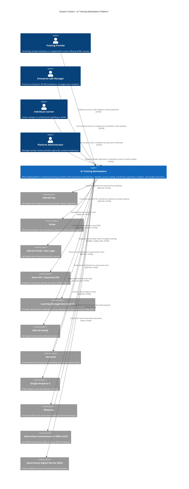

# C4 Context Diagram - AI Training Marketplace

## Document Information

| Field | Value |
|-------|-------|
| **Document ID** | ARC-001-DIAG-CONTEXT-v1.0 |
| **Project** | AI Training Marketplace (Project 001) |
| **Diagram Type** | C4 Context (Level 1) |
| **Classification** | OFFICIAL |
| **Version** | 1.0 |
| **Status** | DRAFT |
| **Date** | 2025-11-09 |
| **Owner** | Solution Architect |

## Purpose

This Context diagram shows the AI Training Marketplace system in its environment, illustrating:
- **System boundary**: What is the AI Training Marketplace platform
- **Users**: Three stakeholder groups (Training Providers, Enterprise Customers, Individual Learners)
- **External systems**: Payment processors, identity providers, LMS systems, government services
- **High-level interactions**: How users and external systems interact with the platform

**Audience**: Business stakeholders, executive sponsors, procurement teams, non-technical stakeholders

---

## C4 Context Diagram

**View this diagram**:
- GitHub: Renders automatically in markdown
- Online: https://mermaid.live (paste Mermaid code above)
- VS Code: Install Mermaid Preview extension

---

## System Boundary

### What is AI Training Marketplace?

**The Platform** (inside the boundary):
- Multi-sided marketplace connecting training providers with enterprises and individual learners
- Course catalog with search, discovery, and recommendation engine
- Provider onboarding, verification, and quality review workflows
- Enterprise customer portals with team management and analytics
- Individual learner accounts with course enrollment and progress tracking
- Payment processing and escrow for transactions
- Analytics dashboards for all stakeholder groups
- Quality assurance (ratings, reviews, completion tracking)
- Compliance management (UK GDPR, TCoP, WCAG 2.2 AA)

**What is NOT AI Training Marketplace** (outside the boundary):
- Payment processors (GOV.UK Pay, Stripe) - external services
- Identity providers (GOV.UK Verify, Azure AD) - external services
- Learning Management Systems (Moodle, Canvas, Blackboard) - provider-owned systems
- Email delivery (GOV.UK Notify, SendGrid) - external services
- Analytics platforms (Google Analytics, Mixpanel) - external services
- Regulatory bodies (ICO, GDS) - external oversight

---

## User Actors

### Training Provider
**Role**: Supply side of marketplace, publishes AI/ML training courses

**Key Responsibilities**:
- Create and publish course listings (title, description, syllabus, pricing)
- Set course pricing and volume discount structures
- Manage course availability and enrollment capacity
- Respond to learner reviews and feedback
- Track course performance analytics (enrollments, revenue, ratings)
- Receive payments (minus 15% platform commission)

**Volume**: Target 200+ active providers by Month 12

**Access**: Web portal, authenticated via email/password or OAuth

**Traceability**: SD-2 (Stakeholder Driver - Training Providers), G-1 (Goal - 200 providers by Month 12)

### Enterprise L&D Manager
**Role**: Demand side of marketplace, procures training for organizations

**Key Responsibilities**:
- Search and evaluate courses for team upskilling
- Procure bulk licenses (50-500 employee seats)
- Manage team enrollment and learning paths
- Monitor team progress and completion rates
- Generate compliance audit reports (UK GDPR, CPD)
- Manage subscription renewals and budget

**Volume**: Target 50+ enterprise customers by Month 12

**Access**: Web portal, authenticated via SSO (SAML/OAuth with Azure AD or GOV.UK Verify)

**Traceability**: SD-3 (Stakeholder Driver - Enterprise Customers), G-1 (Goal - 50 enterprises by Month 12)

### Individual Learner
**Role**: Demand side of marketplace, enrolls in courses for career advancement

**Key Responsibilities**:
- Search and discover relevant AI/ML courses
- Read reviews and ratings from past learners
- Enroll in courses (pay individually or via employer)
- Complete coursework and assessments
- Track learning progress across multiple courses
- Earn completion certificates
- Leave reviews and ratings for courses

**Volume**: Target 10,000 monthly enrollments by Month 24

**Access**: Web portal (mobile-responsive), authenticated via email/password or OAuth

**Traceability**: SD-4 (Stakeholder Driver - Individual Learners), O-1 (Outcome - 10K monthly enrollments)

### Platform Administrator
**Role**: Internal platform operations and quality assurance

**Key Responsibilities**:
- Review provider applications and verify credentials
- Moderate course content for quality and policy compliance
- Monitor platform health and performance metrics
- Respond to user support escalations
- Manage fraud detection and dispute resolution
- Generate operational reports (revenue, user growth, quality metrics)

**Volume**: 5-10 FTE platform operations team

**Access**: Admin portal with elevated permissions

**Traceability**: Internal stakeholder (not in external stakeholder analysis)

---

## External Systems

### GOV.UK Pay
**Type**: Payment Processor (Government)

**Purpose**: Process payments from UK public sector customers (government departments, NHS, local authorities)

**Integration Type**: REST API / HTTPS

**Data Exchanged**:
- **Outbound** (Platform → GOV.UK Pay): Payment requests (amount, description, return URL)
- **Inbound** (GOV.UK Pay → Platform): Payment confirmations, webhook notifications, refund confirmations

**Why External**: UK Government mandates GOV.UK Pay for public sector transactions (TCoP Point 10 - Cloud First)

**Traceability**: INT-001, NFR-C-002 (TCoP compliance)

### Stripe
**Type**: Payment Processor (Commercial)

**Purpose**:
- Process payments from commercial enterprise customers and individual learners
- Provider payouts (Stripe Connect for marketplace)
- Subscription billing for enterprise customers

**Integration Type**: REST API / HTTPS, Stripe.js for PCI-DSS compliant card tokenization

**Data Exchanged**:
- **Outbound** (Platform → Stripe): Payment intents, subscription requests, payout instructions
- **Inbound** (Stripe → Platform): Payment confirmations, webhook events (payment succeeded/failed), payout status

**Why External**: PCI-DSS Level 1 compliant payment processing (platform avoids handling raw card data)

**Traceability**: INT-002, NFR-SEC-005 (PCI-DSS compliance)

### GOV.UK Verify / One Login
**Type**: Identity Provider (Government)

**Purpose**: Authenticate government employees accessing the platform (for public sector enterprise customers)

**Integration Type**: SAML 2.0 / HTTPS

**Data Exchanged**:
- **Outbound** (Platform → GOV.UK Verify): Authentication requests (SAML SSO)
- **Inbound** (GOV.UK Verify → Platform): SAML assertions with user identity (email, name, organization)

**Why External**: UK Government identity federation standard for cross-government services

**Traceability**: INT-004, NFR-C-002 (TCoP compliance - Point 12: Identity Assurance)

### Azure AD / Corporate SSO
**Type**: Identity Provider (Enterprise)

**Purpose**: Authenticate employees from enterprise customers using their corporate identity providers

**Integration Type**: SAML 2.0, OAuth 2.0, OpenID Connect (OIDC) / HTTPS

**Data Exchanged**:
- **Outbound** (Platform → Azure AD): Authentication requests (SAML/OAuth)
- **Inbound** (Azure AD → Platform): Identity tokens with user attributes (email, name, department)

**Why External**: Enterprise customers require SSO for security and user experience (no separate platform login)

**Traceability**: INT-004, FR-022 (Enterprise SSO requirement)

### Learning Management Systems (LMS)
**Type**: Content Delivery Platform (Provider-Owned)

**Purpose**:
- Host course content (videos, documents, assessments)
- Track learner progress and completion
- Issue completion certificates

**Integration Type**:
- **SCORM 1.2/2004**: Package-based content integration
- **xAPI (Tin Can API)**: Experience tracking API for real-time progress updates

**Data Exchanged**:
- **Outbound** (Platform → LMS): Learner enrollment data, SSO tokens
- **Inbound** (LMS → Platform): Progress tracking events (xAPI statements), completion status, assessment scores

**Why External**: Training providers own their LMS infrastructure (Moodle, Canvas, Blackboard, proprietary systems)

**Traceability**: INT-003, FR-043 (Learning progress tracking)

### GOV.UK Notify
**Type**: Email Service (Government)

**Purpose**: Send email notifications to government users (enrollment confirmations, course reminders, certificates)

**Integration Type**: REST API / HTTPS

**Data Exchanged**:
- **Outbound** (Platform → GOV.UK Notify): Email requests (recipient, template ID, personalization variables)
- **Inbound** (GOV.UK Notify → Platform): Delivery status webhooks

**Why External**: UK Government service, free for public sector use, email deliverability optimized for .gov.uk domains

**Traceability**: INT-005, NFR-C-002 (TCoP compliance - Point 8: Share and Reuse)

### SendGrid
**Type**: Email Service (Commercial)

**Purpose**: Send email notifications to commercial users (marketing, transactional, support)

**Integration Type**: REST API / SMTP / HTTPS

**Data Exchanged**:
- **Outbound** (Platform → SendGrid): Email requests (recipient, content, templates)
- **Inbound** (SendGrid → Platform): Delivery status, bounce handling, click tracking

**Why External**: Commercial-grade email deliverability, marketing automation features

**Traceability**: INT-005

### Google Analytics 4
**Type**: Web Analytics

**Purpose**: Track website traffic, user journeys, conversion funnels, marketing attribution

**Integration Type**: JavaScript SDK (client-side tracking), Measurement Protocol API (server-side tracking)

**Data Exchanged**:
- **Outbound** (Platform → Google Analytics): Pageviews, events, user properties, e-commerce transactions

**Why External**: Industry-standard web analytics, marketing team requires Google Analytics

**Traceability**: INT-006, NFR-C-007 (GDPR compliance - cookie consent required)

### Mixpanel
**Type**: Product Analytics

**Purpose**: Track product usage, feature adoption, retention cohorts, A/B test analysis

**Integration Type**: REST API / HTTPS, JavaScript SDK

**Data Exchanged**:
- **Outbound** (Platform → Mixpanel): Product events (course search, enrollment, completion), user properties, revenue tracking

**Why External**: Product-focused analytics for conversion optimization and user behavior analysis

**Traceability**: INT-006

### Information Commissioner's Office (ICO)
**Type**: Regulatory Body (UK GDPR Enforcement)

**Purpose**:
- Receive Data Protection Impact Assessment (DPIA) if required
- Investigate data breaches and complaints
- Enforce UK GDPR and Data Protection Act 2018

**Integration Type**: Email, web portal (manual)

**Data Exchanged**:
- **Outbound** (Platform → ICO): DPIA submissions (if required), data breach notifications (72-hour deadline), responses to information requests
- **Inbound** (ICO → Platform): Audit requests, enforcement notices

**Why External**: UK statutory regulatory body for data protection

**Traceability**: SD-5 (Stakeholder Driver - ICO Compliance), G-3 (Goal - UK GDPR compliance by Month 6), O-3 (Outcome - Zero ICO enforcement actions)

### Government Digital Service (GDS)
**Type**: Regulatory Body (UK Government Technology Standards)

**Purpose**:
- Assess platform against Technology Code of Practice (TCoP) 13 points
- Assess platform against GDS Service Standard 14 points
- Approve platform for G-Cloud listing (procurement framework)

**Integration Type**: Email, web portal (manual submission)

**Data Exchanged**:
- **Outbound** (Platform → GDS): TCoP self-assessment, Service Standard assessment, architecture documentation
- **Inbound** (GDS → Platform): Assessment results, recommendations

**Why External**: UK Government authority for digital service standards

**Traceability**: SD-6 (Stakeholder Driver - GDS Compliance), G-3 (Goal - TCoP compliance by Month 6), O-3 (Outcome - £500K public sector revenue)

---

## Integration Summary

| External System | Integration Type | Protocol | Data Sensitivity | NFR Requirement | Traceability |
|-----------------|------------------|----------|------------------|-----------------|--------------|
| GOV.UK Pay | Payment Processor | REST API / HTTPS | HIGH (payment data) | <500ms response | INT-001 |
| Stripe | Payment Processor | REST API / Stripe.js | HIGH (payment data, PII) | <500ms response, PCI-DSS | INT-002 |
| GOV.UK Verify | Identity Provider | SAML 2.0 / HTTPS | MEDIUM (PII: name, email) | <2s SSO redirect | INT-004 |
| Azure AD | Identity Provider | SAML/OAuth/OIDC | MEDIUM (PII: name, email) | <2s SSO redirect | INT-004 |
| LMS (Various) | Content Platform | SCORM 1.2/2004, xAPI | MEDIUM (learner progress) | Real-time xAPI events | INT-003 |
| GOV.UK Notify | Email Service | REST API / HTTPS | LOW (email addresses) | Asynchronous | INT-005 |
| SendGrid | Email Service | REST API / SMTP | LOW (email addresses) | Asynchronous | INT-005 |
| Google Analytics 4 | Web Analytics | JavaScript SDK | LOW (anonymized user data) | Client-side | INT-006 |
| Mixpanel | Product Analytics | REST API / SDK | LOW (pseudonymized user data) | Asynchronous | INT-006 |
| ICO | Regulatory Body | Manual (email/portal) | HIGH (DPIA, breach reports) | 72-hour breach notification | NFR-C-001 |
| GDS | Regulatory Body | Manual (email/portal) | MEDIUM (architecture docs) | Quarterly assessments | NFR-C-002 |

**Total External Integrations**: 11 systems (6 automated APIs, 2 identity federation, 2 analytics, 2 regulatory manual)

---

## Requirements Coverage

### Business Requirements (BR)

| Requirement ID | Requirement Summary | Covered in Context Diagram |
|----------------|---------------------|----------------------------|
| BR-001 | Platform Liquidity - Provider Onboarding (200 providers) | ✅ Training Provider actor, platform system |
| BR-002 | Platform Liquidity - Enterprise Adoption (50 enterprises) | ✅ Enterprise Customer actor, platform system |
| BR-003 | Platform Liquidity - Learner Acquisition (10K monthly enrollments) | ✅ Individual Learner actor, platform system |
| BR-004 | Quality Assurance (4.2+ rating, 75% completion) | ⚠️ Partially (platform system, quality tracking not shown at context level) |
| BR-005 | Compliance - UK GDPR | ✅ ICO external system, DPIA submission |
| BR-006 | Compliance - GDS Service Standard | ✅ GDS external system, assessment process |
| BR-007 | Revenue - £2M ARR by Month 24 | ✅ Payment processors (GOV.UK Pay, Stripe) |

**Coverage**: 6/7 fully covered (86%), 1/7 partially covered (BR-004 - quality mechanisms internal to platform)

### Integration Requirements (INT)

| Requirement ID | Requirement Summary | Covered in Context Diagram |
|----------------|---------------------|----------------------------|
| INT-001 | GOV.UK Pay Integration | ✅ GOV.UK Pay external system |
| INT-002 | Stripe Payment Integration | ✅ Stripe external system |
| INT-003 | LMS Integration (SCORM/xAPI) | ✅ LMS external systems |
| INT-004 | Identity Federation (SAML, OAuth, OIDC) | ✅ GOV.UK Verify, Azure AD external systems |
| INT-005 | Email Service Integration | ✅ GOV.UK Notify, SendGrid external systems |
| INT-006 | Analytics Integration | ✅ Google Analytics 4, Mixpanel external systems |

**Coverage**: 6/6 fully covered (100%)

### Non-Functional Requirements (NFR) - Compliance

| Requirement ID | Requirement Summary | Covered in Context Diagram |
|----------------|---------------------|----------------------------|
| NFR-C-001 | UK GDPR Compliance | ✅ ICO external system |
| NFR-C-002 | TCoP Compliance | ✅ GDS external system, GOV.UK services (Pay, Notify, Verify) |
| NFR-C-003 | WCAG 2.2 AA Accessibility | ⚠️ Not shown at context level (internal platform capability) |
| NFR-C-004 | Cyber Essentials Plus | ⚠️ Not shown at context level (infrastructure security) |

**Coverage**: 2/4 fully covered (50%), 2/4 internal capabilities (WCAG, Cyber Essentials not visible at context level)

---

## Architecture Principles Alignment

| Principle | Alignment with Context Diagram |
|-----------|--------------------------------|
| **#1: Scalability and Elasticity** | ✅ Cloud-first approach implied (AWS infrastructure not shown at context level, visible in container diagram) |
| **#2: Resilience and Fault Tolerance** | ✅ Multiple payment processors (GOV.UK Pay, Stripe) provide redundancy |
| **#3: Multi-Tenancy and Data Isolation** | ✅ Multiple enterprise customers, individual learners, providers - multi-tenant architecture required |
| **#4: Interoperability and Open Standards** | ✅ SAML 2.0, OAuth 2.0, SCORM 1.2/2004, xAPI - all open standards |
| **#5: Security by Design** | ✅ External identity providers (GOV.UK Verify, Azure AD), PCI-DSS payment processors (Stripe) |
| **#6: Observability and Monitoring** | ✅ Analytics integrations (Google Analytics, Mixpanel) for user behavior tracking |
| **#8: Data Sovereignty and Residency** | ✅ GOV.UK Pay, GOV.UK Notify imply UK data residency for government users |
| **#10: Asynchronous Communication** | ✅ Email services (GOV.UK Notify, SendGrid) are asynchronous |

---

## Strategic Context

### Stakeholder Goals Supported

**G-1: Platform Liquidity**
- Context diagram shows three user groups (providers, enterprises, learners) creating multi-sided marketplace
- External systems enable each side (payment for providers, SSO for enterprises, LMS integration for learners)

**G-2: Quality & Engagement**
- Context diagram shows quality assurance as internal platform function (not detailed at this level)
- LMS integration enables progress tracking for completion rate metric

**G-3: Compliance**
- ICO and GDS external systems make compliance visible
- GOV.UK services (Pay, Notify, Verify) demonstrate TCoP compliance (Share & Reuse, Cloud First)

**G-4: Revenue (£2M ARR)**
- Payment processors (GOV.UK Pay, Stripe) enable revenue collection
- Enterprise customer actor represents bulk licensing revenue stream

### UK Government Compliance

**Technology Code of Practice (TCoP) Visible at Context Level**:
- **Point 5: Cloud First** - Implied through GOV.UK services and payment processors
- **Point 8: Share and Reuse** - GOV.UK Pay, GOV.UK Notify, GOV.UK Verify reused across government
- **Point 10: Define User Needs** - Three distinct user actors (provider, enterprise, learner) with different needs
- **Point 12: Identity Assurance** - GOV.UK Verify and Azure AD for federated identity

**GDS Service Standard Visible at Context Level**:
- **Point 1: Understand User Needs** - Three user personas explicitly shown
- **Point 5: Make Sure Everyone Can Use the Service** - WCAG 2.2 AA (not shown at context level, internal capability)
- **Point 13: Use and Contribute to Open Standards** - SAML 2.0, OAuth 2.0, SCORM, xAPI

---

## Next Steps

### Recommended Follow-On Diagrams

1. **Container Diagram** (`/arckit.diagram container`):
   - Show technical architecture (web app, API, database, cache, message queue)
   - Technology choices (Next.js, Node.js, Postgres, Redis, RabbitMQ)
   - AWS infrastructure (ECS, RDS, ElastiCache, S3)

2. **Component Diagram** (`/arckit.diagram component`):
   - Show internal components of API container (payment service, course catalog service, recommendation engine)
   - Detail business logic and data access layers

3. **Deployment Diagram** (`/arckit.diagram deployment`):
   - Show AWS cloud architecture (VPC, subnets, load balancers, auto-scaling groups)
   - Network topology and security zones
   - High availability and disaster recovery

4. **Sequence Diagram** (`/arckit.diagram sequence`):
   - Show payment flow (learner → platform → Stripe → provider payout)
   - Show SSO flow (enterprise user → platform → Azure AD → authenticated session)
   - Show LMS integration flow (enrollment → LMS progress → completion certificate)

5. **Data Flow Diagram** (`/arckit.diagram dataflow`):
   - Show PII handling (UK GDPR compliance)
   - Data residency (UK data centers for government users)
   - Data retention and deletion policies

### Recommended ArcKit Commands

- `/arckit.hld-review` - Review high-level design with container diagram validation
- `/arckit.traceability` - Validate requirements coverage (currently 86% BR, 100% INT)
- `/arckit.tcop` - Assess TCoP compliance (13 points) with deployment and data flow diagrams
- `/arckit.analyze` - Comprehensive governance quality check across all artifacts

---

## Appendix: Actor Interaction Patterns

### Pattern 1: Training Provider Revenue Flow

1. **Training Provider** publishes course on platform
2. **Individual Learner** or **Enterprise Customer** enrolls and pays
3. **Platform** processes payment via **Stripe** or **GOV.UK Pay**
4. **Platform** holds payment in escrow until course completion
5. **LMS** reports completion to **Platform** (xAPI event)
6. **Learner** receives certificate from **Platform**
7. **Platform** pays out to **Training Provider** (85% of course fee, 15% platform commission) via **Stripe Connect**

**Traceability**: Transaction T-1 (Provider Publishing), T-3 (Individual Enrollment), T-6 (Provider Payment) from Platform Design document

### Pattern 2: Enterprise Team Enrollment

1. **Enterprise L&D Manager** procures bulk licenses (50-500 seats) on platform
2. **Platform** authenticates manager via **Azure AD** (SSO)
3. **Platform** processes payment via **Stripe** (commercial) or **GOV.UK Pay** (government)
4. **Enterprise L&D Manager** provisions employees from CSV upload
5. **Platform** sends enrollment emails via **SendGrid** or **GOV.UK Notify**
6. **Enterprise Employees** (Individual Learners) access courses via **Azure AD** SSO
7. **LMS** reports progress to **Platform** (xAPI events)
8. **Enterprise L&D Manager** views team analytics on platform dashboard

**Traceability**: Transaction T-2 (Enterprise Bulk Purchase) from Platform Design document

### Pattern 3: Quality Assurance Loop

1. **Individual Learner** completes course
2. **LMS** reports completion to **Platform** (xAPI event)
3. **Platform** prompts **Learner** for review (rating, text feedback)
4. **Learner** submits review (verified - must complete >50% of course to review)
5. **Platform** updates **Training Provider** quality score (Completion 40% + Rating 40% + Outcomes 20%)
6. **Platform Administrator** monitors quality scores, de-lists providers with <3.5 rating for 2 consecutive quarters
7. **Platform** surfaces quality scores to **Enterprise Customers** and **Individual Learners** during course search

**Traceability**: Transaction T-4 (Quality Verification) from Platform Design document

---

**Generated by**: ArcKit `/arckit.diagram context` command
**Generated on**: 2025-11-09
**ArcKit Version**: 1.0
**Project**: AI Training Marketplace (Project 001)
**Model**: Claude Sonnet 4.5
**Document ID**: ARC-001-DIAG-CONTEXT-v1.0

**Linked Artifacts**:
- Requirements: `projects/001-ai-training-marketplace/requirements.md` (ARC-001-REQ-v1.0)
- Platform Design: `projects/001-ai-training-marketplace/platform-design.md` (ARC-001-PLATFORM-v1.0)
- Architecture Principles: `.arckit/memory/architecture-principles.md` (ARC-010-PRIN-v1.0)
- Stakeholder Drivers: `projects/001-ai-training-marketplace/stakeholder-drivers.md` (ARC-001-STKE-v1.0)
