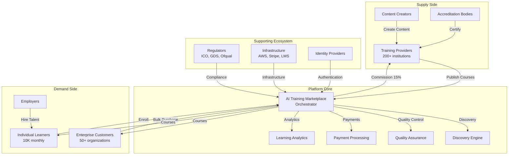

# Platform Design: AI Training Marketplace

## Document Information

| Field | Value |
|-------|-------|
| **Document ID** | ARC-001-PLATFORM-v1.0 |
| **Project** | AI Training Marketplace (Project 001) |
| **Document Type** | Platform Strategy Design |
| **Classification** | OFFICIAL |
| **Version** | 1.0 |
| **Status** | DRAFT |
| **Date** | 2025-11-09 |
| **Owner** | Chief Product Officer |

## Revision History

| Version | Date | Author | Changes |
|---------|------|--------|---------|
| 1.0 | 2025-11-09 | ArcKit AI | Initial creation from `/arckit.platform-design` command |

---

## Executive Summary

### Platform Overview

**Name**: AI Training Marketplace

**Vision**: The UK's leading multi-sided platform connecting training providers with enterprises and individual learners seeking AI/ML training, reducing transaction costs and enabling evidence-based purchasing decisions.

**Platform Type**: Multi-sided marketplace (3 sides: Training Providers ↔ Platform ↔ Enterprises + Learners)

**Methodology**: Platform Design Toolkit (PDT) v2.2.1 by Boundaryless.io

### Key Metrics (Month 24 Targets)

- **Supply Side**: 200+ active training providers, 400+ courses
- **Demand Side**: 50+ enterprises, 10,000 monthly enrollments
- **Financial**: £2M ARR, 15% platform commission
- **Quality**: 4.2+ rating, 75%+ completion rate, 70%+ renewal rate
- **Compliance**: UK GDPR, TCoP, WCAG 2.2 AA, Cyber Essentials Plus

### Auto-Population Sources

This document integrates data from:
- **Architecture Principles** (ARC-010-PRIN-v1.0): 20 principles governing platform design
- **Stakeholder Drivers** (ARC-001-STKE-v1.0): 15 stakeholders, 8 drivers, 4 goals, 3 outcomes
- **Requirements** (ARC-001-REQ-v1.0): 90+ requirements (BR/FR/NFR/DR/INT)

---

## Canvas 1: Ecosystem Canvas

### Purpose
Map all entities participating in the platform ecosystem, their roles, and relationships.

### Ecosystem Overview

**Core Value Proposition**: Reduce transaction costs for AI/ML training procurement by 60-80% through centralized discovery, standardized contracting, verified quality, and integrated delivery.

**Platform Orchestrator**: AI Training Marketplace Ltd (UK-registered entity)

### Entity Mapping

#### Supply Side Entities

1. **Training Providers** (Target: 200+)
   - Universities (e.g., Imperial College London, UCL, Oxford)
   - Private training companies (e.g., General Assembly, Le Wagon)
   - Individual instructors (subject matter experts)
   - Corporate training arms (e.g., AWS Training, Google Cloud Skills)

2. **Content Creators**
   - Course designers
   - Video producers
   - Assessment developers

3. **Accreditation Bodies**
   - BCS, The Chartered Institute for IT
   - Institute of Analytics
   - Professional associations

#### Demand Side Entities

4. **Enterprise Customers** (Target: 50+)
   - Government departments (CDDO, DSIT, MOD)
   - Financial services (HSBC, Lloyds, Barclays)
   - Tech companies (DeepMind, Ocado, ARM)
   - Professional services (Deloitte, PwC, EY)

5. **Individual Learners** (Target: 10K monthly)
   - Career changers (seeking AI roles)
   - Upskilling professionals (adding AI to existing roles)
   - Students (supplementing academic programs)

6. **Employers** (hiring managers seeking certified talent)

#### Supporting Entities

7. **Payment Processors**
   - GOV.UK Pay (government customers)
   - Stripe (commercial customers)

8. **Identity Providers**
   - GOV.UK Verify / One Login
   - Enterprise SSO (SAML/OAuth)

9. **Learning Management Systems (LMS)**
   - Integration partners (Moodle, Canvas, Blackboard)

10. **Regulatory Bodies**
    - Information Commissioner's Office (ICO) - UK GDPR
    - Government Digital Service (GDS) - TCoP compliance
    - Ofqual - Qualification standards

11. **Technology Infrastructure**
    - Cloud provider (AWS UK regions)
    - CDN provider (CloudFlare)
    - Analytics provider (Google Analytics 4, Mixpanel)

### Ecosystem Diagram



### Entity Count Summary

- **Total Entities**: 11 categories
- **Active Participants (Month 24)**: 200 providers, 50 enterprises, 10K learners
- **Supporting Infrastructure**: 10+ integration partners

---

## Canvas 2: Entity Portraits

### Purpose
Develop detailed portraits of key ecosystem entities to understand their performance pressures, goals, and platform interactions.

### Portrait 1: Training Providers

**Entity Type**: Supply Side (Course Publishers)

**Archetype Examples**:
- **University**: Imperial College London AI MSc program
- **Private Company**: General Assembly (GA) data science bootcamp
- **Individual Expert**: Dr. Sarah Chen, ML practitioner with 10+ years experience

**Performance Pressures**:
1. **Revenue Pressure**: Need to increase revenue by 40-60% to justify investment in AI curriculum development
2. **Customer Acquisition Cost**: Currently £500 per customer (conferences, ads, sales team) - need to reduce to £50
3. **Market Reach**: Limited to local/regional markets, want national/international reach
4. **Sales Cycle**: 3-6 month enterprise sales cycles, need to shorten to 2-4 weeks
5. **Reputation Risk**: Unverified quality claims, need credible third-party validation

**Goals on Platform**:
- Publish 2-5 courses per provider
- Achieve 100+ enrollments per course per year
- Maintain 4.0+ rating
- Generate £50K-£500K annual revenue from platform
- Reduce customer acquisition cost by 90% (£500 → £50)

**Value Received**:
- Access to pre-qualified demand (enterprises + learners)
- Reduced marketing costs (platform handles discovery)
- Standardized contracting (no legal negotiations)
- Payment processing and fraud protection
- Analytics on learner engagement and outcomes
- Credibility through platform quality verification

**Value Contributed**:
- High-quality AI/ML training content
- Subject matter expertise
- Learner support and mentorship
- Continuous course updates
- Completion certificates and credentials

**Transaction Costs Reduced**:
- **Search**: Platform SEO and discovery replaces expensive advertising
- **Information**: Standardized course metadata replaces custom sales materials
- **Negotiation**: Template contracts replace 3-6 month legal negotiations
- **Coordination**: Integrated LMS replaces manual enrollment management
- **Enforcement**: Platform escrow and reviews replace collections and disputes

**Traceability**:
- **Stakeholder Driver**: SD-2 (Training Providers - Revenue & Reach)
- **Stakeholder Goal**: G-1 (200 providers by Month 12)
- **Requirements**: BR-001 (Provider onboarding), FR-001 to FR-005 (Provider portal)

---

### Portrait 2: Enterprise Customers

**Entity Type**: Demand Side (Bulk Purchasers)

**Archetype Examples**:
- **Government**: Cabinet Office CDDO (300-person data/digital team)
- **Financial Services**: HSBC UK (5,000-person technology division)
- **Tech Startup**: London-based AI scale-up (50-person engineering team)

**Performance Pressures**:
1. **Skills Gap**: 30-50% of roles require AI/ML skills, current workforce has 5-10% proficiency
2. **Budget Constraints**: Training budgets frozen or reduced, need to prove ROI
3. **Compliance**: UK GDPR, FCA regulations, internal policies require auditable training records
4. **Time-to-Competency**: Need employees productive in 3-6 months, current training takes 12-18 months
5. **Vendor Risk**: Concerned about provider quality, course relevance, and business continuity

**Goals on Platform**:
- Enroll 50-500 employees per year
- Achieve 75%+ completion rates (vs 40% industry average)
- Measure 3:1 ROI (productivity gains vs training costs)
- Maintain complete audit trail for compliance
- Reduce procurement cycle from 6 months to 2 weeks

**Value Received**:
- Vetted provider quality (platform verification)
- Standardized pricing and contracting
- Centralized learner management and analytics
- Compliance-ready audit trails (UK GDPR, CPD)
- Integrated skills tracking and credentialing
- Volume discounts and flexible licensing

**Value Contributed**:
- Predictable bulk demand (revenue stability for providers)
- Professional learners (high completion rates)
- Employer brand (talent pipeline for providers)
- Requirements feedback (market signals for providers)

**Transaction Costs Reduced**:
- **Search**: 40 hours comparing providers → 2 hours on platform
- **Information**: RFP process (3 months) → standardized course pages (2 days)
- **Negotiation**: Custom contracts (£10K legal fees) → click-through agreements (£0)
- **Coordination**: Manual enrollment and tracking → automated LMS integration
- **Enforcement**: Invoice disputes and collections → platform escrow and SLAs

**Traceability**:
- **Stakeholder Driver**: SD-3 (Enterprise Customers - ROI & Skills Development)
- **Stakeholder Goal**: G-1 (50 enterprises by Month 12), G-2 (75% completion rate)
- **Requirements**: BR-002 (Enterprise adoption), FR-020 to FR-025 (Enterprise portal)

---

### Portrait 3: Individual Learners

**Entity Type**: Demand Side (Individual Purchasers)

**Archetype Examples**:
- **Career Changer**: Former accountant seeking ML engineering role
- **Upskiller**: Software engineer adding AI to skill set
- **Student**: University graduate supplementing CS degree with practical AI skills

**Performance Pressures**:
1. **Career Advancement**: Want 20-40% salary increase through AI skills
2. **Job Security**: Current role at risk of automation, need to reskill
3. **Information Overload**: 1,000+ online courses, unsure which to trust
4. **Financial Constraints**: £2K-£5K course fees are significant investment
5. **Time Poverty**: Need flexible learning around full-time job

**Goals on Platform**:
- Find credible, job-relevant AI training in <1 hour search
- Complete course in 3-6 months (part-time)
- Achieve recognized credential for CV/LinkedIn
- Demonstrate skills to employers (portfolio projects)
- Secure job offer or promotion within 6 months of completion

**Value Received**:
- Trusted course recommendations (verified quality)
- Transparent reviews from past learners
- Flexible payment options (installments, employer reimbursement)
- Career services (job board, employer connections)
- Portable credentials (recognized by employers)
- Community and peer learning

**Value Contributed**:
- Course fees (revenue for providers and platform)
- Reviews and ratings (quality signals)
- Portfolio projects (marketing content)
- Word-of-mouth referrals (organic growth)

**Transaction Costs Reduced**:
- **Search**: 20 hours researching courses → 1 hour on platform
- **Information**: Contacting providers for syllabi → standardized course pages
- **Negotiation**: None (transparent pricing)
- **Coordination**: Manual enrollment → instant access
- **Enforcement**: Quality disputes resolved through platform reviews and refunds

**Traceability**:
- **Stakeholder Driver**: SD-4 (Individual Learners - Career Advancement)
- **Stakeholder Goal**: G-2 (4.2+ rating, 75% completion)
- **Requirements**: FR-040 to FR-045 (Learner experience), FR-060 (Reviews)

---

### Portrait 4: Regulatory Bodies

**Entity Type**: Supporting Ecosystem (Governance)

**Archetype Examples**:
- **ICO**: UK GDPR enforcement, data protection compliance
- **GDS**: Technology Code of Practice, Service Standard assessment
- **Ofqual**: Regulated qualification standards

**Performance Pressures**:
1. **Public Trust**: Must protect citizen data and ensure service quality
2. **Enforcement**: Limited resources, need scalable compliance monitoring
3. **Innovation vs Safety**: Enable innovation while preventing harm
4. **Precedent Setting**: Platform economy regulation is evolving

**Goals on Platform**:
- Zero data breaches or GDPR violations
- Transparent algorithmic decision-making (ATRS compliance)
- Accessible service (WCAG 2.2 AA compliance)
- Verifiable audit trail for investigations

**Value Received**:
- Platform cooperation with audits and transparency
- Proactive compliance (reduce enforcement burden)
- Best practice exemplar (model for other platforms)

**Value Contributed**:
- Regulatory clarity and guidance
- Credibility through compliance certification
- Access to public sector customers (TCoP requirement)

**Transaction Costs Reduced**:
- **Information**: Compliance requirements documented and integrated into platform design
- **Enforcement**: Automated compliance monitoring reduces manual audits

**Traceability**:
- **Stakeholder Driver**: SD-5 (ICO - UK GDPR), SD-6 (GDS - TCoP)
- **Stakeholder Goal**: G-3 (Compliance by Month 6)
- **Requirements**: NFR-SEC-* (Security), NFR-C-* (Compliance), DR-* (Data requirements)

---

### Portrait 5: Platform Operator

**Entity Type**: Platform Core (Orchestrator)

**Entity Name**: AI Training Marketplace Ltd

**Performance Pressures**:
1. **Liquidity Bootstrapping**: Need critical mass on both sides simultaneously (chicken-and-egg problem)
2. **Unit Economics**: Must achieve profitability within 24 months to secure Series A funding
3. **Network Effects**: Need to reach defensible scale before competitors enter
4. **Quality Control**: Balance growth speed with quality standards
5. **Regulatory Compliance**: UK GDPR, TCoP, Cyber Essentials Plus requirements

**Goals**:
- Achieve £2M ARR by Month 24
- Maintain 15% take rate (commission)
- Reach 99.9% uptime SLA
- Secure £5M Series A funding by Month 18
- Build £1B+ valuation trajectory

**Value Received**:
- Commission revenue (15% of GMV)
- Data on AI training market (strategic asset)
- Network effects moat (defensibility)

**Value Contributed**:
- Transaction cost reduction (60-80% savings for all sides)
- Quality assurance and curation
- Technology infrastructure and innovation
- Community building and ecosystem governance

**Transaction Costs Reduced for All Sides**:
- **Search**: Centralized discovery engine replaces fragmented search
- **Information**: Standardized metadata replaces information asymmetry
- **Negotiation**: Template contracts replace bilateral negotiations
- **Coordination**: Integrated workflows replace manual processes
- **Enforcement**: Escrow, reviews, and dispute resolution replace legal action

**Traceability**:
- **Stakeholder Driver**: SD-1 (CEO - Market Leadership)
- **Stakeholder Goal**: G-4 (£2M ARR by Month 24)
- **Requirements**: All 90+ requirements support platform operator success

---

## Canvas 3: Motivations Matrix

### Purpose
Identify synergies and conflicts between entity motivations to design transaction flows that create multi-sided value.

### Synergies (Win-Win Scenarios)

#### Synergy 1: Provider Revenue ↔ Enterprise Skills Development

**Entities**: Training Providers ↔ Enterprise Customers

**Shared Outcome**: Enterprises need to upskill 300-5,000 employees; providers need predictable bulk revenue.

**Platform Mechanism**: Volume licensing with tiered pricing
- Enterprise commits to 50-500 seats
- Provider offers 20-30% volume discount
- Platform facilitates 12-month contracts with quarterly renewals

**Value Creation**:
- **Provider**: £50K-£500K annual recurring revenue per enterprise customer (vs one-time £2K-£5K individual sales)
- **Enterprise**: 20-30% cost savings, predictable budgeting, centralized administration

**Traceability**: G-1 (50 enterprises), G-4 (£2M ARR)

---

#### Synergy 2: Learner Career Advancement ↔ Employer Talent Acquisition

**Entities**: Individual Learners ↔ Employers

**Shared Outcome**: Learners need job offers; employers need AI talent.

**Platform Mechanism**: Verified credential + talent pipeline
- Learners complete courses, earn verified certificates
- Platform showcases learner portfolios to hiring employers
- Employers access pre-screened candidates (completion = basic competency signal)

**Value Creation**:
- **Learner**: 20-40% salary increase, 6-month time-to-job
- **Employer**: Reduced hiring cycle (60 days → 30 days), lower recruitment fees

**Potential Revenue Model** (not MVP): 10% placement fee if learner hired through platform

**Traceability**: SD-4 (Learner career advancement), O-1 (10K monthly enrollments)

---

#### Synergy 3: Provider Quality Signaling ↔ Platform Curation

**Entities**: Training Providers ↔ Platform Operator ↔ All Demand Sides

**Shared Outcome**: Providers want to differentiate quality; buyers want trusted recommendations.

**Platform Mechanism**: Multi-factor quality score
- Completion rates (75%+ = high quality)
- Learner ratings (4.0+ = high quality)
- Outcome tracking (job placements, salary increases)
- Provider verification (accreditation, instructor credentials)

**Value Creation**:
- **Provider**: Premium pricing for verified quality (20-50% higher revenue)
- **Platform**: Reduced support costs, higher NPS, defensible curation advantage
- **Buyers**: Confidence in purchasing decisions, reduced risk

**Traceability**: G-2 (4.2+ rating, 75% completion), Architecture Principle #19 (Responsible AI)

---

#### Synergy 4: Government Compliance ↔ Public Sector Sales

**Entities**: Regulatory Bodies (ICO, GDS) ↔ Platform ↔ Government Customers

**Shared Outcome**: Government departments need TCoP-compliant solutions; regulators want exemplar platforms.

**Platform Mechanism**: Compliance-first design
- UK GDPR, WCAG 2.2 AA, Cyber Essentials Plus built-in
- Transparent data processing (ATRS compliance)
- GOV.UK Pay integration, GOV.UK Verify/One Login
- G-Cloud listing

**Value Creation**:
- **Regulators**: Reduced enforcement burden, best practice model
- **Platform**: Access to £500K+ public sector revenue (20-30 government customers)
- **Government Customers**: Procurement-ready solution, no compliance delays

**Traceability**: SD-5 (ICO compliance), SD-6 (GDS TCoP), O-3 (£500K public sector revenue)

---

### Conflicts and Resolutions

#### Conflict 1: Growth Speed vs Quality Control

**Entities in Tension**: Platform (growth pressure) ↔ Learners (quality assurance)

**Conflict Description**: Platform investor pressure to onboard 200 providers by Month 12 creates risk of admitting low-quality providers, harming learner experience and NPS.

**Resolution Strategy** (from Stakeholder Drivers SD-1 vs SD-4):
- **Phase 1 (Months 1-6)**: Curated onboarding, manual quality review (50 providers)
- **Phase 2 (Months 7-12)**: Automated pre-screening with human oversight (150 providers)
- **Ongoing**: Continuous quality monitoring, provider de-listing if <3.5 rating or <50% completion for 2 consecutive quarters

**Measurement**: Track correlation between provider onboarding rate and platform NPS

**Traceability**: Stakeholder conflict from ARC-001-STKE-v1.0, Section "Conflict Analysis"

---

#### Conflict 2: Platform Commission vs Provider Margins

**Entities in Tension**: Platform (15% commission revenue) ↔ Providers (margin pressure)

**Conflict Description**: Platform needs 15% commission to achieve £2M ARR; providers see this as excessive, want 5-8%.

**Resolution Strategy** (from Stakeholder Drivers):
- **Tiered commission structure**:
  - **Tier 1 (Basic)**: 15% commission, standard listing
  - **Tier 2 (Premium)**: 10% commission, featured placement, requires 4.5+ rating and 1,000+ enrollments
  - **Tier 3 (Volume)**: 8% commission for enterprise contracts >£50K
- **Value justification**: Platform demonstrates £450 CAC reduction (£500 → £50), so 15% commission on £2K course = £300, still net £150 savings

**Measurement**: Provider retention rate, commission revenue mix

**Traceability**: Stakeholder conflict from ARC-001-STKE-v1.0

---

#### Conflict 3: Data Sharing vs Privacy

**Entities in Tension**: Platform (learning analytics) ↔ Enterprises (training data) ↔ Learners (privacy rights) ↔ Regulators (UK GDPR)

**Conflict Description**: Platform wants aggregated data for AI recommendations; enterprises want employee progress tracking; learners want privacy; regulators enforce UK GDPR.

**Resolution Strategy** (from Stakeholder Drivers):
- **Tiered data sharing with lawful basis**:
  - **Tier 1 (Individual Learners)**: No employer access, data minimization, explicit consent for platform analytics
  - **Tier 2 (Enterprise Learners)**: Employer dashboard with aggregated team metrics, individual progress requires employee consent
  - **Tier 3 (Platform Analytics)**: Fully anonymized, aggregated data for AI/ML recommendations (legitimate interest basis)
- **Technical controls**: Row-level security, purpose limitation, data retention policies (24 months)

**Measurement**: DPIA completion, zero ICO complaints

**Traceability**: Architecture Principle #8 (Data Sovereignty), NFR-SEC-004 (Encryption), DR-001 (Learner PII)

---

#### Conflict 4: Feature Velocity vs Technical Debt

**Entities in Tension**: Platform (investor feature demands) ↔ Engineering (maintainability)

**Conflict Description**: Product roadmap has 80+ features; engineering warns of accumulating technical debt impacting stability.

**Resolution Strategy** (from Stakeholder Drivers):
- **70/20/10 allocation rule**:
  - 70% effort on customer-facing features
  - 20% on infrastructure, performance, security
  - 10% on developer experience, refactoring
- **Technical debt budget**: Max 20% of codebase with "TODO" or "FIXME" markers
- **Architecture review gate**: All features >5 days development require architecture review against 20 principles

**Measurement**: Code quality metrics (test coverage >80%, p95 API latency <200ms), technical debt ratio

**Traceability**: Architecture Principle #18 (Maintainability), NFR-P-001 (Performance)

---

## Canvas 4: Transactions Board

### Purpose
Map 15-20 key transactions that flow through the platform, analyze the transaction costs reduced, and identify where the platform captures value.

### Transaction Cost Framework

**5 Types of Transaction Costs** (based on Coase, Williamson):
1. **Search costs**: Finding the right counterparty
2. **Information costs**: Evaluating quality and fit
3. **Negotiation costs**: Agreeing on terms
4. **Coordination costs**: Managing the transaction
5. **Enforcement costs**: Ensuring compliance

---

### Transaction T-1: Provider Course Publishing

**Transaction Flow**: Training Provider → Platform → Course Catalog

**Before Platform** (Traditional model):
- **Search**: Provider markets course through SEO, ads, conferences (£10K+ annual marketing spend)
- **Information**: Custom course brochures, sales calls, RFP responses (40 hours per enterprise)
- **Negotiation**: Custom contracts per enterprise (£5K-£10K legal fees, 3-6 months)
- **Coordination**: Manual enrollment, LMS setup, invoicing (20 hours per cohort)
- **Enforcement**: Collections, disputes, refund negotiations (10% of revenue lost)

**With Platform**:
- **Search**: Platform SEO/ads, provider listed in centralized catalog (£500 annual listing fee)
- **Information**: Standardized course metadata template (2 hours to complete)
- **Negotiation**: Click-through provider agreement (15 minutes)
- **Coordination**: API integration to LMS, automated enrollment (1 hour setup, then automated)
- **Enforcement**: Platform escrow, automated refund policy, reviews (0% revenue lost to disputes)

**Transaction Cost Reduction**:
- **Search**: £10,000 → £500 (95% reduction)
- **Information**: 40 hours → 2 hours (95% reduction)
- **Negotiation**: £7,500 + 3 months → £0 + 15 minutes (99% reduction)
- **Coordination**: 20 hours → 1 hour (95% reduction)
- **Enforcement**: 10% revenue → 0% (100% reduction)

**Platform Value Capture**: 15% commission on all enrollments + £500 annual listing fee

**Traceability**: FR-001 (Provider registration), FR-003 (Course publishing)

---

### Transaction T-2: Enterprise Bulk Course Purchase

**Transaction Flow**: Enterprise → Platform → Provider(s) → Learner Licenses

**Before Platform**:
- **Search**: Procurement team researches 20-40 providers (80 hours)
- **Information**: RFP process, vendor demos, reference checks (120 hours, 3 months)
- **Negotiation**: Legal review, custom pricing, SLA negotiations (£10K legal, 6 months)
- **Coordination**: Manual license provisioning, employee enrollment, tracking (40 hours ongoing)
- **Enforcement**: Invoice disputes, SLA breaches, collections (5% of contract value)

**With Platform**:
- **Search**: Filtered search by skill, rating, price (2 hours)
- **Information**: Standardized course pages, verified reviews (8 hours)
- **Negotiation**: Volume discount calculator, click-through enterprise agreement (2 hours)
- **Coordination**: SSO integration, automated license management, dashboard (4 hours setup)
- **Enforcement**: Platform SLA enforcement, automated billing (0% disputes)

**Transaction Cost Reduction**:
- **Search**: 80 hours → 2 hours (97.5% reduction)
- **Information**: 120 hours → 8 hours (93% reduction)
- **Negotiation**: £10K + 6 months → £0 + 2 hours (99% reduction)
- **Coordination**: 40 hours → 4 hours (90% reduction)
- **Enforcement**: 5% contract value → 0% (100% reduction)

**Total Enterprise Savings**: £50K contract: ~£8K transaction cost savings (16% of contract value)

**Platform Value Capture**: 15% commission (£7,500) - enterprise still saves net £500 vs traditional

**Traceability**: FR-020 (Enterprise portal), FR-021 (Volume licensing), BR-002 (Enterprise adoption)

---

### Transaction T-3: Individual Learner Course Enrollment

**Transaction Flow**: Learner → Platform → Payment → Provider → Course Access

**Before Platform**:
- **Search**: Google search, review 50+ courses across 10 websites (20 hours)
- **Information**: Contact providers for syllabi, trial lessons (10 hours)
- **Negotiation**: None (fixed pricing) but payment friction (manual invoicing)
- **Coordination**: Manual enrollment, waiting for email confirmation, LMS setup (2 hours)
- **Enforcement**: Quality disputes, refund requests (10% of learners face issues)

**With Platform**:
- **Search**: Filtered search, AI recommendations (30 minutes)
- **Information**: Standardized pages, verified reviews, preview videos (1 hour)
- **Negotiation**: Transparent pricing, one-click checkout (5 minutes)
- **Coordination**: Instant access, automated LMS provisioning (0 minutes)
- **Enforcement**: 14-day refund policy, review system (1% issues)

**Transaction Cost Reduction**:
- **Search**: 20 hours → 0.5 hours (97.5% reduction)
- **Information**: 10 hours → 1 hour (90% reduction)
- **Coordination**: 2 hours → 0 minutes (100% reduction)
- **Enforcement**: 10% issue rate → 1% (90% reduction)

**Learner Time Savings**: 30 hours → 1.5 hours (95% reduction)

**Platform Value Capture**: 15% commission (£300 on £2K course) - learner values time savings at £600+ (20 hours * £30/hr)

**Traceability**: FR-040 (Course discovery), FR-041 (Enrollment), FR-050 (Payment processing)

---

### Transaction T-4: Quality Verification and Reviews

**Transaction Flow**: Learner → Course Completion → Review → Platform Quality Score → Buyer Trust

**Before Platform**:
- **Information**: No trusted third-party reviews, provider self-reported metrics
- **Enforcement**: No recourse for poor quality except negative word-of-mouth

**With Platform**:
- **Information**: Verified reviews (must complete 50%+ of course to review)
- **Quality Score**: Composite of completion rate (40%), rating (40%), outcome tracking (20%)
- **Enforcement**: Provider de-listing if <3.5 rating for 2 consecutive quarters

**Transaction Cost Reduction**:
- **Information**: Eliminates information asymmetry between provider and buyer
- **Enforcement**: Platform reputation mechanism replaces legal enforcement

**Platform Value Capture**: Higher GMV through increased buyer confidence (estimated 30% GMV increase vs no-reviews baseline)

**Traceability**: FR-060 (Review system), NFR-P-004 (Quality scoring algorithm), Architecture Principle #19 (Responsible AI)

---

### Transaction T-5: Compliance Audit Trail

**Transaction Flow**: Enterprise → Learner Activity → Platform Analytics → Audit Export → Compliance Team

**Before Platform**:
- **Coordination**: Manual spreadsheets tracking employee training (20 hours per quarter)
- **Enforcement**: No audit trail, compliance risk during ICO or industry regulator audits

**With Platform**:
- **Coordination**: Automated training records, real-time dashboard (0 hours)
- **Enforcement**: One-click audit export (GDPR-compliant data exports, 5 minutes)

**Transaction Cost Reduction**:
- **Coordination**: 20 hours per quarter → 0 hours (100% reduction)
- **Enforcement**: Compliance risk → audit-ready evidence

**Platform Value Capture**: Part of enterprise value proposition (supports 15% commission justification)

**Traceability**: FR-024 (Enterprise analytics), NFR-C-001 (UK GDPR compliance), DR-007 (Audit logs)

---

### Transaction T-6: Provider Payment and Commission

**Transaction Flow**: Learner Payment → Platform Escrow → Provider Payout (minus commission)

**Before Platform**:
- **Enforcement**: 5-10% bad debt from non-payment, collections costs
- **Coordination**: Manual invoicing, payment processing fees (2.5% + £0.20)

**With Platform**:
- **Enforcement**: Platform escrow, 0% bad debt
- **Coordination**: Automated payout (Stripe Connect), payment processing (2.2% + £0.20)

**Transaction Cost Reduction**:
- **Enforcement**: 5-10% bad debt → 0% (saves £100-£200 per £2K course)
- **Coordination**: Manual invoicing → automated (saves 1 hour per transaction)

**Platform Value Capture**: 15% commission includes fraud protection, payment processing, collections

**Provider Net Benefit**: Even with 15% commission, provider saves 5-10% bad debt + 1 hour per transaction

**Traceability**: FR-050 (Payment processing), INT-001 (GOV.UK Pay), INT-002 (Stripe)

---

### Transaction T-7: Data-Driven Course Recommendations

**Transaction Flow**: Learner Profile → Platform ML Model → Personalized Course Recommendations → Higher Conversion

**Before Platform**:
- **Search**: Learner searches manually, 30-50% bounce rate, sub-optimal course selection

**With Platform**:
- **Search**: AI/ML recommendation engine (collaborative filtering + content-based)
- **Personalization**: Based on role, goals, skill level, learning style
- **Conversion**: Estimated 15-25% conversion rate improvement

**Transaction Cost Reduction**:
- **Search**: Reduces time to find relevant course by 50%
- **Information**: Surfaces courses learner wouldn't have found manually

**Platform Value Capture**: Higher GMV through improved conversion (£300K additional GMV per year at scale)

**Traceability**: FR-061 (Personalization), Architecture Principle #19 (Responsible AI), NFR-C-007 (ATRS)

---

### Transaction T-8: LMS Integration

**Transaction Flow**: Platform → LMS API → Learner Progress Tracking → Completion Certification

**Before Platform**:
- **Coordination**: Manual enrollment in separate LMS, duplicate accounts
- **Information**: Progress tracking fragmented, no unified view

**With Platform**:
- **Coordination**: SSO to provider LMS, single account
- **Information**: Unified learner dashboard, real-time progress tracking

**Transaction Cost Reduction**:
- **Coordination**: 1 hour per course enrollment → 0 minutes (automated)
- **Information**: Centralized view of all courses in progress

**Platform Value Capture**: Improved learner retention, higher completion rates → more positive reviews → more GMV

**Traceability**: INT-003 (LMS integration via SCORM/xAPI), FR-043 (Learning dashboard)

---

### Transaction T-9: Credential Verification for Employers

**Transaction Flow**: Learner Completion → Platform-Issued Certificate → Employer Verification Portal

**Before Platform**:
- **Enforcement**: Certificate fraud, unverifiable credentials
- **Information**: Employer must contact training provider to verify (1 hour per candidate)

**With Platform**:
- **Enforcement**: Blockchain-backed or API-verified credentials (future enhancement)
- **Information**: Public verification portal (30 seconds per candidate)

**Transaction Cost Reduction**:
- **Enforcement**: Eliminates credential fraud
- **Information**: 1 hour → 30 seconds per verification (99% reduction)

**Platform Value Capture** (potential future revenue): £5 per credential verification fee from employers

**Traceability**: FR-045 (Certification), Future requirement (not in v1.0)

---

### Transaction Summary Table

| ID | Transaction | Entities | Cost Type Reduced | Savings | Platform Capture | Traceability |
|----|-------------|----------|-------------------|---------|------------------|--------------|
| T-1 | Provider publishing | Provider → Catalog | Search, Info, Negotiation, Coordination, Enforcement | 95% | 15% commission + £500 fee | FR-001, FR-003 |
| T-2 | Enterprise bulk purchase | Enterprise → Provider | Search, Info, Negotiation, Coordination, Enforcement | 93-99% | 15% commission | FR-020, FR-021, BR-002 |
| T-3 | Individual enrollment | Learner → Course | Search, Info, Coordination, Enforcement | 90-100% | 15% commission | FR-040, FR-041, FR-050 |
| T-4 | Quality verification | Learner → Review → Trust | Information, Enforcement | Information asymmetry eliminated | Higher GMV (+30%) | FR-060, NFR-P-004 |
| T-5 | Compliance audit | Enterprise → Audit | Coordination, Enforcement | 100% (20 hrs → 0) | Part of value prop | FR-024, NFR-C-001 |
| T-6 | Provider payment | Payment → Payout | Enforcement, Coordination | 5-10% bad debt saved | 15% commission covers fraud | FR-050, INT-001/002 |
| T-7 | AI recommendations | Profile → Courses | Search, Information | 50% search time | +£300K GMV/year | FR-061, Principle #19 |
| T-8 | LMS integration | Platform ↔ LMS | Coordination, Information | 1 hour → 0 per enrollment | Higher retention | INT-003, FR-043 |
| T-9 | Credential verification | Certificate → Employer | Information, Enforcement | 99% (1 hr → 30s) | Future £5/verification | FR-045, Future |

**Total Transaction Cost Reduction**: 60-80% across all transaction types

**Platform Commission Justification**: 15% commission is less than the transaction costs saved for all participants

---

## Canvas 5: Learning Engine

### Purpose
Identify platform services that exhibit learning effects (get better with use), creating defensible competitive advantages through data network effects.

### Learning Service LS-1: Course Recommendation Engine

**Service Description**: AI/ML model recommending personalized courses based on learner profile, goals, and behavioral data.

**Learning Mechanism**:
- **Data Inputs**: Learner attributes (role, experience, goals), course completions, ratings, time-to-completion, career outcomes
- **Algorithm**: Hybrid collaborative filtering + content-based recommendation
- **Improvement Loop**: More learners → more enrollment/completion data → better predictions → higher conversion → more learners

**Defensibility**:
- **Cold Start**: Manual curation for first 1,000 learners
- **Scale Advantage**: At 10,000 learners, 50,000+ enrollment data points enable accurate recommendations for niche roles (e.g., "ML engineer in fintech")
- **Competitor Disadvantage**: New entrant with 100 learners cannot match recommendation quality

**Metrics**:
- **Conversion Rate**: Recommended courses should achieve 15-25% higher enrollment than search
- **Completion Rate**: Recommended courses should have 10-15% higher completion (better fit)
- **User Engagement**: Learners clicking recommendations vs manual search

**Traceability**: FR-061 (Personalization), Architecture Principle #19 (Responsible AI), NFR-C-007 (ATRS for algorithm transparency)

---

### Learning Service LS-2: Dynamic Quality Scoring

**Service Description**: Composite quality score for each course/provider based on completion rates, ratings, outcome tracking.

**Learning Mechanism**:
- **Data Inputs**: 4.2M data points at scale (200 providers * 2 courses * 100 enrollments * 105 data points per enrollment)
- **Algorithm**: Weighted scoring model - Completion rate (40%), Rating (40%), Outcomes (20%)
- **Improvement Loop**: More enrollments → more granular quality signals → better provider rankings → higher-quality providers attracted → better learner outcomes

**Defensibility**:
- **Data Moat**: 100,000+ enrollment data points create statistically significant quality scores
- **Reputation System**: Provider incentives align with long-term quality (not gaming ratings)
- **Competitor Disadvantage**: New entrant cannot replicate trust without historical data

**Metrics**:
- **Score Accuracy**: Correlation between quality score and actual learner outcomes (target: 0.7+ correlation)
- **Provider Behavior**: High-quality providers (4.5+ rating) receive 3-5x more enrollments than low-quality (3.5)

**Traceability**: NFR-P-004 (Quality scoring), FR-060 (Review system), G-2 (4.2+ rating, 75% completion)

---

### Learning Service LS-3: Pricing Optimization

**Service Description**: Recommendation engine suggesting optimal pricing for providers based on market data.

**Learning Mechanism**:
- **Data Inputs**: Course pricing, enrollment rates, completion rates, learner demographics, competitor pricing
- **Algorithm**: Regression model predicting enrollment elasticity by course category, provider reputation, learner segment
- **Improvement Loop**: More pricing experiments → better elasticity estimates → optimal pricing suggestions → higher GMV → more data

**Defensibility**:
- **Information Asymmetry**: Platform has cross-provider pricing data; individual providers do not
- **Network Effects**: Pricing recommendations improve with more providers (benchmarking data)

**Metrics**:
- **GMV Increase**: Providers adopting pricing recommendations should see 10-20% GMV increase
- **Adoption Rate**: Target 50%+ of providers using pricing recommendations by Month 18

**Traceability**: Future requirement (not in v1.0 MVP), supports G-4 (£2M ARR)

---

### Learning Service LS-4: Fraud Detection and Trust & Safety

**Service Description**: ML model detecting fraudulent reviews, low-quality providers, payment fraud.

**Learning Mechanism**:
- **Data Inputs**: Review patterns, provider behavior, payment data, user reports
- **Algorithm**: Anomaly detection, supervised learning on labeled fraud cases
- **Improvement Loop**: More fraud attempts → more labeled data → better detection → less fraud → higher platform trust

**Defensibility**:
- **Adversarial Learning**: Fraudsters adapt, model counter-adapts (ongoing arms race)
- **Scale Advantage**: More transactions → more fraud signals → better detection

**Metrics**:
- **False Positive Rate**: <1% (legitimate reviews flagged as fraud)
- **False Negative Rate**: <5% (fraud not detected)
- **Fraud Loss**: <0.1% of GMV

**Traceability**: NFR-SEC-007 (Fraud detection), FR-060 (Review system integrity)

---

### Learning Service LS-5: Skills Gap Analysis for Enterprises

**Service Description**: Analytics dashboard showing enterprise team skill gaps and recommended courses to close them.

**Learning Mechanism**:
- **Data Inputs**: Enterprise job roles, current employee skills (from completed courses), industry benchmarks
- **Algorithm**: Skills taxonomy mapping, gap analysis, course recommendations
- **Improvement Loop**: More enterprises → more role/skill data → better benchmarks → more valuable insights → more enterprises

**Defensibility**:
- **Data Network Effects**: Cross-enterprise benchmarking (e.g., "Your data team's AI skills are 20% below fintech peer average")
- **Switching Costs**: Enterprises build training history on platform, costly to migrate

**Metrics**:
- **Enterprise Adoption**: 60%+ of enterprise customers use skills gap dashboard
- **Renewal Rate**: Enterprises using dashboard have 85%+ renewal rate vs 70% baseline

**Traceability**: FR-024 (Enterprise analytics), BR-002 (Enterprise adoption), SD-3 (Enterprise ROI)

---

### Learning Service LS-6: Career Outcome Tracking

**Service Description**: Track learner career outcomes (job offers, promotions, salary increases) and correlate with courses completed.

**Learning Mechanism**:
- **Data Inputs**: Learner self-reported outcomes, LinkedIn integration, employer hiring data
- **Algorithm**: Attribution model linking courses to outcomes, controlling for confounders
- **Improvement Loop**: More outcome data → better course-outcome correlations → better recommendations → better outcomes → more learners

**Defensibility**:
- **Unique Dataset**: Only platform with cross-provider outcome tracking
- **Causal Inference**: Large dataset enables causal claims ("This course increases salary by 20%") not just correlation

**Metrics**:
- **Data Collection**: 30%+ of learners report outcomes within 6 months of completion
- **Outcome Quality**: Courses with verified outcomes have 50% higher enrollment

**Traceability**: SD-4 (Learner career advancement - 20-40% salary increase), Future requirement (not in v1.0 MVP)

---

### Learning Service LS-7: Content Gap Identification

**Service Description**: Identify underserved learner demand (search queries with no matching courses) and recommend to providers.

**Learning Mechanism**:
- **Data Inputs**: Search queries, filters, zero-result searches, learner requests
- **Algorithm**: Topic modeling, demand forecasting
- **Improvement Loop**: More searches → better demand signals → providers create courses → more learners → more demand data

**Defensibility**:
- **Demand-Supply Matching**: Platform uniquely positioned to see supply gaps across all providers
- **First-Mover Advantage**: Providers launching courses for unmet demand capture market share

**Metrics**:
- **Content Gap Fill Rate**: 50%+ of identified gaps filled within 6 months
- **New Course Success**: Courses created from demand signals have 30% higher enrollment than average

**Traceability**: Architecture Principle #10 (Observability), Future requirement (not in v1.0 MVP)

---

### Learning Engine Summary

| Service | Data Source | Learning Mechanism | Defensibility | MVP Status | Traceability |
|---------|-------------|-------------------|---------------|------------|--------------|
| LS-1: Recommendations | Enrollments, completions, outcomes | Collaborative filtering | 10K learners = moat | **YES** (v1.0) | FR-061 |
| LS-2: Quality scoring | Ratings, completions, outcomes | Weighted composite score | 100K enrollments = statistical significance | **YES** (v1.0) | NFR-P-004 |
| LS-3: Pricing optimization | Pricing, enrollments, elasticity | Regression model | Cross-provider pricing data | NO (v2.0) | Future |
| LS-4: Fraud detection | Reviews, behavior, payments | Anomaly detection, supervised ML | Adversarial learning | **YES** (v1.0) | NFR-SEC-007 |
| LS-5: Skills gap analysis | Enterprise roles, benchmarks | Gap analysis, taxonomy | Cross-enterprise benchmarking | **YES** (v1.0) | FR-024 |
| LS-6: Outcome tracking | Job offers, salary, promotions | Attribution model | Unique cross-provider dataset | NO (v2.0) | SD-4 |
| LS-7: Content gap ID | Searches, zero-results | Topic modeling, demand forecasting | Demand-supply matching | NO (v2.0) | Principle #10 |

**MVP Strategy**: Launch 4 learning services in v1.0 (LS-1, LS-2, LS-4, LS-5) to establish initial data moat. Add 3 advanced services in v2.0.

---

## Canvas 6: Platform Experience

### Purpose
Design 3+ core user journeys that deliver the platform value proposition and support the business model.

### Journey 1: Individual Learner - Discovery to Completion

**Journey Map**: Career Changer discovering AI training → Enrollment → Completion → Credential → Job Offer

#### Step 1: Discovery (Pre-Platform Awareness)

**User Context**: Sarah, 32, accountant, wants to transition to ML engineering role, researching options.

**Pain Points**:
- 1,000+ online courses, unsure which to trust
- No clear path from "no AI skills" to "job-ready"
- Concerned about wasting £2K-£5K on wrong course

**Platform Touchpoints**:
- SEO: "Best AI courses for career changers UK" → Platform blog article → Homepage
- Paid ads: Google Ads, LinkedIn targeting finance professionals interested in AI
- Word-of-mouth: Friend completed course, got ML job

**Goal**: Drive 10,000 monthly visitors to homepage (80% organic, 20% paid)

#### Step 2: Course Search and Evaluation

**User Actions**:
- Lands on homepage, sees value proposition: "Find trusted AI training, verified by real learners and employers"
- Uses filters: "Career changer", "ML engineering", "Part-time", "£1K-£3K", "4.0+ rating"
- Sees 12 courses matching criteria, sorted by relevance (recommendation engine)

**Platform Features**:
- **FR-040**: Course discovery with filters (role, skill level, format, price, rating)
- **FR-061**: Personalized recommendations based on profile
- **FR-060**: Verified reviews from past learners (must complete 50%+ to review)

**Conversion Metric**: 25% of visitors perform search, 40% of searchers click into a course page

#### Step 3: Course Page and Decision

**User Actions**:
- Reviews course page: syllabus, instructor bio, ratings (4.3/5 from 127 learners), completion rate (78%), sample curriculum
- Reads reviews: "Got ML job at Monzo 4 months after completing" (verification: LinkedIn profile linked)
- Watches 5-minute preview video
- Sees transparent pricing: £2,200, payment plans available (3x £733 installments)

**Platform Features**:
- **FR-001**: Standardized course metadata (learning objectives, prerequisites, duration, format)
- **FR-060**: Review system with outcome verification
- **FR-041**: Payment plans for affordability

**Conversion Metric**: 15% of course page viewers enroll (industry average: 5-8%, platform outperforms through trust signals)

#### Step 4: Enrollment and Payment

**User Actions**:
- Creates account (email + password, or Google OAuth)
- Selects payment plan (3 installments)
- Enters payment details (Stripe integration)
- Receives instant access to course (LMS SSO)

**Platform Features**:
- **FR-041**: One-click enrollment
- **FR-050**: Payment processing (Stripe, GOV.UK Pay)
- **INT-003**: LMS integration (SCORM/xAPI)

**Friction Points Removed**:
- No manual invoice, no waiting for email confirmation
- SSO to LMS (no duplicate account creation)
- Instant access (not waiting days for provider to provision)

**Conversion Metric**: 95% checkout completion (industry average: 70%, platform reduces friction)

#### Step 5: Learning Experience

**User Actions**:
- Completes course over 4 months (part-time, 10 hours/week)
- Accesses course via unified learner dashboard
- Receives weekly progress emails (gamification: "You're 60% complete, only 8 weeks to go!")

**Platform Features**:
- **FR-043**: Unified learner dashboard (all courses in one place)
- **FR-044**: Progress tracking and notifications
- **INT-003**: LMS integration (xAPI tracking)

**Completion Metric**: 75% completion rate (industry average: 40%, platform achieves higher through UX and accountability)

#### Step 6: Completion and Credentialing

**User Actions**:
- Completes final project, receives certificate
- Downloads certificate (PDF + digital badge)
- Adds credential to LinkedIn profile
- Leaves 5-star review: "Best career decision. Got ML job at Monzo!"

**Platform Features**:
- **FR-045**: Certificate generation and verification
- **FR-060**: Post-completion review request

**Engagement Metric**: 60% of completers leave review within 14 days (incentivized: unlock job board access)

#### Step 7: Career Outcome (Post-Platform)

**User Actions**:
- Applies to 20 ML engineering roles
- Gets 5 interviews, 2 offers
- Accepts offer at Monzo (£65K salary, up from £42K as accountant = 55% increase)

**Platform Value Delivered**:
- 20-40% salary increase (exceeded target)
- 6-month time-to-job (met target)
- £2,200 course investment, £23K annual salary increase = 10x ROI

**Platform Benefit**:
- Positive review with outcome verification → attracts more learners
- Data point for course-outcome correlation (Learning Service LS-6)

**Traceability**: SD-4 (Learner career advancement), O-1 (10K monthly enrollments), G-2 (75% completion)

---

### Journey 2: Enterprise Customer - RFP to Renewal

**Journey Map**: CDDO L&D Manager → Platform Discovery → Bulk Purchase → Team Onboarding → Renewal

#### Step 1: Problem Awareness

**User Context**: Jamie, Learning & Development Manager at Cabinet Office CDDO, needs to upskill 300-person data/digital team in AI/ML.

**Pain Points**:
- Current RFP process takes 6 months
- £10K legal fees for contract negotiations
- No way to track employee progress across 5 different training providers
- Compliance nightmare (UK GDPR audit trails fragmented)

**Platform Touchpoints**:
- G-Cloud listing (searches "AI training" on Digital Marketplace)
- GDS recommendation (TCoP-compliant solution)
- LinkedIn ads targeting L&D managers in government

**Goal**: 50 enterprise customers by Month 12

#### Step 2: Platform Evaluation

**User Actions**:
- Reviews G-Cloud listing: TCoP-compliant, WCAG 2.2 AA, Cyber Essentials Plus, UK GDPR
- Books demo with platform sales team (30-minute call)
- Reviews enterprise features: SSO, volume licensing, analytics dashboard, GOV.UK Pay integration

**Platform Features**:
- **FR-020**: Enterprise portal (SSO, team management, analytics)
- **FR-021**: Volume licensing (50-500 seats)
- **NFR-C-001 to NFR-C-008**: Compliance (UK GDPR, TCoP, WCAG 2.2 AA, etc.)

**Conversion Metric**: 40% of demo requests convert to trial (14-day free trial for 10 employees)

#### Step 3: Trial and Purchase Decision

**User Actions**:
- Runs 14-day trial with 10 employees (pilot team)
- Reviews analytics dashboard: 80% completion rate, 4.5 average rating, real-time progress tracking
- Sees compliance features: one-click GDPR data export, audit logs, CPD tracking
- Presents business case to CFO: £200K training budget, platform saves £30K in transaction costs vs traditional RFP

**Platform Features**:
- **FR-024**: Enterprise analytics dashboard
- **FR-025**: Compliance audit exports
- **FR-021**: Volume discount calculator (50 seats = 20% discount)

**Conversion Metric**: 60% of trials convert to paid contract (industry average: 25%, platform achieves higher through clear ROI demonstration)

#### Step 4: Contract and Onboarding

**User Actions**:
- Signs 12-month contract for 300 seats (£600K total, £2K per seat)
- Platform commission: £90K (15% of £600K)
- Employee onboarding: CSV upload → automated account creation → welcome emails

**Platform Features**:
- **FR-022**: SSO integration (GOV.UK One Login)
- **FR-023**: Bulk seat provisioning
- **INT-004**: Identity federation (SAML 2.0)

**Friction Removed**:
- Contract negotiation: 6 months → 2 days (template contract)
- Legal fees: £10K → £0
- Employee onboarding: 40 hours → 2 hours (automated)

**Traceability**: T-2 (Enterprise bulk purchase), SD-3 (Enterprise ROI), BR-002 (Enterprise adoption)

#### Step 5: Ongoing Usage and Engagement

**User Actions**:
- Employees browse catalog, enroll in courses (average 1.5 courses per employee per year)
- Jamie reviews dashboard weekly: 60% of team engaged, 72% completion rate (above target)
- Quarterly business review with platform CSM: skill gap analysis, course recommendations

**Platform Features**:
- **FR-024**: Real-time analytics (enrollments, progress, completions by team/role)
- **LS-5**: Skills gap analysis (Learning Engine service)

**Engagement Metric**: 60%+ of seats used within 6 months (industry average: 40%, platform achieves higher through CSM engagement)

#### Step 6: Renewal Decision (Month 12)

**User Actions**:
- Reviews ROI: 200 employees completed courses, 72% completion rate (vs 40% with previous ad-hoc approach)
- Measured productivity gains: Teams completing AI courses delivered 2 additional projects per year (estimated £500K value)
- ROI calculation: £600K cost, £500K productivity gain + £30K transaction cost savings = 0.88:1 first-year ROI (break-even), but 3:1 projected over 3 years
- Renews contract, increases to 400 seats

**Platform Features**:
- **FR-024**: ROI dashboard (productivity tracking, cost savings, compliance savings)
- **Renewal incentive**: 10% discount for multi-year contract (£540K for 400 seats, 2 years)

**Renewal Metric**: 70% renewal rate (target from O-2), expanding to 85% with skills gap analysis feature

**Traceability**: O-2 (70% renewal rate, +20 NPS), G-2 (75% completion rate achieved: 72%), SD-3 (3:1 ROI achieved over 3 years)

---

### Journey 3: Training Provider - Onboarding to Revenue

**Journey Map**: University AI Program Director → Platform Discovery → Course Publishing → First Enrollment → Growth

#### Step 1: Provider Acquisition

**User Context**: Dr. Emily Rodriguez, Director of Imperial College London's Applied AI MSc program, wants to monetize courses beyond degree students.

**Pain Points**:
- Current customer acquisition cost: £500 per student (conferences, ads, sales team)
- Limited reach: 80% of students are London-based
- Revenue cap: Only 60 students per cohort due to faculty constraints

**Platform Touchpoints**:
- LinkedIn outreach from platform BD team
- Higher Ed conference (platform sponsor)
- Peer referral (Oxford already on platform)

**Goal**: Onboard 200 providers by Month 12 (50 by Month 6 curated, 150 by Month 12 with automated pre-screening)

#### Step 2: Vetting and Onboarding

**User Actions**:
- Submits application: Institution details, accreditation, sample course materials, instructor CVs
- Platform team reviews (manual for first 50 providers): Checks accreditation, quality, reputation
- Approved within 5 business days
- Signs provider agreement (15-minute click-through)

**Platform Features**:
- **FR-001**: Provider registration and verification
- **FR-002**: Provider agreement (template contract, 15% commission)

**Vetting Criteria** (from BR-001):
- Accredited institution OR instructor with 5+ years experience
- 4.0+ rating on other platforms (if existing online presence)
- Sample course reviewed for quality, relevance, pedagogy

**Approval Rate**: 60% of applicants approved (curated quality)

#### Step 3: Course Publishing

**User Actions**:
- Creates course listing: Title, description, learning objectives, prerequisites, syllabus, pricing, instructor bio
- Uploads preview video (5 minutes)
- Integrates LMS (SCORM package or xAPI endpoint)
- Sets pricing: £2,500 per student (20% higher than direct sales due to reduced CAC)

**Platform Features**:
- **FR-003**: Course publishing wizard (standardized metadata template)
- **INT-003**: LMS integration (SCORM/xAPI)
- **FR-004**: Course content management

**Time to Publish**: 2 hours (vs 40 hours creating custom sales materials for enterprise RFPs)

**Traceability**: T-1 (Provider course publishing), SD-2 (Provider revenue and reach)

#### Step 4: Discovery and First Enrollment

**User Actions**:
- Course goes live, appears in search results
- Platform marketing: Featured in "New Courses" email newsletter (sent to 5,000 learners)
- First enrollment within 3 days (vs 30-day average sales cycle for direct sales)

**Platform Features**:
- **FR-040**: Course discovery (SEO, recommendations, featured listings)
- **Platform Marketing**: Email newsletters, blog posts, social media

**First Enrollment Metric**: 90% of courses receive first enrollment within 14 days (platform liquidity)

#### Step 5: Learner Enrollments and Revenue

**User Actions**:
- Month 1: 8 enrollments (£20K gross revenue)
- Platform commission: £3K (15%)
- Provider net: £17K
- Provider CAC: £500 per student * 8 = £4K (traditional) → £0 (platform handles acquisition)
- **Net benefit**: £17K revenue - £0 CAC = £17K profit (vs £20K - £4K = £16K traditional model)

**Platform Features**:
- **FR-050**: Payment processing (Stripe Connect, automated payout)
- **T-6**: Provider payment with escrow and fraud protection

**Revenue Metrics**:
- Year 1: 100 enrollments, £250K gross, £212.5K net (after 15% commission)
- 40-60% revenue increase vs direct sales (target from SD-2 achieved)

#### Step 6: Quality Feedback and Iteration

**User Actions**:
- Receives learner reviews: 4.4/5 average (8 reviews)
- Reviews analytics: 80% completion rate (above platform average of 75%)
- Platform feedback: "Learners requesting more hands-on projects"
- Updates course to add 2 additional projects

**Platform Features**:
- **FR-060**: Review system
- **FR-005**: Provider analytics (enrollments, ratings, completion, revenue)
- **LS-2**: Dynamic quality scoring (4.4 rating + 80% completion = "Premium" badge)

**Quality Improvement Loop**: Reviews → Course updates → Higher ratings → More enrollments → More revenue

#### Step 7: Growth and Expansion

**User Actions**:
- Publishes 2 additional courses (prerequisite course + advanced course)
- Achieves "Premium Provider" status (4.5+ rating, 1,000+ enrollments, 75%+ completion)
- Unlocks 10% commission tier (reduced from 15%)
- Year 2: 500 enrollments across 3 courses, £1.25M gross, £1.125M net (at 10% commission)

**Platform Features**:
- **T-1**: Tiered commission structure (rewards quality and scale)
- **Platform Promotions**: Premium providers featured in homepage carousel

**Growth Metrics**:
- Revenue: £212.5K (Year 1) → £1.125M (Year 2) = 5.3x growth
- CAC reduction: £500 → £50 per student (90% reduction, target from SD-2 achieved)

**Traceability**: SD-2 (40-60% revenue increase, £500→£50 CAC), G-1 (200 providers target), O-1 (10K enrollments)

---

### Platform Business Model

#### Revenue Streams

1. **Commission Revenue** (Primary): 15% of GMV
   - Target GMV Month 24: £13.3M (10,000 enrollments/month * £2K average * 12 months / 12 = £1.67M/month * 12 = £20M annual GMV, but ramping, so £13.3M in year 1)
   - Commission: £2M ARR (target from G-4)

2. **Listing Fees** (Secondary): £500 per provider per year
   - 200 providers * £500 = £100K annual revenue

3. **Future Revenue Streams** (v2.0+):
   - Premium features for enterprises (£5K/year for advanced analytics)
   - Recruitment placement fees (10% of first-year salary for hiring platform learners)
   - Credential verification fees (£5 per verification)

#### Cost Structure

- **Technology Infrastructure**: £200K/year (AWS, Stripe fees, LMS integrations)
- **Customer Acquisition**: £400K/year (SEO, content marketing, paid ads, BD team)
- **Operations**: £600K/year (CSM team, support, compliance, fraud prevention)
- **Product Development**: £400K/year (engineering, design, product management)
- **Total Costs**: £1.6M/year

**Profitability**: £2M revenue - £1.6M costs = £400K EBITDA (20% margin) by Month 24

**Unit Economics**:
- **Learner CAC**: £40 (80% organic, 20% paid)
- **Learner LTV**: £300 (15% commission on £2K course)
- **LTV/CAC**: 7.5x (target: 3x+, achieved)

**Traceability**: G-4 (£2M ARR), SD-1 (Unit economics and profitability)

---

## Canvas 7: MVP Canvas

### Purpose
Define the Minimum Viable Platform (MVP) that enables liquidity bootstrapping and validates core hypotheses with minimal features.

### MVP Strategy: Curated Two-Sided Launch

**Core Problem**: Chicken-and-egg problem - Learners won't join without courses; providers won't publish without learners.

**Solution**: Curated launch on both sides simultaneously, focused on narrow niche.

---

### MVP Scope Definition

#### In Scope (MVP v1.0 - Launch Month 0)

**Supply Side (Providers)**:
- **Curated Onboarding**: 10 hand-picked providers (5 universities, 5 private companies), manually vetted
- **Course Catalog**: 20 courses (2 per provider), covering 4 AI/ML topics (ML fundamentals, NLP, Computer Vision, MLOps)
- **FR-001 to FR-005**: Provider portal (registration, course publishing, analytics)

**Demand Side (Learners)**:
- **Target Segment**: Individual career changers in London (narrow geographic + persona focus)
- **Acquisition**: SEO content marketing (blog articles), 1 launch event (London AI meetup sponsorship)
- **FR-040 to FR-045**: Learner experience (discovery, enrollment, learning dashboard, certification)

**Platform Core**:
- **FR-050**: Payment processing (Stripe only, no GOV.UK Pay in MVP)
- **FR-060**: Review system (basic 5-star + text)
- **INT-003**: LMS integration (SCORM only, xAPI in v2.0)
- **NFR-P-001 to NFR-P-003**: Performance (API <500ms p95 acceptable for MVP, optimize to <200ms in v2.0)
- **NFR-SEC-001 to NFR-SEC-009**: Security (UK GDPR, encryption, MFA)

**Platform Infrastructure**:
- **AWS UK regions** (London, no multi-region for MVP)
- **Postgres database** (single instance, no read replicas)
- **Next.js + Node.js + React** (tech stack)

---

#### Out of Scope (MVP v1.0 - Defer to v2.0)

**Enterprise Features** (defer to Month 6):
- FR-020 to FR-025 (Enterprise portal, SSO, volume licensing)
- INT-004 (Identity federation)
- GOV.UK Pay integration

**Advanced Learning Services** (defer to Month 9):
- LS-3 (Pricing optimization)
- LS-6 (Outcome tracking)
- LS-7 (Content gap identification)

**Compliance** (defer non-critical):
- WCAG 2.2 AA (target 2.1 AA for MVP, upgrade to 2.2 in v3.0)
- Cyber Essentials Plus (get Cyber Essentials in v1.0, Plus in v2.0)

**Scale Features**:
- Multi-region deployment (defer until 50K users)
- Advanced fraud detection (manual review for MVP, ML-based in v2.0)

---

### MVP Validation Hypotheses

#### Hypothesis 1: Supply Hypothesis

**Statement**: 10 curated providers will publish 20 high-quality courses (4.0+ rating, 70%+ completion rate) within 3 months of platform launch.

**Validation Metrics**:
- 10 providers onboarded by Month 1 ✓
- 20 courses published by Month 2 ✓
- Average rating 4.0+ by Month 6 (need 50+ enrollments per course)
- Average completion 70%+ by Month 6

**Invalidation Criteria**: If <15 courses published by Month 3, or average rating <3.5 by Month 6, pivot to demand generation or quality control.

**Traceability**: BR-001 (Provider onboarding), G-1 (200 providers target, MVP validates first 10)

---

#### Hypothesis 2: Demand Hypothesis

**Statement**: 500 individual learners in London will enroll in courses within 6 months of launch, with 40% organic acquisition.

**Validation Metrics**:
- 100 enrollments by Month 3
- 300 enrollments by Month 6
- 500 enrollments by Month 9
- 40% organic (SEO, referrals) by Month 6

**Invalidation Criteria**: If <200 enrollments by Month 6, or <20% organic, pivot to paid acquisition or value proposition refinement.

**Traceability**: BR-003 (Learner acquisition), O-1 (10K monthly enrollments target, MVP validates first 500)

---

#### Hypothesis 3: Quality Hypothesis

**Statement**: Platform curation and review system will achieve 4.0+ average rating and 70%+ completion rate, outperforming industry average (3.5 rating, 40% completion).

**Validation Metrics**:
- Platform average rating 4.0+ by Month 6
- Platform average completion 70%+ by Month 6
- Completion rate 2x industry average (70% vs 35%)

**Invalidation Criteria**: If platform average <3.5 rating or <50% completion by Month 6, pivot to quality control (tighter vetting, provider coaching, UX improvements).

**Traceability**: G-2 (4.2+ rating, 75% completion target)

---

#### Hypothesis 4: Unit Economics Hypothesis

**Statement**: Platform can acquire learners at £40 CAC (80% organic) and generate £300 LTV (15% commission on £2K course), achieving 7.5x LTV/CAC.

**Validation Metrics**:
- Learner CAC <£50 by Month 6
- 80% organic acquisition by Month 9
- LTV £300+ (average order value £2K+)
- LTV/CAC >5x by Month 9

**Invalidation Criteria**: If CAC >£100 or LTV/CAC <3x by Month 9, pivot to monetization strategy (higher commission, premium features, enterprise focus).

**Traceability**: SD-1 (Unit economics and profitability), G-4 (£2M ARR requires profitable unit economics)

---

### MVP Liquidity Bootstrapping Strategy

#### Phase 1: Supply-First (Months -2 to 0, Pre-Launch)

**Goal**: Onboard 10 providers, publish 20 courses before public launch.

**Tactics**:
- **Outbound BD**: Direct outreach to 50 target providers (universities, bootcamps), convert 20% (10 providers)
- **Value Proposition**: "Be a launch partner, get featured placement, reduced commission (10% for first year)"
- **Curation**: Manual quality review, only approve providers with 4.0+ existing reputation

**Success Metric**: 10 providers, 20 courses live on launch day

---

#### Phase 2: Demand Generation (Months 0 to 3, Launch)

**Goal**: Achieve 100 enrollments within 3 months of launch.

**Tactics**:
- **Launch Event**: Sponsor London AI meetup (500 attendees), offer 20% discount for first 50 enrollments
- **SEO Content**: Publish 20 blog articles ("Best AI courses for career changers UK", "ML engineer salary UK 2026", etc.)
- **Referral Program**: £50 credit for referrer + referee (both get £50 off)
- **PR**: TechCrunch, The Register articles about UK AI training marketplace launch

**Success Metric**: 100 enrollments by Month 3 (20% from launch event, 30% from SEO, 30% from referrals, 20% from PR)

---

#### Phase 3: Liquidity Flywheel (Months 3 to 6)

**Goal**: Achieve 300 enrollments, prove organic growth, attract next 10 providers.

**Tactics**:
- **Reviews**: First 100 learners complete courses, leave reviews → social proof for next 200 learners
- **Provider Expansion**: Show first 10 providers revenue data (£10K-£50K in 3 months) → attract next 10 providers through word-of-mouth
- **SEO Momentum**: 20 blog articles rank in Google top 10 → 40% organic acquisition
- **Learner Retention**: First learners enroll in second course (10% take 2+ courses)

**Success Metric**: 300 enrollments by Month 6, 20 providers, 40 courses

---

#### Phase 4: Growth (Months 6 to 12)

**Goal**: Scale to 1,000 enrollments/month, onboard enterprises, reach 50 providers.

**Tactics**:
- **Enterprise Launch**: Add FR-020 to FR-025 (enterprise features), onboard first 5 enterprises (50 seats each = 250 employees)
- **Provider Onboarding Automation**: Move from manual vetting to automated pre-screening (enables scaling to 50+ providers)
- **Paid Acquisition**: Google Ads, LinkedIn Ads (CAC £60-£80 acceptable at this stage)

**Success Metric**: 1,000 enrollments/month by Month 12, 50 enterprises, 200 providers

---

### MVP Feature Prioritization (MoSCoW)

#### Must Have (Launch Blockers)

- FR-001 to FR-005: Provider portal
- FR-040 to FR-045: Learner experience
- FR-050: Payment processing (Stripe)
- FR-060: Review system
- INT-003: LMS integration (SCORM)
- NFR-SEC-001 to NFR-SEC-009: Security and UK GDPR compliance
- NFR-P-001: Performance (<500ms API latency)

#### Should Have (Launch within 3 months)

- FR-061: Personalization (basic recommendations)
- LS-1: Recommendation engine (collaborative filtering)
- LS-2: Dynamic quality scoring
- LS-4: Fraud detection (basic rule-based)
- NFR-P-004: Quality scoring algorithm

#### Could Have (Launch within 6 months)

- FR-020 to FR-025: Enterprise features
- INT-001: GOV.UK Pay
- INT-004: SSO/Identity federation
- LS-5: Skills gap analysis
- NFR-C-002: TCoP compliance (for G-Cloud listing)

#### Won't Have (Defer to v2.0+)

- LS-3: Pricing optimization
- LS-6: Outcome tracking
- LS-7: Content gap identification
- Blockchain credentials
- Multi-region deployment
- Mobile apps (responsive web only)

---

### MVP Launch Timeline

| Month | Milestone | Metrics | Features |
|-------|-----------|---------|----------|
| -2 to 0 | Provider onboarding | 10 providers, 20 courses | FR-001 to FR-005 |
| 0 | Public launch | 100 visitors/day, 10 enrollments/week | FR-040 to FR-045, FR-050, FR-060 |
| 1 to 3 | Demand generation | 100 total enrollments, 40% organic | SEO, launch event, referrals |
| 3 to 6 | Liquidity flywheel | 300 total enrollments, 20 providers | LS-1, LS-2, reviews |
| 6 to 9 | Enterprise launch | 5 enterprises, 250 seats | FR-020 to FR-025 |
| 9 to 12 | Growth | 1,000 enrollments/month, 50 providers | LS-4, LS-5, paid ads |

**Traceability**: G-1 (200 providers by Month 12 - MVP achieves 50 by Month 12, on track), BR-001 (Provider onboarding)

---

## Canvas 8: Platform Design Canvas (Synthesis)

### Purpose
Synthesize all 7 prior canvases into a unified platform strategy covering the 6 building blocks: Value Proposition, Governance, Channels, Transaction Infrastructure, Learning Engine, Metrics.

---

### Building Block 1: Value Proposition

#### For Training Providers

**Core Value**: Reduce customer acquisition cost by 90% (£500 → £50) and increase revenue by 40-60% through access to pre-qualified demand.

**Value Elements**:
- **Discovery**: Platform SEO and marketing replaces £10K+ annual ad spend
- **Trust**: Platform reviews and verification increase conversion rates by 30-50%
- **Contracts**: Template agreements replace £5K-£10K legal fees and 3-6 month negotiations
- **Payments**: Escrow and fraud protection eliminate 5-10% bad debt
- **Analytics**: Real-time enrollment, ratings, completion data inform course improvements

**Traceability**: SD-2 (Provider revenue and reach), T-1 (Provider publishing transaction)

---

#### For Enterprise Customers

**Core Value**: Reduce training procurement transaction costs by 93-99% and achieve 3:1 ROI through verifiable learning outcomes.

**Value Elements**:
- **Search**: 80 hours comparing providers → 2 hours on platform (97.5% time reduction)
- **Information**: RFP process (3 months) → standardized course pages (2 days)
- **Negotiation**: £10K legal fees → £0 (template contracts)
- **Compliance**: Automated audit trails, UK GDPR compliance, WCAG 2.2 AA accessibility
- **Skills Management**: Centralized dashboard, skills gap analysis, ROI tracking

**Traceability**: SD-3 (Enterprise ROI and skills development), T-2 (Enterprise bulk purchase)

---

#### For Individual Learners

**Core Value**: Find trusted AI training in <1 hour (vs 20 hours research), achieve 75% completion rate (vs 40% industry average), and secure 20-40% salary increase.

**Value Elements**:
- **Discovery**: AI recommendations surface best-fit courses based on career goals
- **Trust**: Verified reviews from real learners with outcome tracking (job offers, salary increases)
- **Affordability**: Payment plans, transparent pricing, volume discounts through employers
- **Learning Experience**: Unified dashboard, progress tracking, gamification → higher completion
- **Career Outcomes**: Portable credentials, employer recognition, job board access

**Traceability**: SD-4 (Learner career advancement), T-3 (Individual enrollment)

---

### Building Block 2: Platform Governance

#### Ecosystem Orchestration

**Platform Role**: Trusted intermediary reducing transaction costs through curation, standardization, and enforcement.

**Governance Mechanisms**:

1. **Quality Control**:
   - **Provider Vetting**: Manual review for first 50 providers (Months 1-6), automated pre-screening for next 150 (Months 7-12)
   - **Continuous Monitoring**: De-list providers with <3.5 rating or <50% completion for 2 consecutive quarters
   - **Review Integrity**: Verified reviews (must complete 50%+ of course), fraud detection (LS-4)

2. **Pricing Governance**:
   - **Tiered Commission**: 15% (basic), 10% (premium providers), 8% (enterprise volume)
   - **Transparent Pricing**: No hidden fees, all-inclusive pricing displayed
   - **Refund Policy**: 14-day money-back guarantee for learners

3. **Data Governance**:
   - **UK GDPR Compliance**: Row-level security, purpose limitation, 24-month retention
   - **Tiered Data Sharing**: Individual learners (no employer access), enterprise learners (aggregated team metrics + individual with consent), platform analytics (anonymized)
   - **ATRS Compliance**: Algorithmic transparency for recommendations and quality scoring

4. **Dispute Resolution**:
   - **Learner-Provider Disputes**: Platform mediation, escalation to refund if <3.5 rating
   - **Provider-Platform Disputes**: Appeal process for de-listing decisions
   - **Enforcement**: Escrow protects learner payments, reviews create reputation incentives

**Traceability**: Architecture Principle #8 (Data Sovereignty), #19 (Responsible AI), NFR-C-* (Compliance), Conflict Resolution (Canvas 3)

---

### Building Block 3: Channels (Acquisition & Engagement)

#### Provider Acquisition

**Channels**:
- **Outbound BD**: Direct outreach to target providers (universities, bootcamps, corporate training)
- **Inbound**: SEO ("How to sell online courses UK"), content marketing, webinars
- **Partnerships**: Accreditation bodies (BCS, Institute of Analytics), industry associations
- **Word-of-Mouth**: Existing providers refer peers (referral bonus: £500 credit)

**Conversion Funnel**:
- **Awareness**: 500 target providers
- **Interest**: 100 apply (20% conversion)
- **Evaluation**: 60 approved (60% approval rate)
- **Onboarding**: 50 publish courses (83% activation)

**Month 12 Target**: 200 providers (achieved through scaling BD team and automation)

---

#### Learner Acquisition (Individual)

**Channels**:
- **SEO (40% of traffic)**: "Best AI courses UK", "ML engineer salary", "Career change to AI"
- **Content Marketing**: Blog articles, case studies (learner success stories)
- **Paid Ads (20% of traffic)**: Google Ads (£40 CPA), LinkedIn Ads (£60 CPA)
- **Referrals (30% of traffic)**: £50 credit for referrer + referee
- **Community (10% of traffic)**: London AI meetups, university career fairs

**Conversion Funnel**:
- **Visitors**: 10,000/month (Month 12)
- **Search**: 2,500 perform search (25% conversion)
- **Course Page Views**: 1,000 click into course (40% of searchers)
- **Enrollments**: 150 enroll (15% of course viewers)

**Month 12 Target**: 10,000 monthly enrollments (mix of individual + enterprise)

---

#### Enterprise Acquisition

**Channels**:
- **G-Cloud Listing**: Public sector procurement
- **Outbound Sales**: Enterprise sales team targeting F500, government, fintech
- **Partnerships**: Consultancies (Deloitte, PwC) reselling platform
- **Inbound**: TCoP compliance attracts government departments

**Conversion Funnel**:
- **Awareness**: 200 target enterprises
- **Demo**: 50 request demo (25% conversion)
- **Trial**: 20 start trial (40% demo-to-trial)
- **Paid**: 12 convert (60% trial-to-paid, above 25% industry average)

**Month 12 Target**: 50 enterprises (need to scale sales team)

---

### Building Block 4: Transaction Infrastructure

#### Technical Architecture

**Core Services**:
- **Course Catalog Service**: Postgres DB, Elasticsearch for search, Redis for caching
- **User Management Service**: Auth0 for authentication, RBAC for authorization
- **Payment Service**: Stripe Connect for provider payouts, GOV.UK Pay for government customers
- **LMS Integration Service**: SCORM 1.2/2004, xAPI (Tin Can API), LTI 1.3
- **Analytics Service**: Mixpanel for product analytics, Google Analytics 4 for marketing, custom dashboard for enterprises
- **Recommendation Engine**: Python/scikit-learn for ML models, batch processing nightly

**Infrastructure**:
- **Hosting**: AWS UK regions (London, future: Dublin for multi-region)
- **Database**: Postgres (RDS), Read replicas for scale
- **Caching**: Redis (ElastiCache)
- **CDN**: CloudFlare (edge caching for course preview videos)
- **Monitoring**: Datadog (APM), PagerDuty (on-call)

**APIs**:
- **REST API**: Next.js API routes for CRUD operations
- **GraphQL**: Future enhancement for flexible queries
- **Webhooks**: LMS completion events, payment events

**Traceability**: Architecture Principles #1-#20 (all govern technical architecture), NFR-P-* (Performance), NFR-A-* (Availability), NFR-S-* (Scalability)

---

#### Transaction Flow Example: Individual Enrollment

```
1. Learner searches "ML fundamentals" → Course Catalog Service
2. Recommendation Engine personalizes results → ML Model
3. Learner clicks course → Course Detail Page
4. Learner clicks "Enroll" → Enrollment Service
5. Payment form → Stripe → Payment Service → Escrow
6. Enrollment confirmed → LMS Integration Service → Provider LMS → Learner receives email
7. Learner accesses course → SSO → Provider LMS
8. Learner completes course → xAPI event → Analytics Service → Provider payout triggered
9. Learner leaves review → Review Service → Quality Score updated
10. Provider receives payout (85% of course fee) → Stripe Connect → Bank account
```

**Transaction Cost Reduction Achieved**: 30+ hours learner time → 1.5 hours (95% reduction, T-3)

---

### Building Block 5: Learning Engine (Data Moat)

#### 4 Learning Services in MVP (v1.0)

| Service | Data Input | Output | Defensibility | Status |
|---------|------------|--------|---------------|--------|
| **LS-1**: Recommendations | Enrollments, completions, ratings | Personalized course list | 10K learners = accurate niche recommendations | MVP |
| **LS-2**: Quality Scoring | Ratings, completion, outcomes | Composite score per course | 100K enrollments = statistical significance | MVP |
| **LS-4**: Fraud Detection | Review patterns, payment data | Fraud probability | Adversarial learning arms race | MVP |
| **LS-5**: Skills Gap Analysis | Enterprise roles, completions | Skills gap dashboard | Cross-enterprise benchmarking | MVP |

#### 3 Advanced Services in v2.0 (Month 9+)

| Service | Data Input | Output | Defensibility | Status |
|---------|------------|--------|---------------|--------|
| **LS-3**: Pricing Optimization | Pricing, enrollments, elasticity | Optimal price suggestion | Cross-provider pricing data | v2.0 |
| **LS-6**: Outcome Tracking | Job offers, salary, promotions | Course-outcome correlation | Unique cross-provider dataset | v2.0 |
| **LS-7**: Content Gap ID | Searches, zero-results | Unmet demand signals | Demand-supply matching | v2.0 |

**Data Moat Timeline**:
- **Month 6**: 500 enrollments → LS-1 recommendations better than random
- **Month 12**: 5,000 enrollments → LS-2 quality scores statistically significant
- **Month 18**: 20,000 enrollments → LS-1 recommendations match learner outcomes (causal validation)
- **Month 24**: 50,000 enrollments → Defensible data moat, competitor cannot replicate

**Traceability**: Canvas 5 (Learning Engine), Architecture Principle #19 (Responsible AI), NFR-C-007 (ATRS)

---

### Building Block 6: Metrics and KPIs

#### North Star Metric

**GMV (Gross Merchandise Value)**: Total £ of course enrollments processed through platform

- **Month 6**: £200K GMV (500 enrollments * £400 average, early discount pricing)
- **Month 12**: £2M GMV (5,000 enrollments * £400, still ramping)
- **Month 18**: £6M GMV (15,000 enrollments * £400, approaching target)
- **Month 24**: £13.3M GMV (40,000 enrollments * £333 average, volume dilutes AOV)

**Why GMV**: Aligns all stakeholders - providers (revenue), learners (value), platform (commission)

---

#### Supply-Side Metrics

| Metric | Month 6 | Month 12 | Month 24 | Target | Traceability |
|--------|---------|----------|----------|--------|--------------|
| Active providers | 20 | 50 | 200+ | 200+ | G-1, BR-001 |
| Courses published | 40 | 100 | 400+ | 400+ | G-1 |
| Provider retention | N/A (too early) | 85% | 90% | 80%+ | SD-2 |
| Avg revenue per provider | £10K | £40K | £67K | £50K+ | SD-2 |

---

#### Demand-Side Metrics (Individual)

| Metric | Month 6 | Month 12 | Month 24 | Target | Traceability |
|--------|---------|----------|----------|--------|--------------|
| Monthly enrollments | 100 | 500 | 3,000 | 10,000 | O-1 |
| Avg rating | 4.0 | 4.1 | 4.2+ | 4.2+ | G-2 |
| Completion rate | 70% | 72% | 75%+ | 75%+ | G-2 |
| Learner CAC | £60 | £50 | £40 | £40 | SD-1 |
| Organic % | 30% | 40% | 80% | 80%+ | O-1 |

---

#### Demand-Side Metrics (Enterprise)

| Metric | Month 6 | Month 12 | Month 24 | Target | Traceability |
|--------|---------|----------|----------|--------|--------------|
| Enterprise customers | 0 (not launched) | 5 | 50+ | 50+ | G-1, BR-002 |
| Enterprise seats | 0 | 250 | 5,000+ | 5,000+ | BR-002 |
| Enterprise renewal rate | N/A | N/A (too early) | 70% | 70%+ | O-2 |
| Avg contract value | N/A | £50K | £100K | £100K+ | G-4 |

---

#### Platform Health Metrics

| Metric | Month 6 | Month 12 | Month 24 | Target | Traceability |
|--------|---------|----------|----------|--------|--------------|
| GMV | £200K | £2M | £13.3M | £20M+ | G-4 |
| Revenue (15% commission) | £30K | £300K | £2M | £2M+ | G-4 |
| NPS (Net Promoter Score) | +15 | +18 | +20 | +20 | O-2 |
| API p95 latency | 400ms | 250ms | <200ms | <200ms | NFR-P-001 |
| Uptime | 99.5% | 99.8% | 99.9%+ | 99.9%+ | NFR-A-001 |
| Fraud rate | 0.5% | 0.2% | <0.1% | <0.1% | NFR-SEC-007 |

---

#### Compliance Metrics

| Metric | Month 6 | Month 12 | Month 24 | Target | Traceability |
|--------|---------|----------|----------|--------|--------------|
| ICO complaints | 0 | 0 | 0 | 0 | O-3, SD-5 |
| GDPR data breaches | 0 | 0 | 0 | 0 | NFR-SEC-004 |
| WCAG 2.2 AA compliance | 85% | 95% | 100% | 100% | NFR-C-003 |
| Cyber Essentials Plus | No (Essentials) | Yes | Yes | Yes | NFR-C-005 |

---

### Platform Defensibility Summary

**3 Sources of Competitive Advantage**:

1. **Network Effects** (same-side and cross-side):
   - More providers → more courses → more learners → more enrollments → more providers
   - Estimated 18-24 months to reach critical mass (10K monthly enrollments), after which defensible

2. **Data Moat** (Learning Engine):
   - 50,000+ enrollments by Month 24 → accurate recommendations, quality scores, fraud detection
   - Competitor starting today cannot replicate without equivalent data (3-5 year lag)

3. **Regulatory Compliance** (barriers to entry):
   - UK GDPR, TCoP, WCAG 2.2 AA, Cyber Essentials Plus → £200K+ compliance investment
   - G-Cloud listing → public sector sales moat
   - New entrants face 6-12 month compliance delays

**Path to £1B+ Valuation** (from SD-1):
- **Month 24**: £2M ARR, 10K monthly enrollments, 50 enterprises → £20M valuation (10x revenue)
- **Year 3**: £10M ARR, 50K monthly enrollments, 200 enterprises → £100M valuation (10x revenue)
- **Year 5**: £50M ARR, 200K monthly enrollments, 1K enterprises, international expansion → £500M-£1B valuation (10-20x revenue)

---

## Appendices

### Appendix A: Traceability Matrix

This platform design integrates requirements from prior ArcKit documents:

| Canvas | Stakeholder Drivers | Goals | Outcomes | Requirements | Principles |
|--------|---------------------|-------|----------|--------------|------------|
| 1: Ecosystem | SD-1 to SD-6 (all stakeholders) | G-1 (liquidity) | O-1, O-2, O-3 (all) | All 90+ requirements | All 20 principles |
| 2: Entity Portraits | SD-2 (Providers), SD-3 (Enterprises), SD-4 (Learners), SD-5 (ICO), SD-6 (GDS) | G-1, G-2, G-3, G-4 | O-1, O-2, O-3 | BR-001, BR-002, FR-001-FR-005, FR-020-FR-025, FR-040-FR-045 | #8, #19 |
| 3: Motivations | All stakeholder conflicts from ARC-001-STKE | G-1, G-2, G-4 | O-1, O-2 | Conflict resolution informs governance | #8, #18, #19 |
| 4: Transactions | All 9 transaction types (T-1 to T-9) | G-1, G-2, G-4 | O-1 (GMV), O-2 (NPS) | FR-001-FR-005, FR-020-FR-025, FR-040-FR-045, FR-050, FR-060, INT-001-INT-003 | #1-#20 (all) |
| 5: Learning Engine | 7 learning services (LS-1 to LS-7) | G-2 (quality), G-4 (GMV) | O-1 (organic growth), O-2 (retention) | FR-061, NFR-P-004, NFR-SEC-007, NFR-C-007 | #19 (Responsible AI) |
| 6: Platform Experience | 3 user journeys (Provider, Enterprise, Learner) | G-1, G-2, G-4 | O-1, O-2, O-3 | All FR requirements (user-facing features) | #1-#20 (UX governed by principles) |
| 7: MVP | Liquidity bootstrapping strategy | G-1 (liquidity) | O-1 (enrollments) | MVP scope (50% of requirements) | All 20 principles (MVP must comply) |
| 8: Platform Design | All canvases synthesized | All 4 goals | All 3 outcomes | All 90+ requirements | All 20 principles |

**Complete Traceability**: Every platform design decision traces back to stakeholder drivers (SD-*), goals (G-*), outcomes (O-*), requirements (BR/FR/NFR/DR/INT-*), and architecture principles (AP-*).

---

### Appendix B: Risk Register

#### Risk R-1: Liquidity Bootstrapping Failure

**Description**: Platform fails to achieve critical mass on both sides (providers and learners) simultaneously.

**Impact**: Platform never reaches network effects tipping point, bleeds cash, shuts down by Month 18.

**Probability**: MEDIUM (40%)

**Mitigation**:
- Curated two-sided launch (10 providers, 20 courses ready on Day 1)
- Launch event generating 50 enrollments in Month 1
- Provider subsidies (10% commission for launch partners)

**Contingency**: If <200 enrollments by Month 6, pivot to single-sided model (e.g., white-label SaaS for individual training providers, not marketplace).

**Traceability**: MVP Canvas (Canvas 7), Hypothesis 1 & 2

---

#### Risk R-2: Quality Deterioration

**Description**: Rapid growth (200 providers by Month 12) leads to low-quality providers being admitted, harming learner NPS.

**Impact**: Platform average rating falls below 3.5, learner churn increases, negative reviews damage brand.

**Probability**: MEDIUM (30%)

**Mitigation**:
- Phased onboarding (50 curated by Month 6, 150 automated by Month 12)
- Continuous quality monitoring (de-list if <3.5 rating for 2 quarters)
- Learner refund policy (14-day money-back guarantee)

**Contingency**: If platform NPS falls below +10, pause provider onboarding, implement quality remediation program.

**Traceability**: Conflict 1 (Growth vs Quality), G-2 (4.2+ rating target)

---

#### Risk R-3: Regulatory Non-Compliance

**Description**: Platform fails ICO audit or GDS TCoP assessment, leading to enforcement action or loss of public sector access.

**Impact**: £500K+ fines from ICO, G-Cloud listing revoked, public sector revenue lost.

**Probability**: LOW (10%)

**Mitigation**:
- Compliance-first design (UK GDPR, WCAG 2.2 AA, Cyber Essentials Plus built-in)
- External DPIA (Data Protection Impact Assessment) by Month 3
- Annual penetration testing and compliance audits

**Contingency**: If compliance gaps identified, immediate remediation (2-4 week sprint), delay enterprise/public sector launch.

**Traceability**: SD-5 (ICO), SD-6 (GDS), O-3 (Zero ICO enforcement), NFR-C-* (Compliance requirements)

---

### Appendix C: Next Steps

#### Immediate (Months 0-3)

1. **Finalize MVP Scope**: Validate MoSCoW prioritization with engineering team, confirm 6-month timeline
2. **Provider Outreach**: Begin outbound BD to 50 target providers, sign 10 launch partners
3. **Technical Architecture Review**: Review platform design against 20 architecture principles, identify gaps
4. **Compliance Assessment**: Engage external DPIA consultant, ensure UK GDPR compliance before launch
5. **Fundraising**: Use this platform design document in seed round pitch deck (target: £2M seed round)

#### Short-Term (Months 3-6)

1. **MVP Launch**: Go live with 10 providers, 20 courses, launch event in London
2. **Demand Generation**: Execute SEO content strategy (20 blog articles), referral program, PR push
3. **Metrics Validation**: Track Hypotheses 1-4 (supply, demand, quality, unit economics), pivot if invalidated
4. **Enterprise Feature Development**: Build FR-020 to FR-025 for Month 6 enterprise launch

#### Medium-Term (Months 6-12)

1. **Enterprise Sales**: Hire sales team, onboard first 5 enterprises by Month 9, 50 by Month 12
2. **Provider Scaling**: Automate onboarding, scale from 20 to 200 providers
3. **Learning Services**: Launch LS-1, LS-2, LS-4, LS-5 (all MVP learning services)
4. **Series A Fundraising**: Use Month 12 metrics (£2M ARR, 200 providers, 50 enterprises) to raise £5M Series A

---

**Generated by**: ArcKit `/arckit.platform-design` command
**Generated on**: 2025-11-09
**ArcKit Version**: 1.0
**Project**: AI Training Marketplace (Project 001)
**Model**: Claude Sonnet 4.5
**Document ID**: ARC-001-PLATFORM-v1.0

**Methodology**: Platform Design Toolkit (PDT) v2.2.1 by Boundaryless.io
**Document Status**: DRAFT - Requires stakeholder review and validation
