# Project Plan: AI Training Marketplace

## Document Control

| Field | Value |
|-------|-------|
| **Document ID** | ARC-001-PLAN-v1.1 |
| **Document Type** | Project Plan & Timeline |
| **Project** | AI Training Marketplace (Project 001) |
| **Classification** | OFFICIAL |
| **Status** | DRAFT |
| **Version** | 1.1 |
| **Created Date** | 2025-11-09 |
| **Last Modified** | 2026-01-26 |
| **Review Cycle** | Monthly |
| **Next Review Date** | 2026-02-26 |
| **Owner** | Project Manager, AI Training Marketplace |
| **Reviewed By** | [PENDING] |
| **Approved By** | [PENDING] |
| **Distribution** | Project Team, Executive Stakeholders, Steering Committee |

## Revision History

| Version | Date | Author | Changes | Approved By | Approval Date |
|---------|------|--------|---------|-------------|---------------|
| 1.0 | 2025-11-09 | ArcKit AI | Initial creation from `/arckit.plan` command | [PENDING] | [PENDING] |
| 1.1 | 2026-01-26 | ArcKit AI | Updated to match latest template structure (Document Control fields) | [PENDING] | [PENDING] |

---

## Executive Summary

### Project Overview

**Project**: AI Training Marketplace

**Objective**: Build and launch a multi-sided platform connecting AI/ML training providers with enterprises and individual learners, reducing training procurement transaction costs by 60-80% while achieving £2M ARR by Month 24.

**Duration**: 52 weeks (12 months)

**Budget**: £1.6M (Year 1 operating costs) + £2M seed funding

**Team**: 12 FTE average (varies by phase)

**Delivery Model**: GDS Agile Delivery (Discovery → Alpha → Beta → Live)

**Complexity**: Large Project
- 90+ requirements (7 BR, 25+ FR, 25+ NFR, 7 DR, 6 INT)
- Multi-sided marketplace with complex network effects
- Multiple compliance regimes (UK GDPR, TCoP, WCAG 2.2 AA, Cyber Essentials Plus)
- AI/ML recommendation systems requiring ATRS compliance
- 6+ external integrations (GOV.UK Pay, Stripe, LMS, Identity providers, Analytics)
- Platform liquidity bootstrapping (chicken-and-egg problem)

### Success Criteria

**Business Metrics** (from Stakeholder Goals):
- G-1: Platform Liquidity - 200 active providers, 50 enterprise customers, 10K monthly enrollments by Month 24
- G-2: Quality & Engagement - 4.2+ average rating, 75%+ completion rate
- G-3: Compliance - UK GDPR, TCoP, WCAG 2.2 AA compliance by Month 6 (Alpha)
- G-4: Revenue - £2M Annual Recurring Revenue (ARR) by Month 24

**Technical Metrics** (from NFRs):
- NFR-P-001: API response time <200ms (p95)
- NFR-A-001: 99.9% uptime SLA
- NFR-SEC-004: Zero data breaches, ICO compliance
- NFR-C-003: WCAG 2.2 AA accessibility

### Key Milestones

| Milestone | Week | Date (from 2026-01-06) | Gate |
|-----------|------|------------|------|
| Project Kickoff | 0 | 2026-01-06 | - |
| Discovery Complete | 8 | 2026-03-02 | Discovery Assessment |
| Vendor Selection (if needed) | 14 | 2026-04-13 | Vendor Gate |
| HLD Review & Approval | 18 | 2026-05-11 | HLD Gate |
| Alpha Complete | 20 | 2026-05-25 | Alpha Assessment |
| DLD Review & Approval | 25 | 2026-06-29 | DLD Gate |
| Sprint 4 Complete | 37 | 2026-09-21 | - |
| Security & Performance Testing Complete | 41 | 2026-10-19 | - |
| UAT Complete | 43 | 2026-11-02 | UAT Gate |
| Beta Complete (Go/No-Go Decision) | 44 | 2026-11-09 | Beta Assessment |
| Production Launch | 45 | 2026-11-16 | Go-Live |
| Hypercare Complete | 49 | 2026-12-14 | - |
| Benefits Realization (ongoing) | 52+ | 2027-01-04+ | - |

### Budget Breakdown

| Phase | Duration | Team Size | Cost |
|-------|----------|-----------|------|
| Discovery | 8 weeks | 6 FTE | £192K |
| Alpha | 12 weeks | 10 FTE | £480K |
| Beta | 24 weeks | 14 FTE | £1,344K |
| Live (Hypercare) | 8 weeks | 8 FTE | £256K |
| **Total (Year 1)** | **52 weeks** | **12 FTE avg** | **£2,272K** |

**Funding Strategy**:
- Seed Round: £2M (secured, covers Year 1 development + 6 months runway)
- Revenue: £300K (commission revenue from early enrollments, Months 9-12)
- Series A Target: £5M at Month 18 (once traction proven)

---

## Project Timeline - Gantt Chart

---

## Project Workflow & Gates

```mermaid
graph TB
    Start[Project Kickoff<br/>Week 0] --> Discovery

    Discovery[Discovery Phase<br/>Weeks 1-8<br/>• Stakeholder Analysis<br/>• User Research<br/>• Business Requirements<br/>• Architecture Principles<br/>• Initial Business Case<br/>• Initial Risk Register] --> DiscGate{Discovery<br/>Assessment<br/>Week 8}

    DiscGate -->|✅ Approved<br/>Problem validated| Alpha
    DiscGate -->|🔄 Pivot<br/>Adjust approach| RefineDiscovery[Refine<br/>Problem Definition]
    DiscGate -->|❌ Rejected<br/>Not viable| Stop1[Stop Project]
    RefineDiscovery --> Discovery

    Alpha[Alpha Phase<br/>Weeks 9-20<br/>• Detailed Requirements<br/>• Architecture Design HLD<br/>• Platform Design PDT<br/>• Data Model & DPIA<br/>• AI Playbook & ATRS<br/>• Threat Modeling<br/>• Vendor Evaluation] --> HLDGate{HLD Review<br/>Week 18}

    HLDGate -->|✅ Approved<br/>Design sound| AlphaGate{Alpha<br/>Assessment<br/>Week 20}
    HLDGate -->|❌ Rejected<br/>Design flaws| RefineHLD[Refine HLD<br/>Address gaps]
    RefineHLD --> HLDGate

    AlphaGate -->|✅ Approved<br/>Ready to build| Beta
    AlphaGate -->|🔄 Pivot<br/>Major changes needed| RefineAlpha[Refine<br/>Approach]
    AlphaGate -->|❌ Rejected<br/>Not feasible| Stop2[Stop Project]
    RefineAlpha --> Alpha

    Beta[Beta Phase<br/>Weeks 21-44<br/>• Detailed Design DLD<br/>• Implementation Sprints 1-8<br/>• Security Testing<br/>• Performance Testing<br/>• Accessibility Testing<br/>• User Acceptance Testing<br/>• Operational Readiness] --> DLDGate{DLD Review<br/>Week 25}

    DLDGate -->|✅ Approved<br/>Ready for dev| Build[Implementation<br/>Sprints 1-8<br/>Weeks 26-37]
    DLDGate -->|❌ Rejected<br/>Design issues| RefineDLD[Refine DLD<br/>Fix issues]
    RefineDLD --> DLDGate

    Build --> Testing[Testing Phase<br/>Weeks 38-43<br/>• Security SAST/DAST<br/>• Performance<br/>• WCAG 2.2 AA<br/>• UAT]

    Testing --> UATGate{UAT Pass?<br/>Week 43}
    UATGate -->|✅ Pass<br/>Acceptance criteria met| BetaGate{Beta Assessment<br/>Go/No-Go<br/>Week 44}
    UATGate -->|❌ Fail<br/>Issues found| FixIssues[Fix Critical<br/>Issues]
    FixIssues --> UATGate

    BetaGate -->|✅ Go-Live<br/>Ready for production| Live[Production<br/>Deployment<br/>Week 45]
    BetaGate -->|❌ No-Go<br/>Blockers exist| FixBlockers[Address<br/>Blockers]
    FixBlockers --> Beta

    Live --> Hypercare[Hypercare<br/>Weeks 46-49<br/>24/7 support]
    Hypercare --> BAU[Business As Usual<br/>Week 50+<br/>Support & Enhancement]
    BAU --> BenefitsTracking[Benefits Realization<br/>Quarterly Reviews<br/>Track G-1 to G-4 metrics]

    style DiscGate fill:#FFE4B5
    style HLDGate fill:#FFE4B5
    style AlphaGate fill:#FFE4B5
    style DLDGate fill:#FFE4B5
    style UATGate fill:#FFE4B5
    style BetaGate fill:#FFE4B5
    style Stop1 fill:#FFB6C1
    style Stop2 fill:#FFB6C1
```

---

## Discovery Phase (Weeks 1-8)

### Objective

Validate the problem, understand user needs, and determine if the platform approach is viable. Answer: "Should we build this?"

### Team Composition

- Project Manager (1 FTE)
- Business Analyst (1 FTE)
- User Researcher (1 FTE)
- Enterprise Architect (0.5 FTE)
- Product Owner (1 FTE)
- Commercial Lead (0.5 FTE)
- **Total**: 6 FTE

### Activities & Timeline

| Week | Activity | ArcKit Command | Deliverable | Owner |
|------|----------|----------------|-------------|-------|
| 1-2 | Stakeholder Analysis | `/arckit.stakeholders` | Stakeholder map with 15 stakeholders, 8 drivers, 4 goals, 3 outcomes (ARC-001-STKE-v1.0) | Business Analyst |
| 2-3 | User Research - Training Providers | Manual (interviews, surveys) | User needs, pain points, willingness to pay (20 provider interviews) | User Researcher |
| 2-3 | User Research - Enterprise Customers | Manual (interviews, surveys) | Procurement challenges, quality requirements (15 enterprise interviews) | User Researcher |
| 3-4 | User Research - Individual Learners | Manual (surveys, analytics) | Career goals, budget constraints, platform preferences (100 survey responses) | User Researcher |
| 5-6 | Business Requirements | `/arckit.requirements` (BRs only) | 7 Business Requirements (BR-001 to BR-007) with acceptance criteria | Business Analyst |
| 7 | Architecture Principles | `/arckit.principles AI Training Marketplace` | 20 architecture principles (ARC-010-PRIN-v1.0) | Enterprise Architect |
| 7-8 | Initial Business Case | `/arckit.sobc` | Strategic Outline Business Case (5-case model: Strategic, Economic, Commercial, Financial, Management) | Commercial Lead |
| 7-8 | Initial Risk Register | `/arckit.risk` | Top 10-15 risks with mitigation strategies | Project Manager |
| 8 | Discovery Report | Manual | Executive summary, problem validation, recommendation | Product Owner |

### Gate: Discovery Assessment (Week 8)

**Decision Point**: Should we proceed to Alpha?

**Approval Criteria**:
- [ ] **Problem Validation**: User research confirms training providers have £500 CAC and want to reduce it, enterprises struggle with 6-month procurement cycles
- [ ] **Market Validation**: 20+ training providers express interest in joining platform at launch, 10+ enterprises willing to trial
- [ ] **Business Requirements**: 7 BRs defined and validated with stakeholders (platform liquidity, quality, compliance, revenue)
- [ ] **Architecture Principles**: 20 principles agreed by Architecture Review Board, no conflicts with existing enterprise architecture
- [ ] **Business Case**: Initial SOBC shows positive ROI (3:1 over 3 years), aligns with £2M seed funding
- [ ] **Risk Assessment**: No critical risks without mitigation plans, top 3 risks are liquidity bootstrapping, quality control, compliance
- [ ] **Stakeholder Alignment**: SRO, Product Owner, and CFO support proceeding to Alpha
- [ ] **Funding Secured**: £2M seed round committed (or path to secure within 4 weeks)

**Approvers**:
- Senior Responsible Owner (SRO)
- Architecture Review Board (ARB)
- Chief Financial Officer (CFO)

**Possible Outcomes**:
- ✅ **Go to Alpha** - Problem validated, approach feasible, business case strong, funding secured
- 🔄 **Pivot** - Problem validated but approach needs refinement (e.g., focus only on enterprise segment, not individual learners)
- ❌ **Stop** - Problem not significant enough, market not ready, or ROI insufficient

**Artifacts Produced**:
1. Stakeholder Drivers & Goals Analysis (ARC-001-STKE-v1.0)
2. Architecture Principles (ARC-010-PRIN-v1.0)
3. Business Requirements (7 BRs)
4. Strategic Outline Business Case (SOBC)
5. Initial Risk Register (Top 10-15 risks)
6. Discovery Report (Executive summary + recommendation)

---

## Alpha Phase (Weeks 9-20)

### Objective

Design the solution, prove technical feasibility, assess compliance, and prepare for build. Answer: "Can we build this and should we?"

### Team Composition

- Project Manager (1 FTE)
- Business Analyst (1 FTE)
- Solution Architect (1 FTE)
- Data Architect (0.5 FTE)
- Security Architect (0.5 FTE)
- Tech Lead (1 FTE)
- Product Owner (1 FTE)
- UX Designer (1 FTE)
- Commercial Lead (0.5 FTE) - for vendor evaluation if needed
- Compliance Specialist (0.5 FTE)
- AI/ML Specialist (0.5 FTE) - for responsible AI assessment
- **Total**: 10 FTE

### Activities & Timeline

| Week | Activity | ArcKit Command | Deliverable | Owner |
|------|----------|----------------|-------------|-------|
| 9-11 | Detailed Requirements - Functional | `/arckit.requirements` (FRs) | 25+ Functional Requirements (FR-001 to FR-080+): Provider portal, Learner portal, Enterprise portal, Admin | Business Analyst |
| 12-13 | Detailed Requirements - Non-Functional | `/arckit.requirements` (NFRs) | 25+ Non-Functional Requirements (Performance, Security, Availability, Scalability, Compliance) | Business Analyst + Architects |
| 12-13 | Data Requirements & DPIA | `/arckit.requirements` (DRs) + `/arckit.dpia` | 7 Data Requirements (DR-001 to DR-007), Data Protection Impact Assessment (UK GDPR Article 35) | Data Architect + Compliance |
| 14-15 | Integration Requirements | `/arckit.requirements` (INTs) | 6 Integration Requirements (GOV.UK Pay, Stripe, LMS, Identity, Email, Analytics) | Solution Architect |
| 14-17 | Architecture Design (HLD) | Manual (C4 diagrams, component design) | High-Level Design: System context, containers, components, deployment architecture | Solution Architect |
| 14-15 | Platform Strategy Design | `/arckit.platform-design` | Platform Design (PDT v2.2.1): 8 canvases covering ecosystem, transactions, learning engine, MVP strategy (ARC-001-PLATFORM-v1.0) | Product Owner |
| 11-12 | Vendor Evaluation (if needed) | `/arckit.research` → `/arckit.sow` → `/arckit.evaluate` | SOW/RFP, vendor responses, evaluation scorecard (if procuring LMS, payment gateway, or identity provider) | Commercial Lead |
| 16 | AI Playbook Assessment | `/arckit.ai-playbook` | UK Government AI Playbook compliance assessment (responsible AI deployment for recommendation engine) | AI/ML Specialist |
| 17 | ATRS Documentation | `/arckit.atrs` | Algorithmic Transparency Recording Standard (ATRS) record for course recommendation and quality scoring algorithms | AI/ML Specialist |
| 16-17 | Threat Modeling | Manual (STRIDE, OWASP Top 10) | Threat model for data flows, attack surfaces, security controls | Security Architect |
| 18 | HLD Review Preparation | `/arckit.hld-review` | HLD review pack: Architecture diagrams, requirements traceability, compliance checklist, risk assessment | Solution Architect |
| 18 | HLD Review & Approval | Gate review meeting | HLD approval decision, action items, go/no-go for implementation | Architecture Review Board |
| 19 | Updated Business Case | `/arckit.sobc` (update) | Updated SOBC with detailed costs, technical approach validated, risk-adjusted ROI | Commercial Lead |
| 19-20 | Updated Risk Register | `/arckit.risk` (update) | Updated risk register with technical risks, compliance risks, vendor risks | Project Manager |
| 20 | Alpha Assessment Report | Manual | Alpha phase summary, readiness for Beta, recommendation | Product Owner |

### Gate: HLD Review & Approval (Week 18)

**Decision Point**: Is the High-Level Design sound and ready for implementation?

**Approval Criteria**:
- [ ] **Requirements Complete**: 90+ requirements defined (7 BR, 25+ FR, 25+ NFR, 7 DR, 6 INT), validated with stakeholders
- [ ] **Architecture Quality**: HLD follows 20 architecture principles, addresses all NFRs (performance, security, scalability)
- [ ] **Compliance Coverage**: Design addresses UK GDPR (DPIA complete), TCoP (13 points), WCAG 2.2 AA, Cyber Essentials Plus
- [ ] **AI Transparency**: ATRS documentation complete for recommendation engine and quality scoring, AI Playbook assessment passed
- [ ] **Security Assurance**: Threat model complete, security controls defined for OWASP Top 10 and data protection
- [ ] **Integration Feasibility**: All 6 integrations (GOV.UK Pay, Stripe, LMS, Identity, Email, Analytics) validated with vendors or prototyped
- [ ] **Traceability**: Requirements trace to stakeholder goals (G-1 to G-4) and architecture principles
- [ ] **Reviewers Satisfied**: No major concerns from Architecture Review Board, all critical issues resolved

**Approvers**:
- Architecture Review Board (ARB)
- Chief Technology Officer (CTO)
- Chief Information Security Officer (CISO)
- Data Protection Officer (DPO)

**Possible Outcomes**:
- ✅ **Approved** - HLD is sound, proceed to detailed design (DLD) and implementation
- 🔄 **Approved with Conditions** - Minor issues to be addressed in DLD phase (e.g., clarify caching strategy, add API rate limiting)
- ❌ **Rejected** - Major design flaws (e.g., security vulnerabilities, scalability bottlenecks, compliance gaps), must refine HLD and re-review

### Gate: Alpha Assessment (Week 20)

**Decision Point**: Should we proceed to Beta (build phase)?

**Approval Criteria**:
- [ ] **HLD Approved**: Architecture Review Board has approved HLD with no open critical issues
- [ ] **Business Case Strong**: Updated SOBC shows 3:1 ROI over 3 years, £2M ARR achievable by Month 24
- [ ] **Compliance Path Clear**: DPIA complete (ICO submission not required for this use case), TCoP compliance roadmap defined, WCAG 2.2 AA achievable
- [ ] **Risks Manageable**: No critical risks without mitigation, liquidity bootstrapping strategy defined (curated two-sided launch)
- [ ] **Funding Secured**: £2M seed round committed, runway extends to Month 18 (Series A target)
- [ ] **Team Ready**: Development team can be hired/onboarded within 2 weeks, suppliers (vendors) contracted if needed
- [ ] **Stakeholder Buy-In**: SRO, Product Owner, CTO support proceeding to Beta

**Approvers**:
- Senior Responsible Owner (SRO)
- Chief Technology Officer (CTO)
- Chief Financial Officer (CFO)

**Possible Outcomes**:
- ✅ **Go to Beta** - Design validated, feasibility proven, ready to build
- 🔄 **Pivot** - Major changes to approach (e.g., buy vs build decision, change technology stack, descope MVP)
- ❌ **Stop** - Technical feasibility concerns, compliance blockers, or ROI no longer viable

**Artifacts Produced**:
1. Detailed Requirements (ARC-001-REQ-v1.0): 90+ requirements
2. High-Level Design (HLD): System architecture, C4 diagrams, deployment model
3. Platform Design (ARC-001-PLATFORM-v1.0): PDT canvases, liquidity strategy, MVP roadmap
4. Data Protection Impact Assessment (DPIA): UK GDPR compliance
5. AI Playbook Assessment + ATRS Documentation: Responsible AI compliance
6. Threat Model: Security controls, attack surface analysis
7. Updated Business Case (SOBC): Detailed costs, risk-adjusted ROI
8. Updated Risk Register: Technical, compliance, and vendor risks
9. Vendor Evaluation (if applicable): Selected LMS, payment gateway, or identity provider
10. Alpha Assessment Report: Readiness for Beta

---

## Beta Phase (Weeks 21-44)

### Objective

Build, test, and validate the platform in a production-like environment. Answer: "Does this work and are we ready to launch?"

### Team Composition

- Project Manager (1 FTE)
- Product Owner (1 FTE)
- Scrum Master (1 FTE)
- Tech Lead / Solution Architect (1 FTE)
- Backend Engineers (3 FTE)
- Frontend Engineers (2 FTE)
- DevOps Engineer (1 FTE)
- QA / Test Engineer (1 FTE)
- UX Designer (1 FTE)
- Security Specialist (0.5 FTE)
- Data Analyst (0.5 FTE)
- Technical Writer (0.5 FTE)
- **Total**: 14 FTE

### Activities & Timeline

| Week | Activity | ArcKit Command | Deliverable | Owner |
|------|----------|----------------|-------------|-------|
| 21-24 | Detailed Design (DLD) | Manual (API specs, DB schema, component design) | Detailed Low-Level Design: API contracts, database schema, component interactions, deployment pipeline | Tech Lead |
| 21-22 | Data Model Design | `/arckit.data-model` | Entity-relationship diagram, data dictionary, GDPR compliance mappings, retention policies | Data Architect |
| 25 | DLD Review & Approval | `/arckit.dld-review` | DLD approval decision, implementation-ready design | Architecture Review Board |
| 26-28 | Sprint 1 - Auth & Core APIs | Manual (Agile sprint) | Authentication (Auth0), RBAC, User Management Service, Course Catalog API | Backend Engineers |
| 29-31 | Sprint 2 - Provider Portal | Manual (Agile sprint) | Provider registration, course publishing, analytics dashboard (FR-001 to FR-005) | Full Stack Team |
| 32-34 | Sprint 3 - Learner Portal | Manual (Agile sprint) | Course discovery, enrollment, learning dashboard, certificates (FR-040 to FR-045) | Full Stack Team |
| 35-37 | Sprint 4 - Enterprise Portal | Manual (Agile sprint) | Enterprise portal, SSO, volume licensing, team analytics (FR-020 to FR-025) | Full Stack Team |
| 38-40 | Sprint 5 - Payments & LMS Integration | Manual (Agile sprint) | Stripe + GOV.UK Pay integration, LMS integration (SCORM/xAPI), escrow (FR-050, INT-001 to INT-003) | Backend Engineers |
| 41-43 | Sprint 6 - AI Recommendations | Manual (Agile sprint) | Course recommendation engine, quality scoring algorithm, fraud detection (FR-061, LS-1, LS-2, LS-4) | Backend + Data Team |
| 44-46 | Sprint 7 - Analytics & Reporting | Manual (Agile sprint) | Learner analytics, enterprise dashboards, skills gap analysis (FR-024, LS-5) | Full Stack + Data Team |
| 47-49 | Sprint 8 - Polish & Hardening | Manual (Agile sprint) | Bug fixes, performance optimization, security hardening, accessibility improvements | Full Stack Team |
| 38-39 | Security Testing (SAST/DAST) | Manual (SonarQube, OWASP ZAP) | Security scan report, vulnerabilities remediated (NFR-SEC-*) | Security Specialist |
| 40-41 | Performance Testing | Manual (JMeter, Gatling) | Load test results, API <200ms p95, 50K concurrent users (NFR-P-001, NFR-S-001) | DevOps + QA |
| 42 | Accessibility Testing (WCAG) | Manual (axe, WAVE, NVDA) | WCAG 2.2 AA compliance report, accessibility issues fixed (NFR-C-003) | QA + UX Designer |
| 43-44 | User Acceptance Testing (UAT) | Manual (real users) | UAT report, acceptance criteria met for all 90+ requirements, user feedback incorporated | Product Owner + QA |
| 44 | Operational Readiness | Manual (runbooks, monitoring, support) | Runbooks, monitoring dashboards (Datadog), on-call schedule, support procedures | DevOps |
| 44 | Requirements Traceability | `/arckit.traceability` | Traceability matrix: Requirements → Design → Code → Tests (verify all 90+ requirements implemented) | QA + Tech Lead |
| 44 | Quality Analysis | `/arckit.analyze` | Comprehensive quality analysis across architecture artifacts, identify gaps | Tech Lead |
| 44 | Beta Assessment Report | Manual | Beta phase summary, go/no-go recommendation, production readiness checklist | Product Owner |

### Sprint Breakdown (Weeks 26-49)

**Sprint Duration**: 3 weeks each (8 sprints total)

**Sprint Goals**:

1. **Sprint 1 (Weeks 26-28)**: Foundation - Authentication, authorization, core APIs
   - User registration (providers, learners, enterprises)
   - Auth0 integration, MFA, RBAC
   - Course Catalog Service API (CRUD operations)
   - Database schema v1.0

2. **Sprint 2 (Weeks 29-31)**: Provider Portal
   - Provider registration and verification (FR-001)
   - Course publishing wizard (FR-003)
   - Provider analytics dashboard (FR-005)
   - Payment setup (Stripe Connect onboarding)

3. **Sprint 3 (Weeks 32-34)**: Learner Portal
   - Course discovery with filters (FR-040)
   - Enrollment flow (FR-041)
   - Learning dashboard (FR-043)
   - Certificate generation (FR-045)

4. **Sprint 4 (Weeks 35-37)**: Enterprise Portal
   - Enterprise registration and SSO (FR-020, FR-022)
   - Volume licensing (FR-021)
   - Bulk seat provisioning (FR-023)
   - Enterprise analytics dashboard (FR-024)

5. **Sprint 5 (Weeks 38-40)**: Payments & Integrations
   - Stripe payment processing (FR-050)
   - GOV.UK Pay integration (INT-001)
   - LMS integration (SCORM/xAPI) (INT-003)
   - Email integration (GOV.UK Notify) (INT-005)

6. **Sprint 6 (Weeks 41-43)**: AI/ML Features
   - Course recommendation engine (FR-061, LS-1)
   - Dynamic quality scoring (LS-2)
   - Fraud detection (LS-4)
   - Review system with verified reviews (FR-060)

7. **Sprint 7 (Weeks 44-46)**: Analytics & Insights
   - Learner progress tracking (FR-044)
   - Enterprise team analytics (FR-024)
   - Skills gap analysis (LS-5)
   - Platform admin dashboards (FR-071)

8. **Sprint 8 (Weeks 47-49)**: Hardening & Polish
   - Bug fixes from QA testing
   - Performance optimization (API <200ms)
   - Security hardening (pen test findings)
   - Accessibility improvements (WCAG 2.2 AA)

### Gate: DLD Review & Approval (Week 25)

**Decision Point**: Is the Detailed Design implementation-ready?

**Approval Criteria**:
- [ ] **API Design Complete**: RESTful API specifications for all 25+ functional requirements, OpenAPI 3.0 documentation
- [ ] **Database Design Complete**: Entity-relationship diagram, normalized schema, indexes, partitioning strategy
- [ ] **Component Design Clear**: Sequence diagrams for critical flows (enrollment, payment, recommendation), component interactions documented
- [ ] **Security Controls Defined**: Authentication flow, authorization rules (RBAC), encryption at rest/in transit, secrets management
- [ ] **Integration Contracts Agreed**: API contracts with vendors (Stripe, GOV.UK Pay, LMS), error handling and retry logic
- [ ] **Deployment Architecture Finalized**: AWS services (ECS, RDS, ElastiCache, S3), CI/CD pipeline (GitHub Actions), infrastructure as code (Terraform)
- [ ] **Traceability Maintained**: DLD traces to HLD and requirements, no orphan components
- [ ] **Reviewers Satisfied**: Tech Lead, Security Architect, Data Architect approve

**Approvers**:
- Tech Lead / Solution Architect
- Security Architect
- Data Architect

**Possible Outcomes**:
- ✅ **Approved** - DLD is implementation-ready, developers can start coding
- 🔄 **Approved with Conditions** - Minor clarifications needed (e.g., add API versioning, clarify caching TTLs)
- ❌ **Rejected** - Design issues (e.g., security gaps, performance concerns, data model flaws), must refine and re-review

### Gate: UAT Pass (Week 43)

**Decision Point**: Does the platform meet user acceptance criteria?

**Approval Criteria**:
- [ ] **Functional Acceptance**: All 90+ requirements tested, acceptance criteria met (BR-001 to BR-007, FR-001 to FR-080+, etc.)
- [ ] **User Satisfaction**: UAT participants (5 providers, 5 enterprises, 10 learners) rate platform 4.0+ / 5.0
- [ ] **Critical Paths Work**: End-to-end flows validated (provider publishes course → learner enrolls → payment processes → LMS access → completion → certificate)
- [ ] **Performance Acceptable**: API response times <200ms p95, page load times <2s, 50K concurrent users supported
- [ ] **Security Validated**: SAST/DAST scans clean (critical and high vulnerabilities remediated), pen test passed
- [ ] **Accessibility Compliant**: WCAG 2.2 AA compliance validated (axe scan 0 violations), screen reader tested
- [ ] **No Showstoppers**: Zero critical bugs, <10 high-priority bugs (with workarounds or fix planned for Week 1 post-launch)

**Approvers**:
- Product Owner
- QA Lead
- User Representatives (Provider, Enterprise, Learner)

**Possible Outcomes**:
- ✅ **Pass** - Platform meets acceptance criteria, ready for go/no-go decision
- ❌ **Fail** - Critical issues found (e.g., payment processing fails, data breach risk, accessibility barriers), must fix and re-test

### Gate: Beta Assessment - Go/No-Go (Week 44)

**Decision Point**: Should we launch to production?

**Approval Criteria**:
- [ ] **UAT Passed**: User acceptance testing complete, all acceptance criteria met
- [ ] **Security Cleared**: Security testing complete (SAST, DAST, pen test), all critical vulnerabilities remediated
- [ ] **Performance Validated**: Load testing passed, NFR-P-001 (API <200ms), NFR-S-001 (50K users), NFR-A-001 (99.9% uptime achievable)
- [ ] **Compliance Ready**: UK GDPR (DPIA complete), TCoP (13 points addressed), WCAG 2.2 AA (compliance report), Cyber Essentials (certification in progress, target by Month 9)
- [ ] **Operational Readiness**: Runbooks complete, monitoring configured (Datadog), on-call schedule set, support team trained
- [ ] **Data Migration Ready** (if applicable): N/A for greenfield platform, but provider onboarding process validated
- [ ] **Rollback Plan**: Rollback procedure tested, database backups verified, incident response plan approved
- [ ] **Stakeholder Approval**: SRO, CTO, CISO, Product Owner approve go-live
- [ ] **Business Readiness**: Marketing campaign ready (provider outreach, learner acquisition), sales team trained (enterprise sales)

**Approvers**:
- Senior Responsible Owner (SRO)
- Chief Technology Officer (CTO)
- Chief Information Security Officer (CISO)
- Product Owner
- Head of Operations

**Possible Outcomes**:
- ✅ **Go-Live** - Platform ready for production, proceed to deployment
- 🔄 **Go-Live with Mitigations** - Minor issues acceptable with mitigations (e.g., launch with limited provider set, add features post-launch)
- ❌ **No-Go** - Critical blockers exist (e.g., security vulnerabilities, compliance gaps, performance issues), must address before launch

**Artifacts Produced**:
1. Detailed Low-Level Design (DLD): API specs, DB schema, component design
2. Data Model: Entity-relationship diagram, data dictionary, GDPR mappings
3. Implemented Platform: 8 sprints of development, all 90+ requirements implemented
4. Test Reports: Security (SAST/DAST), Performance (load test), Accessibility (WCAG 2.2 AA), UAT
5. Requirements Traceability Matrix: Requirements → Design → Code → Tests
6. Quality Analysis Report: Comprehensive governance quality analysis
7. Operational Runbooks: Deployment, monitoring, incident response, support
8. Beta Assessment Report: Go/no-go recommendation, production readiness checklist

---

## Live Phase (Weeks 45-52+)

### Objective

Deploy to production, support early users during hypercare, and track benefits realization. Answer: "Is this delivering value?"

### Team Composition

- Product Owner (1 FTE)
- Tech Lead (1 FTE)
- Backend Engineers (2 FTE)
- Frontend Engineer (1 FTE)
- DevOps Engineer (1 FTE)
- Support Engineers (2 FTE) - 24/7 on-call during hypercare
- Data Analyst (0.5 FTE)
- **Total**: 8 FTE (Weeks 45-49 hypercare), then 5 FTE (BAU support from Week 50+)

### Activities & Timeline

| Week | Activity | ArcKit Command | Deliverable | Owner |
|------|----------|----------------|-------------|-------|
| 45 | Production Deployment | Manual (CI/CD pipeline) | Platform live in production (AWS UK London region), smoke tests passed | DevOps |
| 45 | Go-Live Communication | Manual | Provider outreach (10 launch partners), learner acquisition (launch event), enterprise demos scheduled | Product Owner |
| 46-49 | Hypercare - 24/7 Support | Manual | Incident response, bug fixes, user support, performance monitoring | Support Engineers |
| 46-49 | Provider Onboarding | Manual | Onboard 10 curated providers (manually vetted), publish 20 courses (MVP catalog) | Product Owner |
| 47-49 | Learner Acquisition | Manual | London AI meetup sponsorship, SEO content (20 blog articles), referral program launch | Marketing |
| 50-52 | Benefits Realization Tracking | Manual | Track G-1 to G-4 metrics: Enrollments, ratings, completion rates, revenue | Data Analyst |
| 52+ | Quarterly Reviews | `/arckit.analyze` (quarterly) | Quality analysis, requirements compliance, architecture drift detection | Tech Lead |
| 52+ | Risk Register Updates | `/arckit.risk` (quarterly) | Operational risks, incident retrospectives, mitigation effectiveness | Product Owner |
| 52+ | Business Case Updates | `/arckit.sobc` (annually) | Benefits realization report, ROI tracking, variance analysis (planned vs actual) | Commercial Lead |

### Hypercare Period (Weeks 46-49)

**Objective**: Ensure smooth transition to production, rapid issue resolution, user confidence building.

**Activities**:
- **24/7 On-Call**: Support engineers on rotation, <15min response time for P1 incidents
- **Daily Standups**: DevOps, Support, Product Owner review incidents, deployment status, user feedback
- **Weekly Reviews**: SRO, CTO, Product Owner review platform health, user adoption, critical issues
- **Proactive Monitoring**: Datadog dashboards, PagerDuty alerts, user behavior analytics (Mixpanel)
- **Rapid Hotfix Deployment**: CI/CD pipeline supports hotfixes within 2 hours for critical bugs

**Success Criteria**:
- [ ] 99.9% uptime achieved (max 4 minutes downtime per week)
- [ ] <5 P1 incidents per week (critical platform unavailability)
- [ ] <15 P2 incidents per week (degraded performance, non-critical features broken)
- [ ] User satisfaction >4.0 / 5.0 (provider, learner, enterprise surveys)
- [ ] 10 providers onboarded, 20 courses published (MVP catalog live)
- [ ] 50+ enrollments in first 4 weeks (demand validation)

### Benefits Realization Tracking (Weeks 50-52+)

**Objective**: Measure actual outcomes against planned goals (G-1 to G-4), track ROI, identify areas for improvement.

**Metrics Tracked** (from Stakeholder Goals):

**G-1: Platform Liquidity**
- Active Providers: Target 200 by Month 12 (Track: Month 3 = 20, Month 6 = 50, Month 9 = 120, Month 12 = 200)
- Active Courses: Target 400 by Month 12 (Track: Month 3 = 40, Month 6 = 100, Month 9 = 240, Month 12 = 400)
- Enterprise Customers: Target 50 by Month 12 (Track: Month 6 = 0, Month 9 = 5, Month 12 = 50)
- Monthly Enrollments: Target 10,000 by Month 24 (Track: Month 3 = 100, Month 6 = 300, Month 9 = 1,000, Month 12 = 1,500)

**G-2: Quality & Engagement**
- Average Rating: Target 4.2+ (Track: Month 6 = 4.0, Month 12 = 4.1, Month 24 = 4.2+)
- Completion Rate: Target 75%+ (Track: Month 6 = 70%, Month 12 = 72%, Month 24 = 75%+)

**G-3: Compliance**
- UK GDPR: Zero ICO complaints (Track: Monthly review of data protection incidents)
- TCoP: Compliance assessment passed by Month 6 (Track: GDS Service Assessment scheduled Month 9)
- WCAG 2.2 AA: 100% compliance by Month 12 (Track: Quarterly accessibility audits)
- Cyber Essentials Plus: Certification by Month 9 (Track: Application submitted Month 6, audit Month 8)

**G-4: Revenue**
- ARR: Target £2M by Month 24 (Track: Month 6 = £30K, Month 12 = £300K, Month 18 = £1M, Month 24 = £2M)
- GMV: Target £13.3M by Month 24 (Track: Month 6 = £200K, Month 12 = £2M, Month 18 = £6M, Month 24 = £13.3M)
- Commission Rate: 15% average (Track: Mix of 15% basic, 10% premium, 8% volume)

**Reporting Cadence**:
- **Weekly** (Weeks 46-49 Hypercare): Platform health (uptime, incidents, performance), user adoption (enrollments, reviews)
- **Monthly** (Months 3-12): G-1 to G-4 metrics, variance analysis (planned vs actual), risk register updates
- **Quarterly** (Every 3 months): Comprehensive review (benefits realization, ROI tracking, strategic pivots), Architecture quality analysis (`/arckit.analyze`)
- **Annually** (Month 12, Month 24): Business case update (`/arckit.sobc`), benefits realization report, Series A fundraising preparation

### Transition to Business As Usual (BAU) (Week 50+)

**Objective**: Move from hypercare to steady-state operations, focus on enhancement and growth.

**Activities**:
- **On-Call Rotation**: Reduced to business-hours support (9am-5pm UK), on-call for P1 incidents only
- **Enhancement Backlog**: Prioritize features based on user feedback (e.g., LS-3 pricing optimization, LS-6 outcome tracking)
- **Provider Scaling**: Automate provider onboarding (manual → automated pre-screening), scale from 50 to 200 providers
- **Enterprise Sales**: Launch enterprise sales campaign, onboard first 5 enterprises by Month 9, 50 by Month 12
- **Continuous Improvement**: A/B testing (conversion optimization), performance tuning (API <200ms), security patching (CVE monitoring)

---

## ArcKit Commands in Project Flow

This section maps all relevant ArcKit commands to the project timeline, showing when to generate each governance artifact.

### Discovery Phase (Weeks 1-8)

| Week | ArcKit Command | Purpose | Output |
|------|----------------|---------|--------|
| 1-2 | `/arckit.stakeholders` | Analyze stakeholders, drivers, goals, outcomes | `stakeholder-drivers.md` (ARC-001-STKE-v1.0) |
| 5-6 | `/arckit.requirements` | Define Business Requirements (BRs) | `requirements.md` (BRs only, 7 requirements) |
| 7 | `/arckit.principles AI Training Marketplace` | Define architecture principles | `.arckit/memory/architecture-principles.md` (ARC-010-PRIN-v1.0, 20 principles) |
| 7-8 | `/arckit.sobc` | Create Strategic Outline Business Case | `business-case.md` (5-case model: Strategic, Economic, Commercial, Financial, Management) |
| 7-8 | `/arckit.risk` | Create initial risk register | `risk-register.md` (Top 10-15 risks with mitigation) |

### Alpha Phase (Weeks 9-20)

| Week | ArcKit Command | Purpose | Output |
|------|----------------|---------|--------|
| 9-11 | `/arckit.requirements` | Detailed Functional Requirements (FRs) | `requirements.md` (25+ FRs: FR-001 to FR-080+) |
| 12-13 | `/arckit.requirements` | Non-Functional Requirements (NFRs) | `requirements.md` (25+ NFRs: Performance, Security, Availability, Scalability, Compliance) |
| 12-13 | `/arckit.requirements` | Data Requirements (DRs) | `requirements.md` (7 DRs: DR-001 to DR-007) |
| 12-13 | `/arckit.dpia` | Data Protection Impact Assessment | `dpia.md` (UK GDPR Article 35 compliance) |
| 14-15 | `/arckit.requirements` | Integration Requirements (INTs) | `requirements.md` (6 INTs: GOV.UK Pay, Stripe, LMS, Identity, Email, Analytics) |
| 14-15 | `/arckit.platform-design` | Platform strategy using PDT methodology | `platform-design.md` (ARC-001-PLATFORM-v1.0, 8 PDT canvases) |
| 11-12 | `/arckit.research` | Technology research, build vs buy analysis | `technology-research.md` (LMS, payment gateway, identity provider evaluation) |
| 11-12 | `/arckit.sow` | Generate Statement of Work for vendors | `sow.md` (RFP for LMS or payment gateway if procuring) |
| 13-14 | `/arckit.evaluate` | Vendor evaluation framework | `vendor-evaluation.md` (Scorecard, weighted scoring, recommendation) |
| 14-17 | `/arckit.diagram` | Architecture diagrams (C4 model) | `architecture-diagrams.md` (System context, containers, components, deployment) |
| 16 | `/arckit.ai-playbook` | UK Government AI Playbook compliance | `ai-playbook-assessment.md` (Responsible AI for recommendation engine) |
| 17 | `/arckit.atrs` | Algorithmic Transparency Recording Standard | `atrs-record.md` (ATRS for recommendation and quality scoring algorithms) |
| 18 | `/arckit.hld-review` | HLD review preparation and approval | `hld-review-report.md` (Architecture Review Board approval decision) |
| 19 | `/arckit.sobc` (update) | Update business case with detailed costs | `business-case.md` (Updated with technical approach, risk-adjusted ROI) |
| 19-20 | `/arckit.risk` (update) | Update risk register with technical risks | `risk-register.md` (Add technical, compliance, vendor risks) |

### Beta Phase (Weeks 21-44)

| Week | ArcKit Command | Purpose | Output |
|------|----------------|---------|--------|
| 21-22 | `/arckit.data-model` | Create comprehensive data model | `data-model.md` (Entity-relationship diagram, data dictionary, GDPR compliance) |
| 25 | `/arckit.dld-review` | DLD review preparation and approval | `dld-review-report.md` (DLD approval decision, implementation-ready) |
| 44 | `/arckit.traceability` | Requirements traceability matrix | `traceability-matrix.md` (Requirements → Design → Code → Tests, verify all 90+ requirements) |
| 44 | `/arckit.analyze` | Comprehensive governance quality analysis | `quality-analysis-report.md` (Analyze architecture artifacts, identify gaps) |
| (Optional) | `/arckit.secure` | Secure by Design assessment (if UK Government project) | `secure-by-design-assessment.md` (NCSC Secure by Design principles) |
| (Optional) | `/arckit.tcop` | Technology Code of Practice review | `tcop-review.md` (GDS TCoP 13 points compliance) |
| (Optional) | `/arckit.service-assessment` | GDS Service Standard assessment prep | `service-assessment-readiness.md` (Evidence against 14 points, gap analysis) |

### Live Phase (Weeks 45-52+)

| Week | ArcKit Command | Purpose | Output |
|------|----------------|---------|--------|
| Quarterly | `/arckit.analyze` | Periodic quality analysis | `quality-analysis-report.md` (Quarterly review, architecture drift detection) |
| Quarterly | `/arckit.risk` (update) | Update operational risk register | `risk-register.md` (Operational risks, incident retrospectives) |
| Annually | `/arckit.sobc` (update) | Benefits realization report | `business-case.md` (Track ROI, variance analysis, planned vs actual) |
| As needed | `/arckit.backlog` | Generate prioritized product backlog | `product-backlog.md` (Convert requirements to user stories, organize into sprints) |
| As needed | `/arckit.wardley` | Strategic Wardley Maps for decisions | `wardley-maps.md` (Build vs buy analysis, architecture evolution) |

### Future Enhancements (Post-Launch)

| ArcKit Command | Purpose | When to Use |
|----------------|---------|-------------|
| `/arckit.principles-compliance` | Assess compliance with architecture principles | Quarterly architecture reviews, detect drift |
| `/arckit.gcloud-search` | Find G-Cloud services on Digital Marketplace | When expanding to public sector, G-Cloud listing research |
| `/arckit.dos` | Generate Digital Outcomes and Specialists procurement docs | If procuring additional vendors for enhancements |
| `/arckit.mod-secure` (if MOD customer) | MOD Secure by Design assessment | If targeting Ministry of Defence customers |
| `/arckit.jsp-936` (if MOD AI) | MOD JSP 936 AI assurance | If building AI systems for MOD |

---

## Timeline Estimates

### Summary by Phase

| Phase | Start Week | End Week | Duration | FTE | Cost |
|-------|-----------|----------|----------|-----|------|
| **Discovery** | 1 | 8 | 8 weeks | 6 | £192K |
| **Alpha** | 9 | 20 | 12 weeks | 10 | £480K |
| **Beta** | 21 | 44 | 24 weeks | 14 | £1,344K |
| **Live (Hypercare)** | 45 | 49 | 4 weeks | 8 | £128K |
| **Live (BAU)** | 50 | 52 | 3 weeks | 5 | £60K |
| **Total (Year 1)** | 1 | 52 | 52 weeks (12 months) | 12 avg | £2,204K |

**Note**: Costs assume £40K per FTE per week (£40K salary + £40K overhead = £80K fully-loaded annual cost ÷ 52 weeks = £1.54K per week; 6 FTE × 8 weeks × £4K = £192K rounded up)

### Critical Path

The critical path (longest dependency chain) determines the minimum project duration:

1. **Discovery → Discovery Assessment** (8 weeks) - Cannot start Alpha until Discovery approved
2. **Alpha Requirements → HLD → HLD Review** (11 weeks) - Cannot start Beta until HLD approved
3. **Alpha HLD Review → Alpha Assessment** (2 weeks) - Cannot start Beta until Alpha approved
4. **Beta DLD → DLD Review** (5 weeks) - Cannot start implementation until DLD approved
5. **Beta Sprints 1-8** (24 weeks) - Sequential sprints, some parallelization possible
6. **Beta Testing → UAT → Beta Assessment** (6 weeks) - Cannot go-live until testing complete

**Total Critical Path**: 8 + 11 + 2 + 5 + 24 + 6 = 56 weeks

**Actual Timeline**: 52 weeks (4 weeks saved through parallelization: Alpha requirements + HLD overlap, Beta sprints + testing overlap)

### Factors That Could Extend Timeline

**Add 4-8 weeks if**:
- **Complex Vendor Procurement**: If procuring enterprise LMS or payment gateway requires formal RFP process (public sector rules)
- **Data Migration Needed**: If migrating existing learner data from legacy systems (not applicable for greenfield platform)
- **Multi-Region Deployment**: If deploying to multiple AWS regions (London + Dublin) for disaster recovery (not in MVP)
- **Advanced AI Features**: If building complex ML models beyond collaborative filtering (e.g., deep learning, NLP for course descriptions)

**Add 2-4 weeks if**:
- **Regulatory Delays**: If ICO requests additional DPIA information or GDS Service Assessment scheduling delays
- **Security Findings**: If penetration testing identifies critical vulnerabilities requiring architecture changes
- **Performance Issues**: If load testing reveals scalability bottlenecks requiring re-architecture

**Reduce 2-4 weeks if**:
- **Experienced Team**: If hiring engineers with prior marketplace platform experience (faster ramp-up)
- **Off-the-Shelf Components**: If using managed services (Auth0, Stripe, Algolia search) vs custom-built (less integration effort)
- **Smaller MVP Scope**: If descoping enterprise features to post-launch (focus on individual learners only)

---

## Risks & Assumptions

### Key Risks

**From Risk Register** (see `risk-register.md` for full details):

**R-1: Liquidity Bootstrapping Failure** (Probability: MEDIUM, Impact: HIGH)
- **Risk**: Platform fails to achieve critical mass on both sides (providers and learners) simultaneously, chicken-and-egg problem persists
- **Impact**: Platform never reaches network effects tipping point, bleeds cash, shuts down by Month 18
- **Mitigation**: Curated two-sided launch (10 providers, 20 courses ready on Day 1), launch event generating 50 enrollments in Month 1, provider subsidies (10% commission for launch partners)
- **Contingency**: If <200 enrollments by Month 6, pivot to single-sided model (white-label SaaS for individual training providers)

**R-2: Quality Deterioration** (Probability: MEDIUM, Impact: MEDIUM)
- **Risk**: Rapid provider growth (200 by Month 12) leads to low-quality providers admitted, harming learner NPS
- **Impact**: Platform average rating falls below 3.5, learner churn increases, negative reviews damage brand
- **Mitigation**: Phased onboarding (50 curated by Month 6, 150 automated by Month 12), continuous quality monitoring (de-list if <3.5 rating for 2 quarters), learner refund policy
- **Contingency**: If platform NPS falls below +10, pause provider onboarding, implement quality remediation program

**R-3: Regulatory Non-Compliance** (Probability: LOW, Impact: HIGH)
- **Risk**: Platform fails ICO audit or GDS TCoP assessment, leading to enforcement action or loss of public sector access
- **Impact**: £500K+ fines from ICO, G-Cloud listing revoked, public sector revenue lost
- **Mitigation**: Compliance-first design (UK GDPR, WCAG 2.2 AA, Cyber Essentials Plus built-in), external DPIA by Month 3, annual penetration testing
- **Contingency**: If compliance gaps identified, immediate remediation (2-4 week sprint), delay enterprise/public sector launch

**R-4: Technical Scalability Issues** (Probability: LOW, Impact: MEDIUM)
- **Risk**: Platform architecture cannot scale to 50K concurrent users, performance degrades, API latency >500ms
- **Impact**: Poor user experience, learner churn, inability to achieve G-1 (10K monthly enrollments)
- **Mitigation**: Performance testing in Beta (Week 40-41), auto-scaling infrastructure (AWS ECS), caching strategy (Redis), read replicas for database
- **Contingency**: If performance issues arise, emergency architecture changes (add CDN, optimize database queries, horizontal scaling)

**R-5: Funding Gap** (Probability: LOW, Impact: CRITICAL)
- **Risk**: £2M seed round insufficient to reach Month 18 (Series A target), runway exhausted
- **Impact**: Project halted, team laid off, platform shut down
- **Mitigation**: Conservative burn rate (£1.6M Year 1 costs vs £2M funding = 15 months runway), early revenue from enrollments (£300K Months 9-12), Series A fundraising starts Month 15
- **Contingency**: If burn rate higher than planned, reduce team size, descope features, or raise bridge round

### Key Assumptions

**Business Assumptions**:
- [ ] £2M seed funding secured by Week 0 (Project Kickoff)
- [ ] 10 training providers willing to be launch partners (commit to publishing 2 courses each)
- [ ] 10 enterprises willing to trial platform by Month 9 (pilot with 10-50 employees each)
- [ ] UK Government AI skills funding (£2.5B) creates public sector demand for platform
- [ ] Market size: 500+ potential training providers in UK, 1,000+ enterprises with AI upskilling needs

**Technical Assumptions**:
- [ ] AWS UK (London region) provides sufficient infrastructure (ECS, RDS, ElastiCache, S3)
- [ ] Stripe and GOV.UK Pay integrations feasible within 3-week sprint (no complex API limitations)
- [ ] LMS providers (Moodle, Canvas, Blackboard) support SCORM 1.2/2004 and xAPI for integration
- [ ] Auth0 provides RBAC, MFA, and SSO capabilities required for NFR-SEC requirements
- [ ] Collaborative filtering recommendation engine achievable with scikit-learn (no need for TensorFlow/PyTorch in MVP)

**Team Assumptions**:
- [ ] 14 FTE engineering team can be hired/onboarded by Week 21 (Beta start)
- [ ] Engineers have relevant experience (React, Node.js, Postgres, AWS) to minimize ramp-up time
- [ ] Scrum Master and Product Owner have prior marketplace platform experience
- [ ] Security Architect has UK GDPR and Cyber Essentials Plus certification experience

**Compliance Assumptions**:
- [ ] DPIA does not require ICO submission (platform is not high-risk under UK GDPR Article 35)
- [ ] GDS Service Assessment can be scheduled within Month 9-12 window (not earlier)
- [ ] WCAG 2.2 AA compliance achievable with off-the-shelf UI component library (e.g., Chakra UI, Material-UI with accessibility features)
- [ ] Cyber Essentials Plus certification achievable by Month 9 (application Month 6, audit Month 8, certification Month 9)

**Dependency Assumptions**:
- [ ] Vendor contracts (Stripe, Auth0, AWS) signed within 2 weeks of Beta start (Week 21-22)
- [ ] GOV.UK Pay application approved (public sector organizations only, may require G-Cloud listing first)
- [ ] LMS providers willing to support integration testing (dedicated sandbox environments)

---

## Communication & Governance

### Steering Committee

**Membership**:
- Senior Responsible Owner (SRO) - Chair
- Chief Technology Officer (CTO)
- Chief Financial Officer (CFO)
- Chief Product Officer (CPO)
- Project Manager

**Frequency**: Bi-weekly (Weeks 1-20), Weekly (Weeks 21-49 during Beta and Go-Live), Monthly (Week 50+ BAU)

**Agenda**:
- Progress against plan (milestones, budget, risks)
- Gate decisions (Discovery, Alpha, Beta assessments)
- Escalations (critical risks, scope changes, funding)
- Benefits realization tracking (G-1 to G-4 metrics)

### Architecture Review Board (ARB)

**Membership**:
- Chief Technology Officer (CTO) - Chair
- Enterprise Architect
- Solution Architect
- Security Architect
- Data Architect

**Frequency**: As needed for gate reviews (HLD Review Week 18, DLD Review Week 25, Quarterly reviews Week 50+)

**Responsibilities**:
- Approve HLD and DLD against 20 architecture principles
- Review compliance with NFRs (performance, security, scalability)
- Validate AI/ML approach (ATRS, AI Playbook)
- Assess technical risks and mitigation strategies

### Project Team Standups

**Frequency**: Daily (Weeks 21-49 during Beta), 3x per week (Week 50+ BAU)

**Participants**: Project Manager, Scrum Master, Product Owner, Tech Lead, Engineering Team

**Agenda**:
- Yesterday's progress (sprint goals, blockers)
- Today's plan (tasks, dependencies)
- Blockers and escalations (infrastructure issues, vendor delays)

### Stakeholder Updates

**Frequency**: Monthly (Weeks 1-52+)

**Recipients**: All 15 stakeholders from `stakeholder-drivers.md` (CEO, Training Providers, Enterprise Customers, Individual Learners, Regulators, Investors)

**Content**:
- Project status (RAG rating: Red/Amber/Green)
- Milestone achievements (Discovery complete, HLD approved, Go-Live)
- Metrics (enrollments, providers, revenue for post-launch)
- Upcoming milestones and dependencies

---

## Appendices

### Appendix A: Phase Dependencies

### Appendix B: ArcKit Document Traceability

| ArcKit Document | Document ID | Created Week | Updated Weeks | Traces From | Traces To |
|-----------------|-------------|--------------|---------------|-------------|-----------|
| Architecture Principles | ARC-010-PRIN-v1.0 | 7 | - | - | All requirements, HLD, DLD |
| Stakeholder Drivers | ARC-001-STKE-v1.0 | 1-2 | - | User research | Business requirements (BRs) |
| Requirements | ARC-001-REQ-v1.0 | 5-15 | 19-20 | Stakeholder drivers, principles | HLD, DLD, tests |
| Platform Design | ARC-001-PLATFORM-v1.0 | 14-15 | - | Stakeholder drivers, requirements, principles | MVP roadmap, liquidity strategy |
| Business Case (SOBC) | ARC-001-SOBC-v1.0 | 7-8 | 19, Annually | Stakeholder goals, requirements | Funding decisions, benefits realization |
| Risk Register | ARC-001-RISK-v1.0 | 7-8 | 19-20, Quarterly | Discovery findings | Mitigation plans, contingency |
| DPIA | ARC-001-DPIA-v1.0 | 12-13 | - | Data requirements (DRs) | UK GDPR compliance, ICO submission (if needed) |
| AI Playbook Assessment | ARC-001-AIPLAY-v1.0 | 16 | - | FR-061 (Recommendations) | Responsible AI compliance |
| ATRS Record | ARC-001-ATRS-v1.0 | 17 | - | AI algorithms (LS-1, LS-2) | Algorithmic transparency compliance |
| HLD | ARC-001-HLD-v1.0 | 14-17 | - | Requirements (FRs, NFRs, DRs, INTs) | DLD, implementation |
| DLD | ARC-001-DLD-v1.0 | 21-24 | - | HLD | Code, tests |
| Data Model | ARC-001-DATA-v1.0 | 21-22 | - | Data requirements (DRs), DPIA | Database schema, migrations |
| Traceability Matrix | ARC-001-TRACE-v1.0 | 44 | Quarterly | Requirements | Design, code, tests |
| Quality Analysis | ARC-001-QA-v1.0 | 44 | Quarterly | All artifacts | Gap analysis, improvement recommendations |

### Appendix C: Success Metrics Dashboard

**Week 52 Target Metrics** (End of Year 1):

| Category | Metric | Target | Tracking Frequency |
|----------|--------|--------|-------------------|
| **Platform Liquidity (G-1)** | Active Providers | 200 | Monthly |
| | Active Courses | 400 | Monthly |
| | Enterprise Customers | 50 | Monthly |
| | Monthly Enrollments | 1,500 (ramping to 10K by Month 24) | Weekly |
| **Quality (G-2)** | Average Rating | 4.1 (ramping to 4.2+ by Month 24) | Weekly |
| | Completion Rate | 72% (ramping to 75% by Month 24) | Weekly |
| **Compliance (G-3)** | UK GDPR (ICO Complaints) | 0 | Monthly |
| | TCoP Compliance | Passed | Quarterly |
| | WCAG 2.2 AA | 100% | Quarterly |
| | Cyber Essentials Plus | Certified | Annually |
| **Revenue (G-4)** | ARR | £300K (ramping to £2M by Month 24) | Monthly |
| | GMV | £2M (ramping to £13.3M by Month 24) | Monthly |
| | Commission Rate | 15% average | Monthly |
| **Technical (NFRs)** | API Response Time (p95) | <200ms | Real-time (Datadog) |
| | Uptime | 99.9% | Real-time (Datadog) |
| | Concurrent Users | 50K supported | Quarterly (load test) |
| **Financial** | Burn Rate | £170K/month | Monthly |
| | Runway | 15 months (to Series A) | Monthly |

---

## Next Steps

### Immediate Actions (Weeks 0-2)

1. **Secure Funding**: Finalize £2M seed round term sheet, close by Week 0
2. **Hire Project Manager**: Recruit experienced PM with marketplace platform background
3. **Assemble Discovery Team**: Hire Business Analyst, User Researcher (can be contractors for 8 weeks)
4. **Kickoff Meeting**: SRO, CTO, CPO, PM align on objectives, success criteria, governance
5. **Set Up Project Infrastructure**: GitHub repo, Slack workspace, Jira project, Confluence wiki
6. **Schedule Discovery Interviews**: Book 20 provider interviews, 15 enterprise interviews, 100 learner surveys

### Week 1 Actions

1. **Run `/arckit.stakeholders`**: Generate stakeholder analysis (Week 1-2 activity)
2. **Begin User Research**: Start provider interviews (understand CAC, pain points, willingness to pay)
3. **Establish Governance**: Schedule bi-weekly Steering Committee meetings, set up ARB
4. **Project Plan Approval**: Review this plan with SRO, CTO, CPO, get sign-off

### Gate Preparation Checklist

Use this checklist to prepare for each gate:

**Discovery Assessment (Week 8)**:
- [ ] Stakeholder analysis complete (`stakeholder-drivers.md`)
- [ ] User research complete (20 provider, 15 enterprise, 100 learner insights)
- [ ] 7 Business Requirements defined and validated
- [ ] 20 Architecture principles agreed by ARB
- [ ] Initial Business Case (SOBC) shows positive ROI
- [ ] Initial Risk Register (top 10-15 risks with mitigation)
- [ ] Discovery Report drafted with recommendation
- [ ] SRO, ARB, CFO approval secured

**Alpha Assessment (Week 20)**:
- [ ] HLD approved by ARB (Week 18)
- [ ] 90+ requirements complete and validated
- [ ] DPIA complete (UK GDPR compliance)
- [ ] AI Playbook + ATRS documentation complete
- [ ] Threat model complete (security controls defined)
- [ ] Updated Business Case shows 3:1 ROI
- [ ] Updated Risk Register (technical, compliance, vendor risks)
- [ ] Alpha Report drafted with recommendation
- [ ] SRO, CTO, CFO approval secured

**Beta Assessment (Week 44)**:
- [ ] DLD approved by ARB (Week 25)
- [ ] All 8 sprints complete (Weeks 26-49)
- [ ] Security testing passed (SAST, DAST, pen test)
- [ ] Performance testing passed (API <200ms, 50K users)
- [ ] Accessibility testing passed (WCAG 2.2 AA)
- [ ] UAT passed (user acceptance criteria met)
- [ ] Operational readiness (runbooks, monitoring, on-call)
- [ ] Requirements traceability complete (all 90+ requirements implemented)
- [ ] Beta Report drafted with go/no-go recommendation
- [ ] SRO, CTO, CISO, CPO approval secured

---

**Generated by**: ArcKit `/arckit.plan` command
**Generated on**: 2026-01-26 11:00 GMT
**ArcKit Version**: 0.11.1
**Project**: AI Training Marketplace (Project 001)
**AI Model**: claude-opus-4-5-20251101
**Generation Context**: Project plan for multi-sided platform with GDS Agile Delivery methodology. Updated to match latest template structure.

**Delivery Framework**: GDS Agile Delivery (Discovery → Alpha → Beta → Live)
**Document Status**: DRAFT - Requires SRO review and approval
